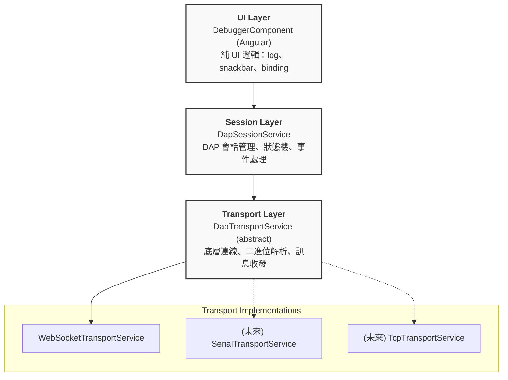
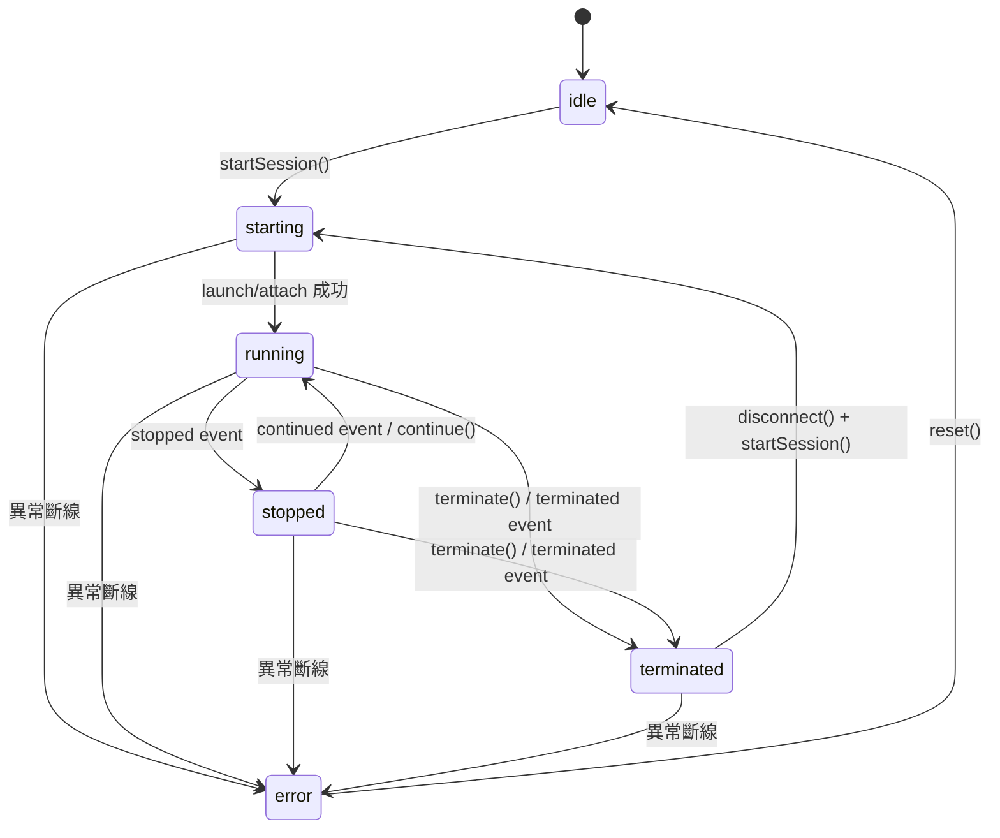
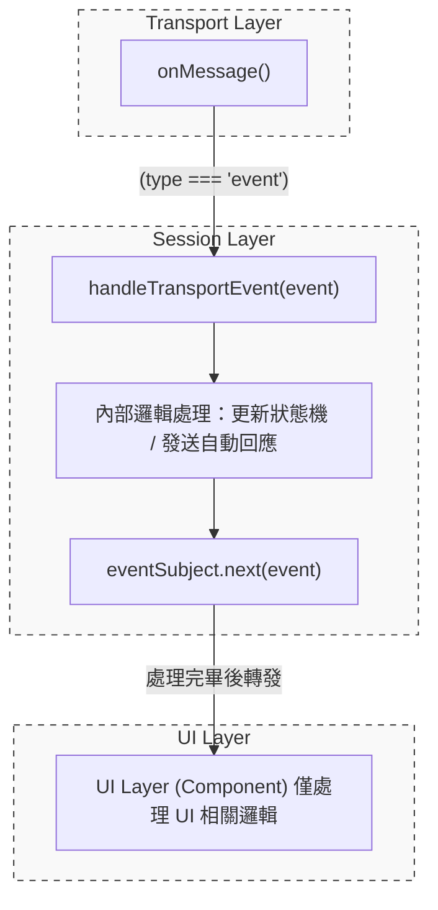
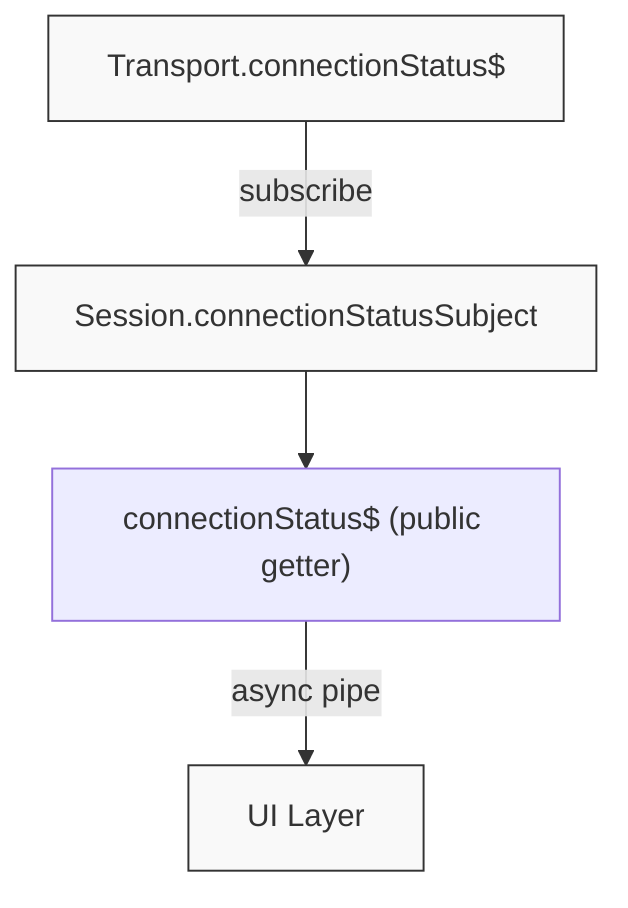
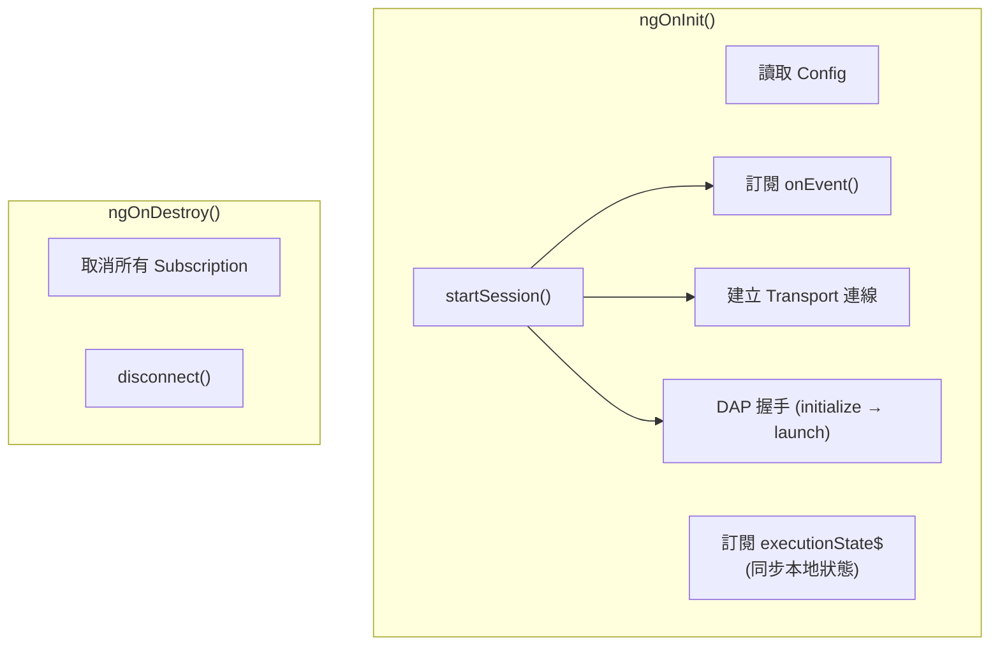
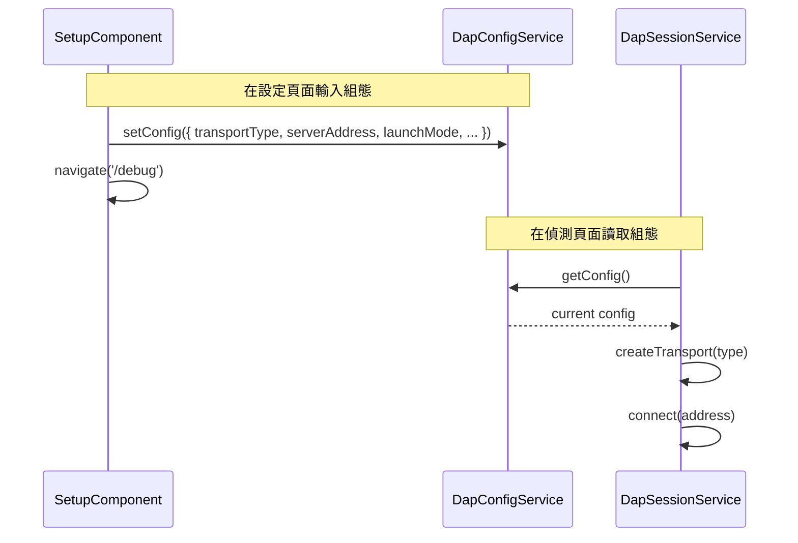

# **系統分層架構說明書 (Session / Transport / UI)**

## 1. 架構總覽

本系統採三層式架構分離關注點，由上至下為：



**設計原則**：每一層僅依賴下一層的抽象介面，不可跨層存取或直接耦合具體實作。

---

## 2. Transport Layer（傳輸層）

### 2.1 職責

- 管理與 DAP Server 之間的**底層連線**（建立、斷開）
- 將 DAP 協定訊息**序列化/反序列化**（含 `Content-Length` header 處理）
- 提供原始的 **訊息串流**（`onMessage()`）與**事件串流**（`onEvent()`）
- 發佈**連線狀態**（`connectionStatus$`）

### 2.2 類別結構

| 類別 | 檔案 | 說明 |
|---|---|---|
| `DapTransportService` | `dap-transport.service.ts` | **抽象基底類別**，定義傳輸層介面 |
| `WebSocketTransportService` | `websocket-transport.service.ts` | WebSocket 實作，含 DAP 二進位流解析 |

### 2.3 擴充方式

新增傳輸類型僅需三步：

1. **建立新 Service**：繼承 `DapTransportService`，實作所有抽象方法
2. **註冊型別**：在 `DapConfig` 的 `TransportType` 聯合型別中新增選項
3. **註冊工廠**：在 `transport.factory.ts` 的 `createTransport()` 中新增對應 `case`

```
// transport.factory.ts
export function createTransport(type: TransportType): DapTransportService {
  switch (type) {
    case 'websocket': return new WebSocketTransportService();
    case 'serial':    return new SerialTransportService();   // 新增
    case 'tcp':       return new TcpT`ransportService();      // 新增
    default: throw new Error(`Unsupported transport type: ${type}`);
  }
}
```

> **注意**：Session 層與 UI 層完全不需要修改，符合開放封閉原則 (OCP)。

### 2.4 關鍵介面

```typescript
abstract class DapTransportService {
  abstract connect(address: string): Observable<void>;
  abstract disconnect(): void;
  abstract sendRequest(request: DapRequest): void;
  abstract onEvent(): Observable<DapEvent>;      // 原始事件流
  abstract onMessage(): Observable<DapMessage>;  // 所有訊息流
  abstract get connectionStatus$(): Observable<boolean>;
}
```

---

## 3. Session Layer（會話層）

### 3.1 職責

- 管理 **DAP 會話生命週期**（initialize → launch/attach → 偵錯 → disconnect）
- 管理 **Transport 實例**（根據 config 延遲建立，disconnect 時銷毀）
- 維護 **請求/回應配對**（seq → pending request mapping）
- 管理 **執行狀態機**（`ExecutionState`）
- **攔截並處理 Transport 事件**，再轉發給 UI 層
- 發佈 **Session 層級 Observable**（`connectionStatus$`、`executionState$`、`onEvent()`）

### 3.2 執行狀態機



`ExecutionState` 型別定義與狀態說明：
```typescript
type ExecutionState = 'idle' | 'starting' | 'running' | 'stopped' | 'terminated' | 'error';
```

| 狀態 | 說明 |
|---|---|
| `idle` | 尚未建立連線，或是連線已安全斷開後的初始狀態。 |
| `starting` | 正在建立底層連線、傳送 initialize、傳送 launch/attach 並等待握手完成的過渡狀態。 |
| `running` | 偵錯目標程式正在執行中，此時 DAP 處於忙碌狀態，不接受 stackTrace 或 variables 等查詢請求。 |
| `stopped` | 程式因中斷點、逐步執行或暫停操作而停下。此時可進行執行緒、堆疊與變數的查詢。 |
| `terminated` | 目標程式已經執行結束或被強制終止。需透過關閉會話 `disconnect()` 並調用 `startSession()` 重新進入 `starting` 狀態。 |
| `error` | 發生非預期的連線中斷或通訊異常。需透過 `reset()` 清理資源並返回 `idle`，才能再次啟動連線。 |

### 3.3 事件處理流程

Transport 層的原始事件**不直接暴露**給 UI，而是經 Session 內部的 `handleTransportEvent()` 先行處理：



### 3.4 連線狀態橋接

Session 層透過 `BehaviorSubject<boolean>` 橋接 Transport 的 `connectionStatus$`。這使得 UI 可在 Transport 尚未建立前就安全訂閱（初始值為 `false`）：



### 3.5 Transport 生命週期

Transport 實例由 Session 透過工廠函式**延遲建立**（Lazy Instantiation），而非在 constructor 中 hardcode：

| 時機 | 操作 |
|---|---|
| `constructor()` | 不建立 Transport（`transport = undefined`） |
| `startSession()` | 根據 `config.transportType` 透過 `createTransport()` 建立 |
| `disconnect()` | 呼叫 `transport.disconnect()` 後設為 `undefined`，重置所有狀態 |

### 3.6 對外 API

| API | 型別 | 說明 |
|---|---|---|
| `connectionStatus$` | `Observable<boolean>` | 連線狀態（Transport 建立前為 `false`） |
| `executionState$` | `Observable<ExecutionState>` | 偵錯執行狀態 |
| `onEvent()` | `Observable<DapEvent>` | 已處理過的事件串流 |
| `fileTree` | `FileTreeService` | 專屬此 Session 的檔案樹服務 (隨 Session 建立) |
| `capabilities` | `any` | 從 Server 取得的能力 (Capabilities) |
| `startSession()` | `Promise<DapResponse>` | 完整啟動流程 (connect → initialize → launch) |
| `continue() / next() / stepIn() / stepOut() / pause()` | `Promise<DapResponse>` | 偵錯控制指令 |
| `threads() / stackTrace() / scopes() / variables()`| `Promise<DapResponse>` | 執行緒與變數探索指令 (`stopped` 狀態可用) |
| `sendRequest()` | `Promise<DapResponse>` | 泛用 DAP 請求 |
| `disconnect()` | `Promise<void>` | 中斷連線並清理資源 |

---

## 4. UI Layer（使用者介面層）

### 4.1 職責

- **綁定 Session Observable** 至模板（`connectionStatus$`、`executionState$`）
- 處理**純 UI 邏輯**：log 輸出、snackbar 通知、對話框顯示
- 管理**使用者互動**：按鈕點擊 → 呼叫 Session 方法
- **不直接操作** Transport 或管理會話狀態

### 4.2 職責分離對照

| 職責 | 所屬層級 | 說明 |
|---|---|---|
| `configurationDone` 自動回應 | **Session** | 收到 `initialized` 事件後自動執行 |
| `executionState` 狀態轉移 | **Session** | 由事件驅動，UI 僅訂閱 |
| DAP Log / Program Log 輸出 | **UI** | 接收事件後 append 至 log 陣列 |
| Snackbar 通知（終止、錯誤） | **UI** | 接收事件後顯示使用者通知 |
| 錯誤重試對話框 | **UI** | 連線失敗時顯示 ErrorDialog |
| 偵錯控制按鈕狀態 | **UI** | 根據 `executionState` disabled/enabled |

### 4.3 元件生命週期 (DebuggerComponent)



---

## 5. 組態流程 (DapConfig)



`TransportType` 型別定義：
```typescript
type TransportType = 'websocket' | 'serial' | 'tcp';
```

---

## 6. 檔案對照表

| 檔案 | 層級 | 說明 |
|---|---|---|
| `debugger.component.ts` | UI | 偵錯主畫面元件 |
| `debugger.component.html` | UI | 偵錯主畫面模板 |
| `setup.component.ts` | UI | 設定頁面元件 |
| `dap-session.service.ts` | Session | DAP 會話管理服務 |
| `dap-config.service.ts` | Session | 組態管理服務 |
| `dap-file-tree.service.ts` | Session | 檔案樹服務（隨 Session 建立） |
| `dap-transport.service.ts` | Transport | 傳輸層抽象基底類別 |
| `websocket-transport.service.ts` | Transport | WebSocket 傳輸實作 |
| `transport.factory.ts` | Transport | Transport 工廠函式 |
| `dap.types.ts` | 共用 | DAP 協定型別定義 |
| `file-tree.service.ts` | 共用 | 檔案樹抽象介面 |
