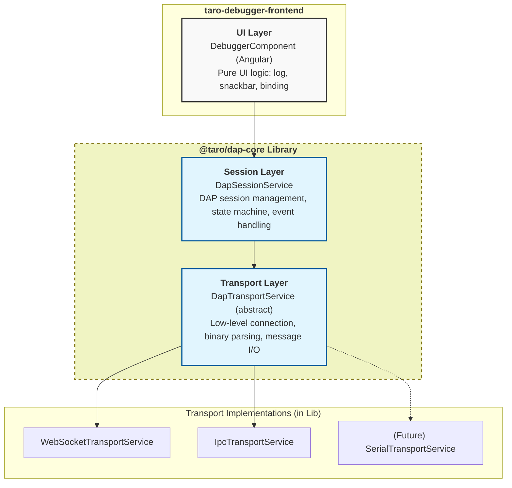

# System Architecture (Master Index)

## 1. Architecture Overview

The system adopts a three-layer architecture to separate concerns. From top to bottom:

**Design Principle**: Each layer depends only on the abstract interface of the layer below it. Cross-layer access or direct coupling to concrete implementations is prohibited.

---

## 2. Detailed Sub-Systems

The architectural documentation has been modularized. Please see the specific sub-documents below for detailed rules, lifecycles, and architectures of each area.

| Sub-System | Documentation Document | Description |
| :--- | :--- | :--- |
| **Transport Layer** | [architecture/transport-layer.md](architecture/transport-layer.md) | Low-level connection management, binary stream parsing, and extension interface. |
| **Session Layer** | [architecture/session-layer.md](architecture/session-layer.md) | Execution State Machine, configuration flows, request pairing, and transport lifecycle. |
| **UI Layer** | [architecture/ui-layer.md](architecture/ui-layer.md) | Dependency Injection constraints, UI rendering, logging architecture, and variable display caching. |
| **Visual Design** | [architecture/visual-design.md](architecture/visual-design.md) | Design Tokens, typography, density scaling, and strict layout spacing rules. |
| **Error Handling** | [architecture/error-handling.md](architecture/error-handling.md) | Synthetic Event handling (`_transportError`, `_dapError`), failure detection, and recovery sequences. |
| **Command Serialization** | [architecture/command-serialization.md](architecture/command-serialization.md) | Sync/cancel contract for control buttons, evaluate command, and call stack frame switch. |
| **Monorepo Standards** | [architecture/monorepo-standards.md](architecture/monorepo-standards.md) | Workspace resolution strategy, build-time constraints, and dependency hierarchy rules. |

---

## 3. Component & Feature Specifications

Granular specifications for complex UI components and specific DAP feature implementations.

| Feature / Component | Documentation Document | Description |
| :--- | :--- | :--- |
| **Assembly View** | [architecture/ui-components/assembly-view-spec.md](architecture/ui-components/assembly-view-spec.md) | Low-level instruction inspection, address-to-source mapping, and tabbed editor integration. |
| **Keyboard Shortcuts** | [architecture/ui-components/keyboard-shortcuts-spec.md](architecture/ui-components/keyboard-shortcuts-spec.md) | VS Code compatible Action ID mapping, global event performance optimization, and focus guard design. |

---

## 4. File Reference Table

> **Note:** For a complete and up-to-date mapping of source files to their architectural layers and responsibilities, please refer to the **[Source File Responsibility Map](file-map.md)**.
