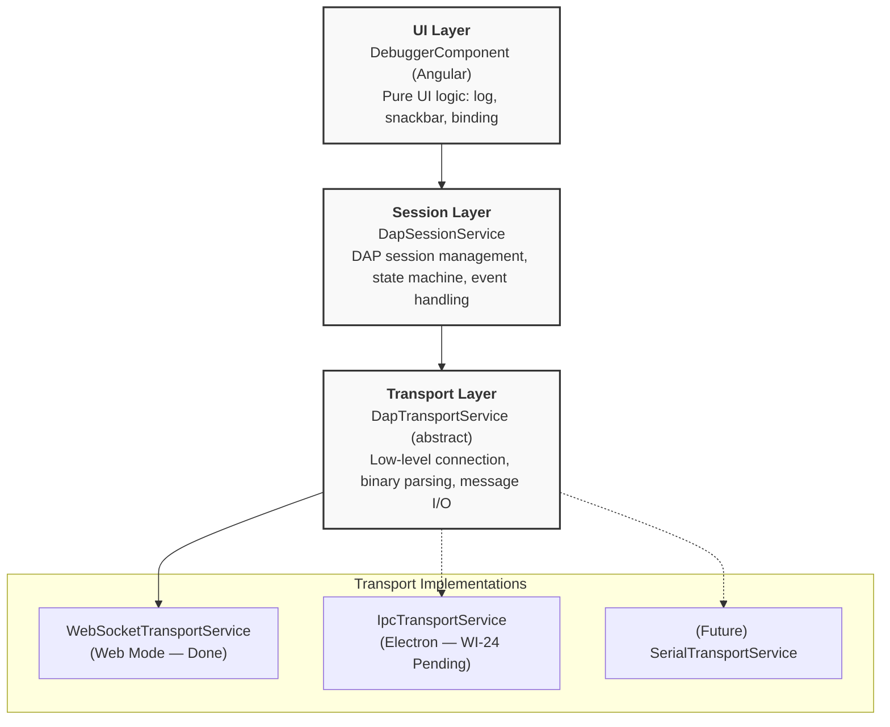
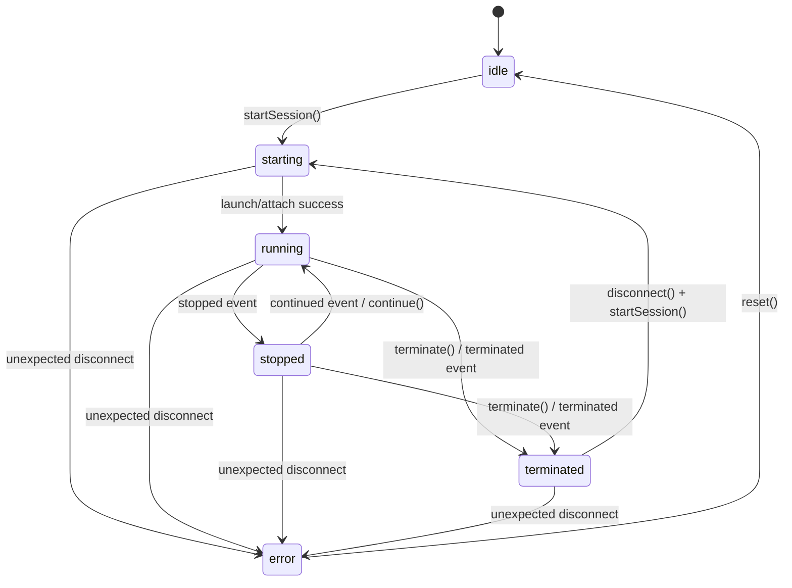
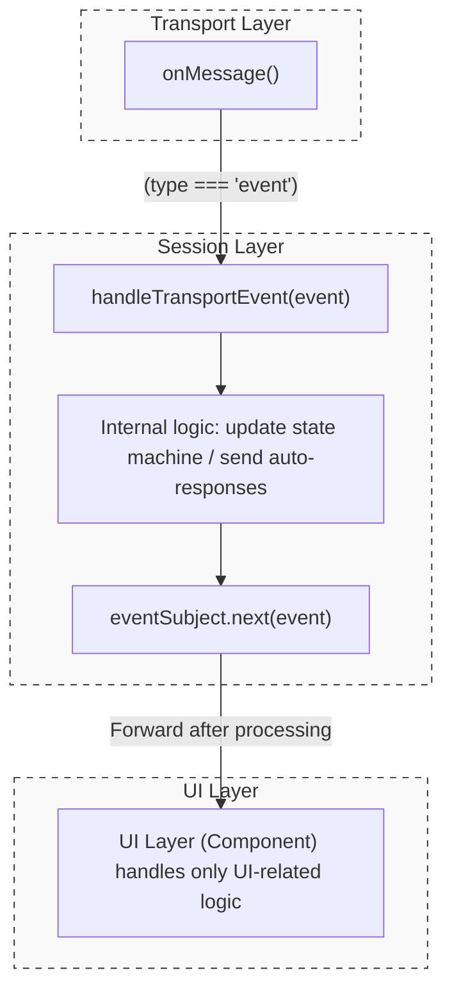
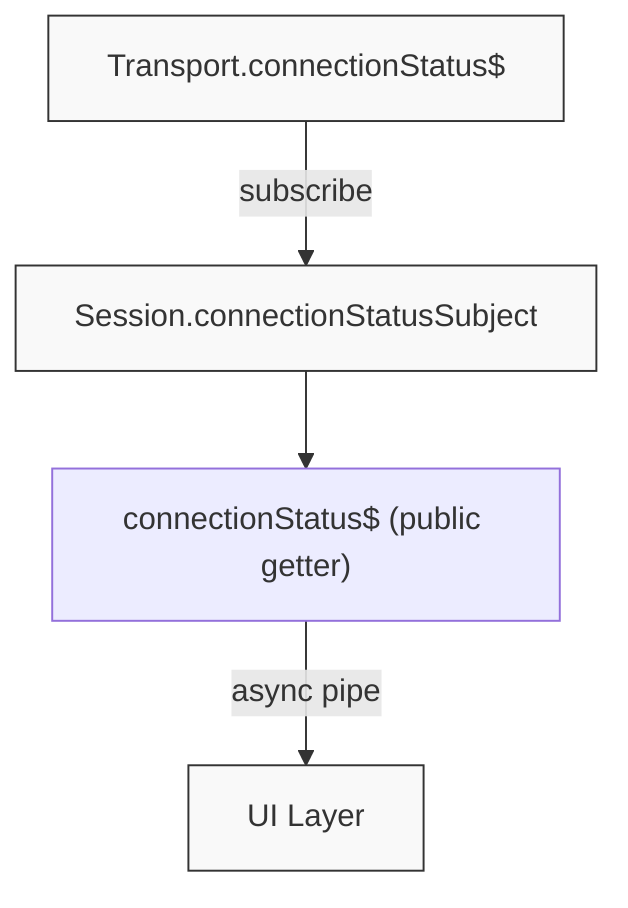
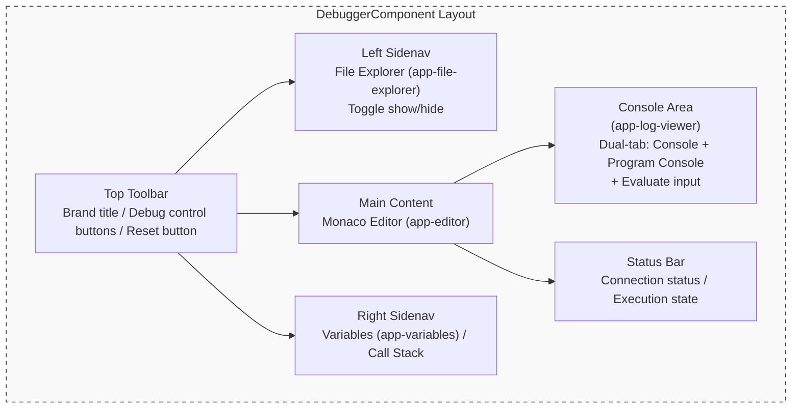
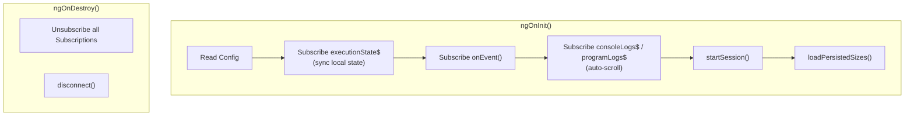
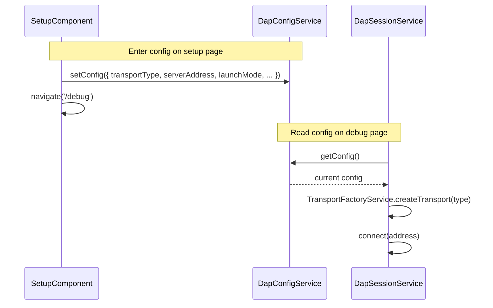
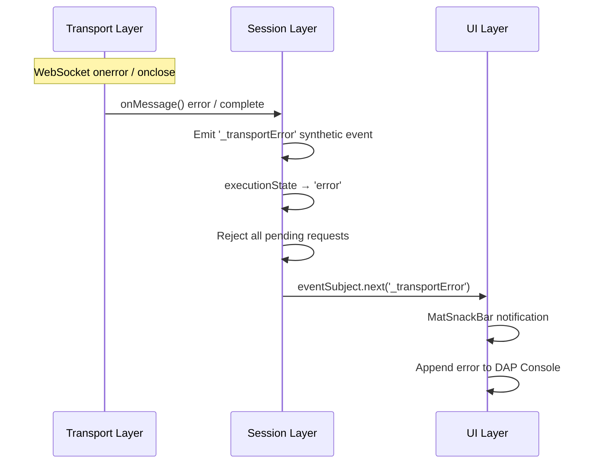
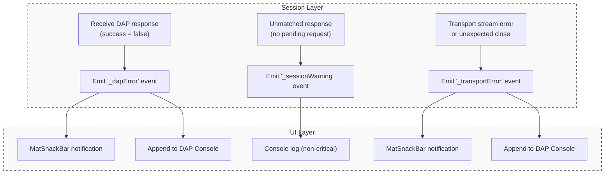

# System Architecture (Session / Transport / UI)

## 1. Architecture Overview

The system adopts a three-layer architecture to separate concerns. From top to bottom:



**Design Principle**: Each layer depends only on the abstract interface of the layer below it. Cross-layer access or direct coupling to concrete implementations is prohibited.

---

## 2. Transport Layer

### 2.1 Responsibilities

- Manage **low-level connections** to the DAP Server (establish, disconnect)
- **Serialize/deserialize** DAP protocol messages (including `Content-Length` header handling)
- Provide raw **message streams** (`onMessage()`) and **event streams** (`onEvent()`)
- Publish **connection status** (`connectionStatus$`)

### 2.2 Class Structure

| Class | File | Description |
| --- | --- | --- |
| `DapTransportService` | `dap-transport.service.ts` | **Abstract base class**, defines the transport layer interface |
| `WebSocketTransportService` | `websocket-transport.service.ts` | WebSocket implementation, includes DAP binary stream parser with Content-Length header parsing. **Robustness**: Handles sticky/half packets via manual buffering; implements fail-fast error isolation for malformed packets; supports buffer auto-expansion (e.g., doubling capacity from 4KB). |
| `IpcTransportService` | `ipc-transport.service.ts` *(WI-24, Pending)* | Electron IPC implementation: the Angular renderer-side service calls `window.electronAPI` (exposed via `electron/preload.ts` `contextBridge`) for all DAP message I/O. The main process side (`electron/main.ts`) forwards IPC calls to the DAP server via TCP. |
| `TransportFactoryService` | `transport-factory.service.ts` | Transport factory service, creates instances by `TransportType` |

### 2.3 Extension Guide

To add a new transport type:

1. **Create a new Service**: Extend `DapTransportService`, implement all abstract methods
2. **Register the type**: Add a new option to the `TransportType` union type in `DapConfig`
3. **Register with factory**: Add the corresponding `case` in `TransportFactoryService.createTransport()`

> **Note**: The Session layer and UI layer require no modifications whatsoever, adhering to the Open/Closed Principle (OCP).

### 2.4 Key Interface

```typescript
abstract class DapTransportService {
  abstract connect(address: string): Observable<void>;
  abstract disconnect(): void;
  abstract sendRequest(request: DapRequest): void;
  abstract onEvent(): Observable<DapEvent>;      // Raw event stream
  abstract onMessage(): Observable<DapMessage>;  // All message stream
  abstract get connectionStatus$(): Observable<boolean>;
}
```

---

## 3. Session Layer

### 3.1 Responsibilities

- Manage the **DAP session lifecycle** (initialize → launch/attach → debug → disconnect)
- Manage **Transport instances** (lazy creation based on config, destruction on disconnect)
- Maintain **request/response pairing** (seq → pending request mapping)
- Manage the **execution state machine** (`ExecutionState`)
- **Intercept and process Transport events**, then forward to the UI layer
- Publish **Session-level Observables** (`connectionStatus$`, `executionState$`, `onEvent()`)

### 3.2 Execution State Machine



`ExecutionState` type definition and state descriptions:

```typescript
type ExecutionState = 'idle' | 'starting' | 'running' | 'stopped' | 'terminated' | 'error';
```

| State | Description |
| --- | --- |
| `idle` | No connection established, or the initial state after a safe disconnect. |
| `starting` | Transitional state: establishing the connection, sending `initialize`, sending `launch`/`attach`, and waiting for handshake completion. |
| `running` | The debug target is executing. DAP is in a busy state and does not accept `stackTrace` or `variables` query requests. |
| `stopped` | The program has stopped due to a breakpoint, step execution, or pause operation. Thread, stack, and variable queries are available. |
| `terminated` | The target program has finished executing or was forcefully terminated. Requires closing the session via `disconnect()` and calling `startSession()` to re-enter `starting` state. |
| `error` | An unexpected connection interruption or communication anomaly occurred. Requires `reset()` to clean up resources and return to `idle` before a new connection can be established. |

### 3.3 Event Processing Flow

Raw events from the Transport layer are **not directly exposed** to the UI. Instead, they are first processed by Session's internal `handleTransportEvent()`:



### 3.4 Connection Status Bridging

The Session layer bridges the Transport's `connectionStatus$` via a `BehaviorSubject<boolean>`. This allows UI to safely subscribe before the Transport is created (initial value is `false`):



### 3.5 Transport Lifecycle

Transport instances are **lazily created** by Session via `TransportFactoryService`, not hardcoded in the constructor:

| Timing | Operation |
| --- | --- |
| `constructor()` | Transport is not created (`transport = undefined`) |
| `startSession()` | Created via `TransportFactoryService.createTransport()` based on `config.transportType` |
| `disconnect()` | Calls `transport.disconnect()` then sets to `undefined`, resets all state |

### 3.6 Public API

| API | Type | Description |
| --- | --- | --- |
| `connectionStatus$` | `Observable<boolean>` | Connection status (defaults to `false` before Transport is created) |
| `executionState$` | `Observable<ExecutionState>` | Debug execution state |
| `onEvent()` | `Observable<DapEvent>` | Processed event stream |
| `onTraffic$` | `Observable<any>` | Diagnostic traffic stream for raw DAP protocol messages |
| `fileTree` | `FileTreeService` | File tree service dedicated to this Session (created with Session) |
| `capabilities` | `any` | Capabilities obtained from the Server |
| `startSession()` | `Promise<DapResponse>` | Complete startup flow (connect → initialize → launch) |
| `continue() / next() / stepIn() / stepOut() / pause()` | `Promise<DapResponse>` | Debug control commands |
| `threads() / stackTrace() / scopes() / variables()` | `Promise<DapResponse>` | Thread and variable exploration commands (available in `stopped` state) |
| `sendRequest()` | `Promise<DapResponse>` | Generic DAP request |
| `disconnect()` | `Promise<void>` | Disconnect and clean up resources |
| `terminate()` | `Promise<void>` | Terminate the debug target (falls back to `disconnect` if `supportsTerminateRequest` is false) |
| `reset()` | `void` | Force reset Session to `idle` (cleans up all resources) |

---

## 4. UI Layer

### 4.1 Responsibilities

- **Bind Session Observables** to templates (`connectionStatus$`, `executionState$`)
- Handle **pure UI logic**: log output, snackbar notifications, dialog display
- Manage **user interactions**: button clicks → call Session methods
- Manage **layout state**: sidebar widths, visibility, console height (including persistence to localStorage)
- **Must not directly operate** Transport or manage session state

### 4.2 Responsibility Separation Reference

| Responsibility | Layer | Description |
| --- | --- | --- |
| `configurationDone` auto-response | **Session** | Automatically executed after receiving `initialized` event |
| `executionState` state transition | **Session** | Event-driven, UI only subscribes |
| DAP Log / Program Log output | **UI** | Managed via `DapLogService` dual console log stream |
| Snackbar notifications (termination, errors) | **UI** | Displays user notifications upon receiving events |
| Error retry dialog | **UI** | Displays `ErrorDialog` on connection failure (retry / go back) |
| Debug control button states | **UI** | disabled/enabled based on `executionState` |
| File tree display & collapse | **UI** | `FileExplorerComponent` fetches via `dapSession.fileTree`, emits `fileSelected` |
| File source loading & editor update | **UI** | `DebuggerComponent.onFileSelected()` calls DAP `source`, updates `EditorComponent` |
| Layout size persistence | **UI** | Sidebar widths, visibility, console height stored in localStorage |

### 4.3 DebuggerComponent Layout Structure



### 4.4 Component Lifecycle (DebuggerComponent)



### 4.5 Logging Architecture (DapLogService + LogViewerComponent)

`DapLogService` is a global singleton service (`providedIn: 'root'`) managing two independent log streams:

| Stream | Observable | Purpose |
| --- | --- | --- |
| **Console Log** | `consoleLogs$` | System status, DAP protocol events, general console messages |
| **Program Log** | `programLogs$` | The debugged program's stdout / stderr output |

Log Category definitions (corresponding to `LogCategory` type):

| Category | Description |
| --- | --- |
| `system` | Frontend system internal messages (e.g., "Connecting...", "Session started") |
| `dap` | DAP protocol events (e.g., "[Event] stopped") — may carry a structured `data` payload |
| `console` | General Debugger Console messages |
| `stdout` | Debugged program standard output |
| `stderr` | Debugged program standard error output |

Log memory cap is **1 MB** (approximate); oldest records are automatically evicted when exceeded.

#### LogEntry Structured Payload

The `LogEntry` interface supports an optional `data?: any` field for attaching a raw structured object (e.g., a raw DAP event) to a log entry. This payload is **display-only** and is never used for state management:

```typescript
interface LogEntry {
  timestamp: Date;
  message: string;
  category: LogCategory;
  level: 'info' | 'error';
  data?: any; // Optional structured payload for UI inspection only
}
```

#### LogViewerComponent (UI Rendering)

`LogViewerComponent` (`<app-log-viewer>`) is the dedicated standalone component responsible for rendering all console output. It adheres to the following architecture constraints:

- **Injects `DapLogService` directly** — does not receive log data via `@Input()` from the parent `DebuggerComponent` (R_SM4 compliance).
- **Injects `DapSessionService`** — for sending `evaluate` requests from the command input field.
- **Manages expanded/collapsed state locally** via `private readonly expandedLogs = new Set<string>()`, keyed by `log.timestamp.getTime().toString()`. This UI state is **never** stored in any Service.
- **Clears `expandedLogs` in `ngOnDestroy()`** per R_SM5 to prevent orphan key accumulation on component teardown.

### 4.6 Diagnostic Traffic Stream (onTraffic$)

To prevent high-frequency raw protocol telemetry from polluting the core business event pipeline (`onEvent`), the Session Layer (`DapSessionService`) exposes a dedicated `onTraffic$` observable.

- **Isolation**: All outgoing requests (`sendRequest`) and incoming messages (`handleIncomingMessage`) are emitted to the internal `trafficSubject` immediately upon sending/receiving, before any state machine processing.
- **Opt-in Telemetry**: The UI Layer (`DebuggerComponent`) subscribes to `onTraffic$` and forwards these raw payloads to `DapLogService` as structured `LogEntry` items with the `dap` category.
- **Separation of Concerns**: This ensures the core `onEvent()` stream only emits structurally significant state events (e.g., `stopped`, `terminated`) required for state machine updates, while `onTraffic$` purely serves diagnostic logging purposes.

### 4.7 Variable & Scope State Management

The inspection of program variables follows a lazy-loading, reactive pattern to handle complex data structures efficiently without blocking the UI.

#### Data Model & Rendering

- **Hierarchical-to-Flat Transformation**: To support **Virtual Scrolling** (`cdk-virtual-scroll-viewport`), the `VariablesComponent` converts the nested DAP variable structure into a flattened array of `FlatVariableNode` items.
- **Lazy Loading**: Nodes with `variablesReference > 0` are rendered with an expansion toggle. Children are only fetched from `DapVariablesService` (triggering a DAP `variables` request) upon the first user expansion.

#### State & Caching (`DapVariablesService`)

- **SSOT for Runtime Inspectables**: The `DapVariablesService` acts as the SSOT for derived variable states, exposing a `scopes$` Observable updated on every `stopped` event.
- **Result Caching**: Successfully fetched variable sets are cached by their `variablesReference` ID within the service level.
- **Implicit Lifecycle Cleanup (R_SM5)**: To prevent memory leaks and stale data display, the service automatically clears its internal cache and resets `scopes$` to an empty state whenever `executionState$` transitions out of `stopped` (e.g., to `running`, `terminated`, or `error`).

---

## 5. Configuration Flow (DapConfig)



`TransportType` type definition:

```typescript
type TransportType = 'websocket' | 'serial' | 'tcp';
```

`DapConfig` full interface:

```typescript
interface DapConfig {
  serverAddress: string;       // DAP Server connection address (e.g., localhost:4711)
  transportType: TransportType; // Transport type
  launchMode: 'launch' | 'attach'; // Launch mode
  executablePath: string;      // Path to the debugged executable
  sourcePath: string;          // Source code root directory path
  programArgs: string;         // Command-line arguments passed to the debuggee
}
```

### 5.1 Electron Specifics (Bridge Management)

To ensure compatibility with Electron's `file://` protocol and multi-mode architecture:

- **HashLocationStrategy**: The application uses `withHashLocation()` in `app.config.ts` to prevent "file not found" errors when reloading inside Electron.
- **Main Process Isolation**: All Node.js/Filesystem logic is abstracted into the Electron Main Process (`electron/main.ts`) and accessed via the secure Preload bridge (`electron/preload.ts`).

---

## 6. Error Handling Architecture

This section corresponds to System Specification [§7.1](system-specification.md#71-connection-error-handling) and [§7.2](system-specification.md#72-dap-server-error-handling) error handling requirements, describing the responsibility division and event transmission mechanism across layers.

### 6.1 Connection Error Handling

Connection errors originate from the Transport layer, and the handling flow spans all three layers:



| Error Scenario | Transport Layer Behavior | Session Layer Behavior | UI Layer Behavior |
| --- | --- | --- | --- |
| **Connection timeout** | `connect()` Observable error | `startSession()` reject | `ErrorDialog` (retry / go back) |
| **Connection lost** | `connectionStatus$` → `false`<br/>`onMessage()` complete | Emit `_transportError` event<br/>`executionState` → `error` | `MatSnackBar` notification + Console log |
| **WebSocket error** | `onerror` → `connectionStatus$` `false`<br/>`onMessage()` error | Emit `_transportError` event<br/>`executionState` → `error` | `MatSnackBar` notification + Console log |

**Recovery flow**: Users must use the Restart/Reconnect button in the UI layer to call `disconnect()` + `startSession()` to reconnect. If in `error` state, `disconnect()` internally calls `reset()` to return to `idle`.

### 6.2 DAP Server Error Handling

DAP protocol-level errors are detected by the Session layer and transmitted to the UI layer for display via the **Synthetic Event** pattern, adhering to R7 (Services must not inject UI components):



| Error Scenario | Session Layer Behavior | UI Layer Behavior |
| --- | --- | --- |
| **DAP error response** (`success=false`) | Emit `_dapError` synthetic event<br/>Reject corresponding Promise | `MatSnackBar` displays command + error message |
| **Invalid DAP response** (unknown `request_seq`) | Emit `_sessionWarning` synthetic event | Console log (non-critical) |
| **Unexpected process termination** (`exited` event, exit code ≠ 0) | Forward `exited` event normally | Console log |
| **Unexpected disconnect** (Transport stream interrupted) | Emit `_transportError` synthetic event<br/>`executionState` → `error` | `MatSnackBar` notification + Console log |

#### Synthetic Event Naming Convention

To avoid conflicts with standard DAP event names, all synthetic events generated by the Session layer are prefixed with an underscore `_`:

| Synthetic Event | Trigger Condition | Body Structure |
| --- | --- | --- |
| `_dapError` | DAP Response `success=false` | `{ command: string; message: string }` |
| `_transportError` | Transport stream error / complete | `{ reason: 'error' \| 'disconnected'; message: string }` |
| `_sessionWarning` | Session-layer internal protocol anomaly (e.g., unknown `request_seq`) | `{ message: string }` |

---

## 7. File Reference Table

> **Note:** For a complete and up-to-date mapping of source files to their architectural layers and responsibilities, please refer to the **[Source File Responsibility Map](file-map.md)**.
