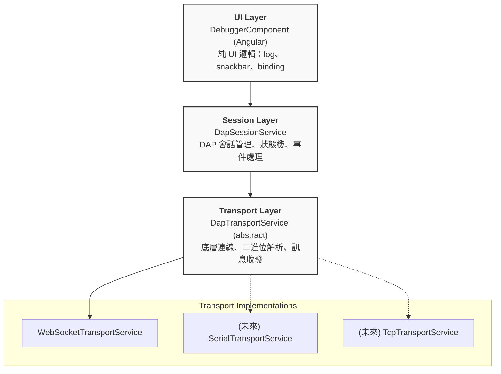
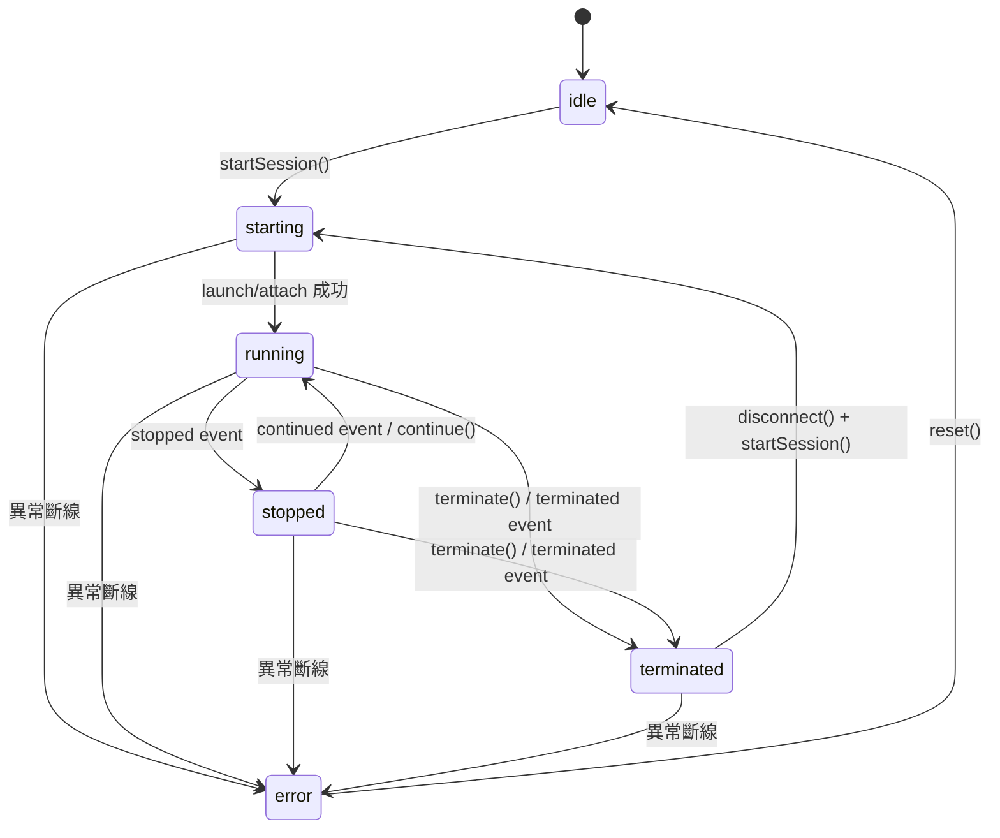
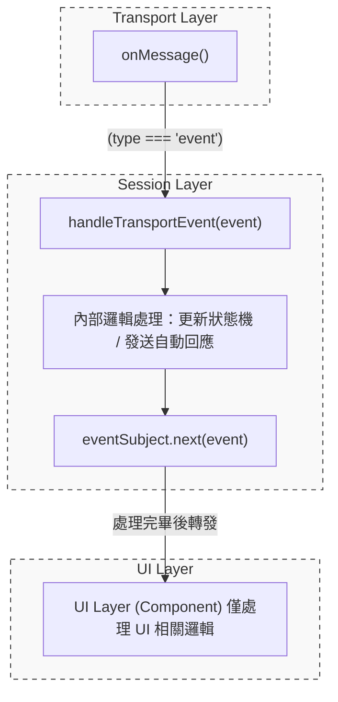
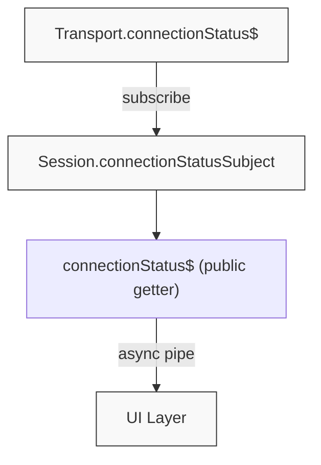
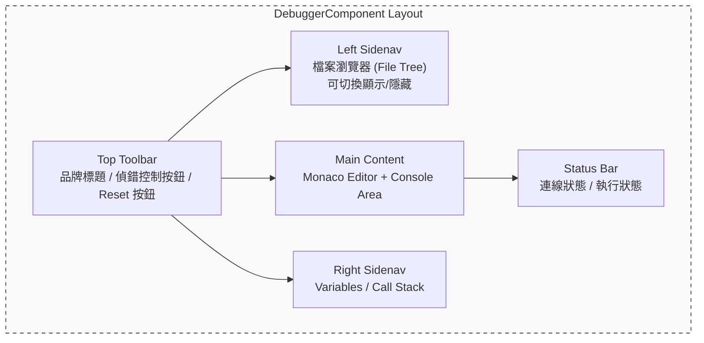
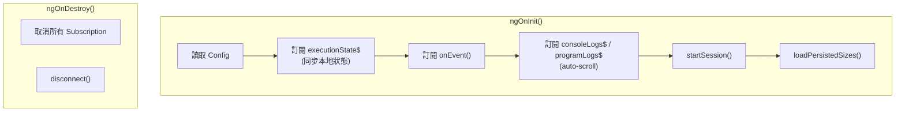
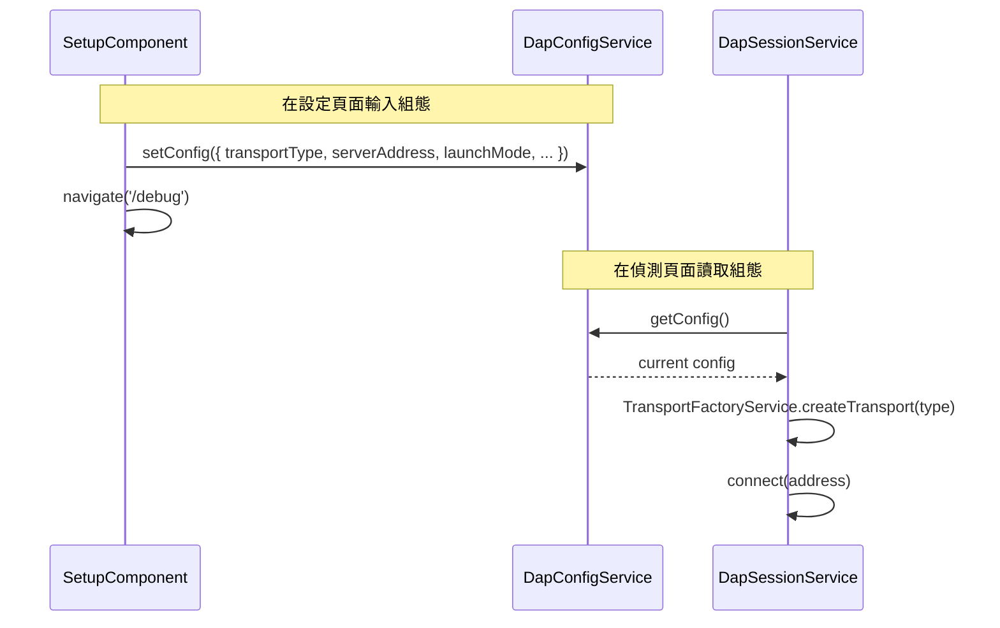
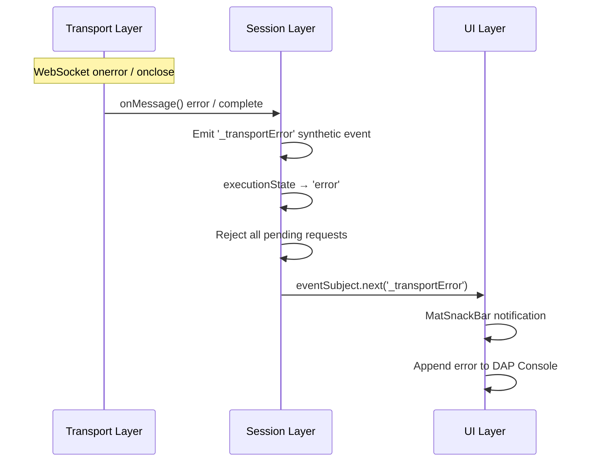
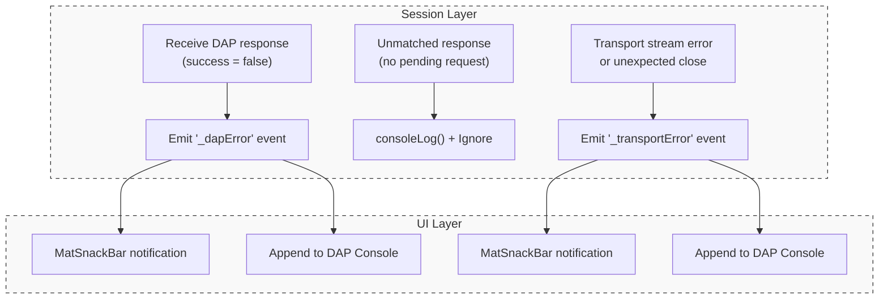

# **系統分層架構說明書 (Session / Transport / UI)**

## 1. 架構總覽

本系統採三層式架構分離關注點，由上至下為：



**設計原則**：每一層僅依賴下一層的抽象介面，不可跨層存取或直接耦合具體實作。

---

## 2. Transport Layer（傳輸層）

### 2.1 職責

- 管理與 DAP Server 之間的**底層連線**（建立、斷開）
- 將 DAP 協定訊息**序列化/反序列化**（含 `Content-Length` header 處理）
- 提供原始的 **訊息串流**（`onMessage()`）與**事件串流**（`onEvent()`）
- 發佈**連線狀態**（`connectionStatus$`）

### 2.2 類別結構

| 類別 | 檔案 | 說明 |
|---|---|---|
| `DapTransportService` | `dap-transport.service.ts` | **抽象基底類別**，定義傳輸層介面 |
| `WebSocketTransportService` | `websocket-transport.service.ts` | WebSocket 實作，含 DAP 二進位流解析 |
| `TransportFactoryService` | `transport-factory.service.ts` | Transport 工廠服務，依 `TransportType` 建立實例 |

### 2.3 擴充方式

新增傳輸類型：

1. **建立新 Service**：繼承 `DapTransportService`，實作所有抽象方法
2. **註冊型別**：在 `DapConfig` 的 `TransportType` 聯合型別中新增選項
3. **註冊工廠**：在 `TransportFactoryService.createTransport()` 中新增對應 `case`

> **注意**：Session 層與 UI 層完全不需要修改，符合開放封閉原則 (OCP)。

### 2.4 關鍵介面

```typescript
abstract class DapTransportService {
  abstract connect(address: string): Observable<void>;
  abstract disconnect(): void;
  abstract sendRequest(request: DapRequest): void;
  abstract onEvent(): Observable<DapEvent>;      // 原始事件流
  abstract onMessage(): Observable<DapMessage>;  // 所有訊息流
  abstract get connectionStatus$(): Observable<boolean>;
}
```

---

## 3. Session Layer（會話層）

### 3.1 職責

- 管理 **DAP 會話生命週期**（initialize → launch/attach → 偵錯 → disconnect）
- 管理 **Transport 實例**（根據 config 延遲建立，disconnect 時銷毀）
- 維護 **請求/回應配對**（seq → pending request mapping）
- 管理 **執行狀態機**（`ExecutionState`）
- **攔截並處理 Transport 事件**，再轉發給 UI 層
- 發佈 **Session 層級 Observable**（`connectionStatus$`、`executionState$`、`onEvent()`）

### 3.2 執行狀態機



`ExecutionState` 型別定義與狀態說明：
```typescript
type ExecutionState = 'idle' | 'starting' | 'running' | 'stopped' | 'terminated' | 'error';
```

| 狀態 | 說明 |
|---|---|
| `idle` | 尚未建立連線，或是連線已安全斷開後的初始狀態。 |
| `starting` | 正在建立底層連線、傳送 initialize、傳送 launch/attach 並等待握手完成的過渡狀態。 |
| `running` | 偵錯目標程式正在執行中，此時 DAP 處於忙碌狀態，不接受 stackTrace 或 variables 等查詢請求。 |
| `stopped` | 程式因中斷點、逐步執行或暫停操作而停下。此時可進行執行緒、堆疊與變數的查詢。 |
| `terminated` | 目標程式已經執行結束或被強制終止。需透過關閉會話 `disconnect()` 並調用 `startSession()` 重新進入 `starting` 狀態。 |
| `error` | 發生非預期的連線中斷或通訊異常。需透過 `reset()` 清理資源並返回 `idle`，才能再次啟動連線。 |

### 3.3 事件處理流程

Transport 層的原始事件**不直接暴露**給 UI，而是經 Session 內部的 `handleTransportEvent()` 先行處理：



### 3.4 連線狀態橋接

Session 層透過 `BehaviorSubject<boolean>` 橋接 Transport 的 `connectionStatus$`。這使得 UI 可在 Transport 尚未建立前就安全訂閱（初始值為 `false`）：



### 3.5 Transport 生命週期

Transport 實例由 Session 透過 `TransportFactoryService` **延遲建立**（Lazy Instantiation），而非在 constructor 中 hardcode：

| 時機 | 操作 |
|---|---|
| `constructor()` | 不建立 Transport（`transport = undefined`） |
| `startSession()` | 根據 `config.transportType` 透過 `TransportFactoryService.createTransport()` 建立 |
| `disconnect()` | 呼叫 `transport.disconnect()` 後設為 `undefined`，重置所有狀態 |

### 3.6 對外 API

| API | 型別 | 說明 |
|---|---|---|
| `connectionStatus$` | `Observable<boolean>` | 連線狀態（Transport 建立前為 `false`） |
| `executionState$` | `Observable<ExecutionState>` | 偵錯執行狀態 |
| `onEvent()` | `Observable<DapEvent>` | 已處理過的事件串流 |
| `fileTree` | `FileTreeService` | 專屬此 Session 的檔案樹服務 (隨 Session 建立) |
| `capabilities` | `any` | 從 Server 取得的能力 (Capabilities) |
| `startSession()` | `Promise<DapResponse>` | 完整啟動流程 (connect → initialize → launch) |
| `continue() / next() / stepIn() / stepOut() / pause()` | `Promise<DapResponse>` | 偵錯控制指令 |
| `threads() / stackTrace() / scopes() / variables()`| `Promise<DapResponse>` | 執行緒與變數探索指令 (`stopped` 狀態可用) |
| `sendRequest()` | `Promise<DapResponse>` | 泛用 DAP 請求 |
| `disconnect()` | `Promise<void>` | 中斷連線並清理資源 |
| `terminate()` | `Promise<void>` | 終止偵錯目標（支援 `supportsTerminateRequest` 回退至 `disconnect`） |
| `reset()` | `void` | 強制重置 Session 至 `idle`（清理所有資源） |

---

## 4. UI Layer（使用者介面層）

### 4.1 職責

- **綁定 Session Observable** 至模板（`connectionStatus$`、`executionState$`）
- 處理**純 UI 邏輯**：log 輸出、snackbar 通知、對話框顯示
- 管理**使用者互動**：按鈕點擊 → 呼叫 Session 方法
- 管理**佈局狀態**：側邊欄寬度、可見性、Console 高度（含持久化至 localStorage）
- **不直接操作** Transport 或管理會話狀態

### 4.2 職責分離對照

| 職責 | 所屬層級 | 說明 |
|---|---|---|
| `configurationDone` 自動回應 | **Session** | 收到 `initialized` 事件後自動執行 |
| `executionState` 狀態轉移 | **Session** | 由事件驅動，UI 僅訂閱 |
| DAP Log / Program Log 輸出 | **UI** | 透過 `DapLogService` 管理雙 Console 日誌流 |
| Snackbar 通知（終止、錯誤） | **UI** | 接收事件後顯示使用者通知 |
| 錯誤重試對話框 | **UI** | 連線失敗時顯示 `ErrorDialog`（重試 / 返回設定頁） |
| 偵錯控制按鈕狀態 | **UI** | 根據 `executionState` disabled/enabled |
| 檔案樹與原始碼顯示 | **UI** | 透過 `fileTree` 載入檔案清單，透過 Monaco 編輯器顯示原始碼 |
| 佈局尺寸持久化 | **UI** | 側邊欄寬度、可見性、Console 高度存取 localStorage |

### 4.3 DebuggerComponent 佈局結構



### 4.4 元件生命週期 (DebuggerComponent)



### 4.5 日誌架構 (DapLogService)

`DapLogService` 為全域單例服務 (`providedIn: 'root'`)，管理兩個獨立的日誌串流：

| 串流 | Observable | 用途 |
|---|---|---|
| **Console Log** | `consoleLogs$` | 系統狀態、DAP 協定事件、一般 Console 訊息 |
| **Program Log** | `programLogs$` | 被偵錯程式的 stdout / stderr 輸出 |

Log Category 分類定義（對應 `LogCategory` 型別）：

| Category | 說明 |
|---|---|
| `system` | 前端系統內部訊息（如 "Connecting..."、"Session started"） |
| `dap` | DAP 協定事件（如 "[Event] stopped"） |
| `console` | 一般 Debugger Console 訊息 |
| `stdout` | 被偵錯程式標準輸出 |
| `stderr` | 被偵錯程式標準錯誤輸出 |

日誌記憶體上限為 **1 MB**（近似值），超過時自動淘汰最舊的紀錄。

---

## 5. 組態流程 (DapConfig)



`TransportType` 型別定義：
```typescript
type TransportType = 'websocket' | 'serial' | 'tcp';
```

`DapConfig` 完整介面：
```typescript
interface DapConfig {
  serverAddress: string;       // DAP Server 連線位址 (e.g., localhost:4711)
  transportType: TransportType; // 傳輸類型
  launchMode: 'launch' | 'attach'; // 啟動模式
  executablePath: string;      // 被偵錯程式路徑
  sourcePath: string;          // 原始碼根目錄路徑
  programArgs: string;         // 傳遞給被偵錯程式的命令列參數
}
```

---

## 6. 錯誤處理架構 (Error Handling Architecture)

本節對應系統規格書 §7.1 與 §7.2 之錯誤處理需求，說明各層級之職責劃分與事件傳遞機制。

### 6.1 連線異常處理 (Connection Error Handling)

連線異常源自 Transport 層，處理流程跨越三層：



| 異常情境 | Transport 層行為 | Session 層行為 | UI 層行為 |
|---|---|---|---|
| **連線逾時** | `connect()` Observable error | `startSession()` reject | `ErrorDialog` (retry / go back) |
| **連線中斷** | `connectionStatus$` → `false`<br/>`onMessage()` complete | 發送 `_transportError` 事件<br/>`executionState` → `error` | `MatSnackBar` 通知 + Console 日誌 |
| **WebSocket 錯誤** | `onerror` → `connectionStatus$` `false`<br/>`onMessage()` error | 發送 `_transportError` 事件<br/>`executionState` → `error` | `MatSnackBar` 通知 + Console 日誌 |

**復原流程**：使用者須透過 UI 層的 Restart/Reconnect 按鈕呼叫 `disconnect()` + `startSession()` 重新連線。若為 `error` 狀態，`disconnect()` 內部會呼叫 `reset()` 返回 `idle`。

### 6.2 DAP Server 異常處理 (DAP Server Error Handling)

DAP 協定層面的錯誤由 Session 層偵測，透過 **Synthetic Event** 模式傳遞至 UI 層顯示，以遵守 R7（Service 不得注入 UI 元件）：



| 異常情境 | Session 層行為 | UI 層行為 |
|---|---|---|
| **DAP error response** (`success=false`) | 發送 `_dapError` synthetic event<br/>Reject 對應 Promise | `MatSnackBar` 顯示 command + error message |
| **無效 DAP 回應** (unknown `request_seq`) | `consoleLog()` 記錄並忽略 | 無（已在 Session 層處理） |
| **程序異常終止** (`exited` event, exit code ≠ 0) | 正常轉發 `exited` 事件 | Console 日誌 |
| **非預期斷線** (Transport stream 中斷) | 發送 `_transportError` synthetic event<br/>`executionState` → `error` | `MatSnackBar` 通知 + Console 日誌 |

#### Synthetic Event 命名慣例

為避免與標準 DAP 事件名稱衝突，所有 Session 層自行產生的合成事件均以底線 `_` 為前綴：

| Synthetic Event | 觸發條件 | Body 結構 |
|---|---|---|
| `_dapError` | DAP Response `success=false` | `{ command: string; message: string }` |
| `_transportError` | Transport stream error / complete | `{ reason: 'error' \| 'disconnected'; message: string }` |

---

## 7. 檔案對照表

| 檔案 | 層級 | 說明 |
|---|---|---|
| `debugger.component.ts` | UI | 偵錯主畫面元件 |
| `debugger.component.html` | UI | 偵錯主畫面模板 |
| `setup.component.ts` | UI | 設定頁面元件 |
| `dap-session.service.ts` | Session | DAP 會話管理服務 |
| `dap-config.service.ts` | Session | 組態管理服務 |
| `dap-log.service.ts` | Session | DAP Console / Program Console 日誌服務 |
| `dap-file-tree.service.ts` | Session | 檔案樹服務（隨 Session 建立） |
| `dap-transport.service.ts` | Transport | 傳輸層抽象基底類別 |
| `websocket-transport.service.ts` | Transport | WebSocket 傳輸實作 |
| `transport-factory.service.ts` | Transport | Transport 工廠服務（依 `TransportType` 建立實例） |
| `dap.types.ts` | 共用 | DAP 協定型別定義 |
| `file-tree.service.ts` | 共用 | 檔案樹抽象介面 |
