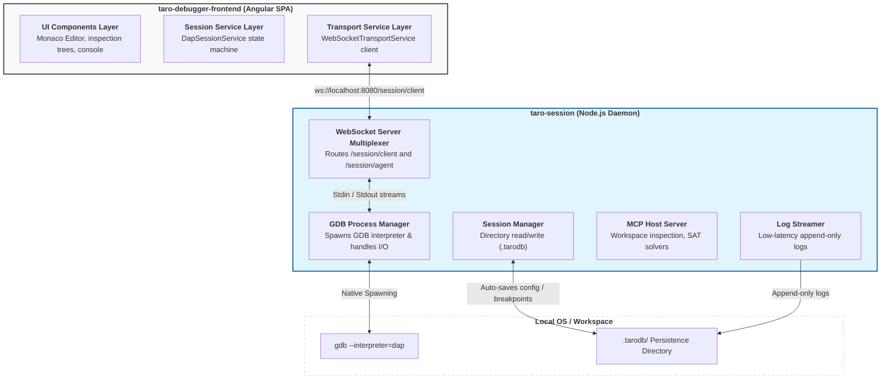

# Master System Architecture & Topology

This document specifies the master architecture and system-level topology for the Taro Debugger ecosystem. It describes the physical and logical decoupling of the frontend user interface (**`taro-debugger-frontend`**) and the local session daemon (**`taro-session`**).

---

## 1. Architectural Topology Overview

Taro Debugger utilizes a decoupled, client-server architecture designed to bypass web browser sandbox limitations and enable high-performance, intelligent diagnostic workflows.

- **`taro-debugger-frontend`**: A rich Angular standalone Single Page Application (SPA). It is responsible for rendering the high-density visual debugger layout (Monaco Editor, call-stack trees, registers, Hex memory visualization) and managing reactive state streams in the browser or Electron renderer process.
- **`taro-session`**: A lightweight Node.js CLI daemon running locally. It acts as the physical parent of GDB process, spawns compiler and SAT/SMT solver diagnostics, performs continuous session saving, and exposes Model Context Protocol (MCP) host services.

> [Diagram: System-level client-server topology. The `taro-debugger-frontend` Angular application connects via standard WebSocket to the standalone `taro-session` Node.js daemon. The frontend encapsulates the UI components, session layer state machine, and the WebSocket client. The backend daemon hosts the WebSocket router/multiplexer, GDB process manager, MCP server, session manager, and low-latency logger. The daemon manages native GDB subprocess execution and reads/writes persistent state to the local workspace's `.tarodb/` folder.]

---

## 2. Decoupled Core Responsibilities

To ensure optimal crash resilience and separation of concerns, the systems follow a strict division of responsibilities:

### 2.1 `taro-debugger-frontend` (Presentation & Local Layout State)

- **High-Density UI Rendering**: Projects and updates standalone visual components (editor gutter highlights, disassembly table virtual scrolls, CDK-connected variable type info overlays).
- **Reactive Stream Consumption**: Subscribes to execution states (`executionState$`, `activeThread$`) and streams telemetry directly to UI components.
- **Client-Side Transport**: Buffers raw incoming network frames via `WebSocketTransportService`, enforcing strict content-length validation.
- **Local Layout State**: Persists customizable sidebar dimensions and tab configurations to browser-local `localStorage`.
- **DI Encapsulation**: Guarantees session isolation by binding all debug state services (`DapSessionService`, `DapVariablesService`, etc.) to the lifecycle of the parent `DebuggerComponent` to prevent context leakages.

### 2.2 `taro-session` (Process Execution & Session Persistence)

- **Subprocess Isolation**: Spawns and owns the `gdb --interpreter=dap` child process.
- **Unified Persistence**: Maintains the `.tarodb` directory (`config.json`, `breakpoints.json`, `chat.json`, `memory.md`, `logs/`).
- **Telemetry Brokering**: Multiplexes GDB output to both `/session/client` and `/session/agent` simultaneously.
- **Intelligent Diagnostics**: Hosts an MCP server for workspace inspection, compilation diagnostics, and Z3 solver tools.

> For the full server responsibility breakdown, connection state machine, graceful disconnect policy, logging configuration, and CLI reference, see 👉 [architecture/taro-session.md](architecture/taro-session.md).

---

## 3. Communication Protocol Map

Taro uses a multiplexed, channel-based WebSocket protocol to handle DAP and Agentic chat traffic concurrently:

| Route / Channel | Payload Schema | Source | Target | Architectural Purpose |
| :--- | :--- | :--- | :--- | :--- |
| **`/session/client`** | standard DAP Request | Frontend | GDB | Passes user debug commands (stepping, pause, scopes). |
| **`/session/client`** | Chat Message Envelope | Frontend | Agent | Sends user conversational chat queries and active frame context. |
| **`/session/agent`** | read-only DAP Request | Agent | GDB | Allows the cognitive companion to inspect state variables/stack. |
| **`/session/agent`** | Chat Response Envelope | Agent | Frontend | Returns conversational explanations and diagnostic summaries. |
| **`/session/agent`** | JSON-RPC 2.0 (MCP) | Agent | Daemon | Triggers local workspace operations (read code, solve symbolic constraints). |

---

## 4. Architectural Map of Sub-systems

The system documentation is organized logically into detailed modules:

### 4.1 System Integration & Topology

- **Master Index (This Document)**: Overview of frontend-backend client-server decoupling and topology.
- **System Specification**: Detailed component-level specifications and deployment constraints: 👉 [system-specification.md](project/system-specification.md).
- **taro-session Daemon**: Full server responsibilities, connection state machine, logging, and CLI reference: 👉 [architecture/taro-session.md](architecture/taro-session.md).
- **Agentic Debug Architecture**: Cognitive companion, MCP tool details, SMT solver interfaces, and chat-log persistence: 👉 [architecture/agentic-debug-architecture.md](architecture/agentic-debug-architecture.md).
- **Monorepo Build & Resolution Standards**: Compiled `@taro/*` library resolution and cascading watcher execution sequence: 👉 [architecture/monorepo-standards.md](architecture/monorepo-standards.md).

### 4.2 Core Domain Layer & Session State (`projects/dap-core`)

- **DAP Core Library (`@taro/dap-core`)**: Core Debug Adapter Protocol serialization, transport interfaces, caches, and core protocol boundaries: 👉 [architecture/core/dap-core.md](architecture/core/dap-core.md).
- **Transport Services**: Buffer management, content-length parsers, and fail-fast validation: 👉 [architecture/transport-layer.md](architecture/transport-layer.md).
- **Session State Machine**: DAP lifecycle state machine, threads cache, and verified breakpoints SSOT: 👉 [architecture/session-layer.md](architecture/session-layer.md).
- **Breakpoint Management System**: Breakpoint serialization, gutter click debouncing, and Stop-on-Entry logic: 👉 [architecture/core/breakpoint-system.md](architecture/core/breakpoint-system.md).
- **Command Serialization**: Concurrency gates and isolated event streams for control buttons and evaluate inputs: 👉 [architecture/command-serialization.md](architecture/command-serialization.md).
- **Error Handling Architecture**: Division of error handling responsibilities, WebSocket error recovery, and synthetic protocol events: 👉 [architecture/error-handling.md](architecture/error-handling.md).

### 4.3 Frontend Components, UI Layout & Styles

- **UI Layer & Injection Control**: Dependency Injection boundaries, component lifecycles, and layout hierarchy: 👉 [architecture/ui-layer.md](architecture/ui-layer.md).
- **UI Shared Foundation**: Panel systems, shared styling tokens, and dialog templates: 👉 [architecture/ui-shared.md](architecture/ui-shared.md).
- **Visual Design Architecture**: Dynamic high-density responsive padding, typography scales, and native IDE borders: 👉 [architecture/visual-design.md](architecture/visual-design.md).
- **Fatal Error Redirection**: global catch boundaries, `ErrorDialog` popup integration, and routing recovery: 👉 [architecture/fatal-error-flow.md](architecture/fatal-error-flow.md).

### 4.4 Technical Specifications for Feature Components

- **Code Editor Panel**: Monaco integration, breakpoint set triggers, and line gutter decorators: 👉 [architecture/ui-components/editor.md](architecture/ui-components/editor.md).
- **Inspection Panel**: Variable flat list conversions, CDF overlay, and call-stack virtual scrolls: 👉 [architecture/ui-components/inspection.md](architecture/ui-components/inspection.md).
- **Low-Level Assembly**: Virtual disassembly lists, sticky symbol headers, and dual-anchored program counter logic: 👉 [architecture/ui-components/assembly-view.md](architecture/ui-components/assembly-view.md).
- **File Explorer Panel**: Source tree hierarchy categorizations, active file scroll revelations, and loadedSources limits: 👉 [architecture/ui-components/file-explorer.md](architecture/ui-components/file-explorer.md).
- **Log Viewer & Consoles**: Debug/Output/Protocol console groupings, auto-scroll and memory eviction rules: 👉 [architecture/ui-components/log-viewer.md](architecture/ui-components/log-viewer.md).
- **Global Keyboard Shortcuts**: Action ID keyboard mappings, zone re-entry guards, and Monaco textareas: 👉 [architecture/ui-components/keyboard-shortcuts.md](architecture/ui-components/keyboard-shortcuts.md).

---

## 5. Structural Monorepo Workspace Mappings

All features reside in the primary workspace root. Developers can locate concrete code segments using the following mapping:

| Project Area | Module Path | Architectural Responsibility |
| :--- | :--- | :--- |
| **Frontend Host** | `projects/taro-debugger-frontend` | The Angular application hosting layout, setups, and router components. |
| **Backend Daemon** | `projects/taro-session` | The Node.js command-line utility, websocket multiplexer, and GDB manager. |
| **DAP Protocol Core** | `projects/dap-core` | Framework-agnostic library containing TypeScript typings, schemas, and abstract classes. |
| **UI Shared Library** | `projects/ui-shared` | Shared visual design library (PanelComponent, dialogs, styling mixins). |
| **Functional Views** | `projects/ui-*` (e.g. `ui-assembly`) | Features containing dedicated view-binding code (disassembly, console, inspection, editor). |

---

## 6. Exclusion Boundaries

To maintain focus and avoid scope creep, the following areas are **out of scope**:
- **Multi-Tenant Server Deployments**: `taro-session` processes operate strictly in a 1-to-1 mapping with an active debugger session bound to a local host (`localhost`) loopback. WAN public hosting is prohibited.
- **SSL/TLS & Client Authentication**: Handshake SSL layer encryption is not built into `taro-session`; loopback binding guarantees environment safety.
- **Non-C/C++ Debugger Engines**: Adapters not exposing standard GDB/LLDB compatibility are excluded from current specifications.
