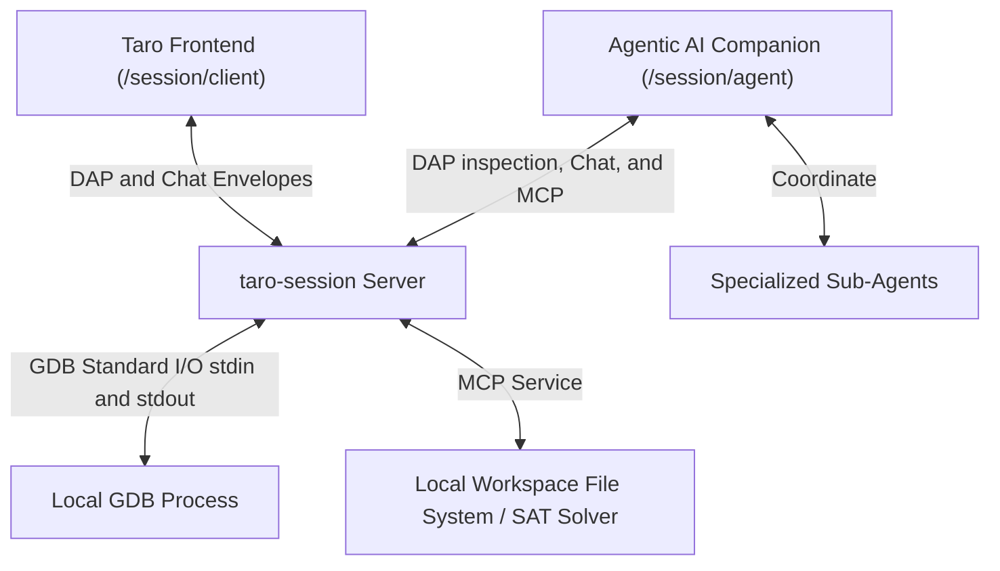

# `taro-session` (Agentic Debug Session Server) Architecture

This document specifies the comprehensive system architecture for the Taro Debugger Agentic AI Integration and the **`taro-session`** server utility. It outlines the dual-role connection topologies, message routing protocols, MCP (Model Context Protocol) interfaces, and formal constraint-solving diagnostics.

## 1. Overview

To provide a state-of-the-art intelligent debugging experience, Taro Debugger decouples low-level GDB process execution from cognitive reasoning. This is accomplished using a **Dual-Role Session Server Architecture** powered by the standalone **`taro-session`** command-line utility. Rather than running cognitive LLM engines inside the frontend browser sandbox or the GDB transport layer, a standalone external cognitive agent communicates with the persistent session server via multiplexed WebSockets.


[Diagram: Dual-Role WebSocket Bridge Flow — The Taro Frontend and the cognitive Agentic AI Companion establish separate WebSocket connections to the local `taro-session` Server. The Server multiplexes GDB standard I/O standard DAP commands, provides a direct chat sub-protocol between the client and the agent, coordinates specialized sub-agents, and hosts MCP services accessing the local file system and formal SAT solver analysis.]

---

## 2. Layer Responsibilities

The system consists of five distinct layers working in harmony:

### 2.1 Taro Debugger Frontend (Angular Web Client)
- Establishes a single WebSocket connection to `ws://localhost:8080/session/client`.
- Renders the graphical user interface (Standalone Components in Angular 21+).
- Encloses interactive diagnostic logs and frames user messages into rich `ChatMessageEnvelope` packets containing real-time debug scope context.
- Multiplexes chat dialogue rendering and standard DAP visual inspection panels.

### 2.2 `taro-session` Server (Node.js Host)
- Runs as a lightweight local CLI server (using the `ws` library).
- **CLI-Driven Startup Model**: Each `taro-session` process serves exactly one active debug session. It is started by specifying the session data path via a command-line argument:
  ```bash
  taro-session --session-path /path/to/session.tarodb
  ```
- **Automatic Session Restoration**: On launch, the server loads the configuration and breakpoints database from the file, immediately spawning the GDB target child process and pre-populating the context database.
- **Active Session Persistence**: Continuously auto-saves the active configuration, breakpoint database, chat dialogue logs, and memory context directly back to the database file specified by `--session-path`.
- **Orchestrates Debugger Lifecycle**: Spawns and manages GDB (`gdb --interpreter=dap`) as an isolated child process.
- **Stateful Event Broadcasting**: Acts as a stateful pub/sub event broker, broadcasting GDB's `stdout` and `stderr` streams simultaneously to both the frontend client and the AI agent.
- **Logical Multiplexing**: Routes logical sub-protocols (DAP requests vs. chat dialogue) based on message channel identifiers.
- **Hosts the MCP Server**: Provides controlled execution of local operations (file system reads, test runners, and symbolic solver tools).
- **Agent Memory Support**: Exposes dedicated MCP tools/APIs to read and write `MEMORY.md`, serving as the unified persistence and file I/O layer for the loosely-coupled AI companion's long-term cognitive memory.
- **Loose Coupling Design**: The AI Companion and the active Debug Session are loosely coupled. The Debug Session operates independently of the AI's lifecycle, allowing the server to handle session resume seamlessly regardless of whether the agent client is connected.
- **Orphan Prevention**: Implements strict process lifecycle cleanup, killing GDB on client disconnects to prevent orphan processes.


### 2.3 Agentic AI Companion (Cognitive Process Client)
- Connects independently to `ws://localhost:8080/session/agent`.
- Houses the LLM prompt templates, role-based system guidelines (`AGENTS.md`), private transient variables (`MEMORY.md`), and specific task-based instructions (`skills/`).
- Performs conversational debug reasoning with the user.
- Utilizes tool-calling to issue read-only DAP requests (`stackTrace`, `variables`) or MCP solver queries over the connection.

### 2.4 Specialized Sub-Agents
- Spawned dynamically by the Agentic AI Companion to handle segmented diagnostic tasks (e.g., GDB CLI diagnostic parsing, static code analysis, compiler warning resolution).
- Interact using structured multi-agent coordination envelopes over the agent channel.

### 2.5 GDB Debugger Engine (Target Process)
- Spawned as a child process of the Bridge.
- Communicates exclusively over stdin/stdout using standard JSON-based Debug Adapter Protocol (DAP) messages.
- Executes low-level target machine inspection (memory, register states, breakpoints).

---

## 3. API Contract & Communication Schemas

To ensure structural safety and type-safe routing, all messages exchanged between the entities conform to strict JSON schemas.

### 3.1 Connection Routing Endpoints
The local bridge exposes two primary connection routes:
- **Client Route**: `ws://localhost:8080/session/client`
- **Agent Route**: `ws://localhost:8080/session/agent`

### 3.2 Chat Envelope & Debug Context Schema
Conversational dialogue messages utilize a logical envelope containing a comprehensive snapshot of the active debugger state. This enables the Agentic AI to maintain complete context without triggering repetitive, high-latency socket requests.

```typescript
interface ChatMessageEnvelope {
  channel: 'chat';
  id: string;                 // Unique message identifier
  timestamp: string;          // ISO-8601 string timestamp
  sender: 'client' | 'agent'; // Message source
  content: string;            // Textual dialogue content (Markdown)
  context?: ChatDebugContext; // Attached session runtime state context
}

interface ChatDebugContext {
  activeSessionId: string;
  activeThreadId?: number;
  activeFrameId?: number;
  
  // Call stack trace at the moment the message was generated
  callStack?: {
    level: number;
    functionName: string;
    sourceFile: string;
    line: number;
  }[];

  // Variables evaluated in the current scopes
  variables?: {
    name: string;
    value: string;
    type: string;
    scope: 'local' | 'global' | 'register';
  }[];

  // Active breakpoints in the debug session
  breakpoints?: {
    sourceFile: string;
    line: number;
    verified: boolean;
  }[];

  // Code snippet surrounding the active program counter (PC)
  codeSnippet?: {
    sourceFile: string;
    startLine: number;
    lines: string[];
  };

  // Recent program stdout/stderr or DAP log entries for console context
  recentLogs?: {
    timestamp: string;
    category: 'system' | 'dap' | 'stdout' | 'stderr';
    message: string;
  }[];
}
```

### 3.3 Model Context Protocol (MCP) Interface
The Bridge hosts a local MCP server. The Agentic AI Companion invokes these server tools via standard JSON-RPC over `/session/agent`:

* **`read_workspace_file(path: string)`**: Reads a specific code file in the local workspace for static code review.
* **`get_build_errors()`**: Retrieves local compilation output streams to help resolve compile errors.
* **`run_local_test(testSuite: string)`**: Initiates vitest runs to execute regression checks.
* **`solve_memory_corruption(constraints: MemoryConstraint[])`**: A formal verification endpoint that interfaces with an SMT-lib solver (e.g., Z3). The agent inputs conditions (such as pointers offsets, loop indices, base sizes), and the tool solves for constraints that violate safety invariants, yielding formal counter-examples of overflows or memory bugs.
* **`write_agent_memory(content: string)`**: Writes the updated cognitive `MEMORY.md` contents back to the local workspace filesystem. This allows `taro-session` to serve as the physical file persistence layer for the agent client.
* **`read_agent_memory()`**: Reads `MEMORY.md` to retrieve the agent's long-term cognitive context upon session startup or re-attachment.


---

## 4. State Management & Data Persistence Matrix

To ensure modularity and crash resilience, **the `taro-session` Server is the primary owner of Debug Session Persistence**, providing a robust local persistent storage mechanism to support continuous session saving and resumption. 

The **AI Companion and the active Debug Session are loosely coupled**: the session operates and persists independently of the AI companion's connection state, allowing GDB execution, log buffering, and breakpoint tracking to survive agent client lifecycle events.

State management and data persistence are cleanly distributed across the layers as follows:| State Type | Primary Owner | Storage/Persistence Mechanism | Architectural Lifecycle |
| :--- | :--- | :--- | :--- |
| **Session Configurations** (paths, target binaries, arguments) | **`taro-session` Server** | Local Host Storage Directory (`config.json`). | Saved on creation. Loaded automatically when a session is resumed to relaunch GDB. |
| **Breakpoints & Watchpoints Database** | **`taro-session` Server** | Local Host Storage Directory (`breakpoints.json`). | Persisted continuously by the server. Restored by the server sending corresponding DAP requests to GDB on startup or session resume. |
| **Active Execution State** (active breakpoints, watchpoints, stack memory, register states) | **GDB Target Process** | Target process memory. | Dynamically managed by GDB. Lost completely if GDB terminates or crashes, but restored immediately by the server reloading the persisted database on session resume. |
| **Diagnostic Hypotheses & Cognitive State** | **Agentic AI Companion** | Local Host Storage Directory (`memory.md`). | Persisted directly to `memory.md` on the host by `taro-session`. Loosely coupled to the active debug session, allowing it to survive debugger restarts. |
| **I/O Streams & Logs** | **`taro-session` Server** | Local Host Storage Directory (`logs/` flat text files). | Logged continuously. Appended in real-time to allow direct inspection and complete chat and log reconstruction upon session resume. |

### 4.1 Unified Debug Session Directory (`.tarodb`)

To enable developers to inspect, modify, and easily track debugger states, the Taro ecosystem defines a filesystem directory structure named **`session.tarodb/`**. This folder consolidates all configs, log files, chat history, and cognitive memory files into discrete, human-readable flat files on disk:

```text
session.tarodb/
├── config.json         # JSON file for active debugger session launch properties
├── breakpoints.json    # JSON file containing list of active breakpoints & conditions
├── chat.json           # JSON file containing conversational chat history
├── memory.md           # The AI Companion's cognitive memory file (directly persisted Markdown)
└── logs/               # Log directory for real-time text output logging
    ├── stdout.log      # Flat text file appending target program standard output
    ├── stderr.log      # Flat text file appending target program standard error
    └── dap.log         # Flat text file logging raw DAP request/response events
```

#### 4.1.1 Config Schema (`config.json`)
```json
{
  "version": "1.0.0",
  "exportedAt": "2026-05-24T10:30:00Z",
  "configuration": {
    "program": "/path/to/binary",
    "args": ["-v"],
    "cwd": "/path/to/workspace",
    "env": {
      "DEBUG": "1"
    }
  }
}
```

#### 4.1.2 Breakpoint Schema (`breakpoints.json`)
```json
{
  "breakpoints": [
    {
      "sourceFile": "main.cpp",
      "line": 42,
      "condition": "x > 10",
      "hitCount": 2
    }
  ]
}
```

#### 4.1.3 Chat Dialogue Schema (`chat.json`)
```json
{
  "chatHistory": [
    {
      "channel": "chat",
      "id": "msg-001",
      "timestamp": "2026-05-24T10:31:00Z",
      "sender": "client",
      "content": "Why did we stop here?"
    }
  ]
}
```

#### Session Persistence & Recovery Flow:
- **Loading & Resume (Startup)**: When `taro-session` is launched via `--session-path /path/to/session.tarodb`:
  1. **Directory Read**: The server reads the existing `session.tarodb/` directory, parsing the `config.json`, `breakpoints.json`, `chat.json`, and cognitive `memory.md` files.
  2. **Subprocess Spawning**: The GDB target child process is spawned, and the server automatically re-applies the breakpoint table to the GDB session.
  3. **UI / Agent Re-attachment**: When the Taro Frontend and the loosely-coupled AI Companion connect to the server, they query `taro-session` to load and re-populate the complete chat logs, UI breakpoint registries, and cognitive context (`memory.md` variables).
- **Auto-Saving (Runtime)**: During active debugging, `taro-session` acts as a write-through cache:
  1. All new DAP log streams, console stdout/stderr traces, and breakpoints are appended continuously to the local `.tarodb/` directory files on the host's disk.
  2. Whenever the AI companion updates its cognitive invariants (via the `write_agent_memory` MCP tool), the server immediately writes the contents directly to the physical `memory.md` file in that directory.
  3. **Sharing/Archiving**: Because session databases are standard directories containing flat human-readable files on the local filesystem, developers can share or archive debug sessions simply by zipping or copying the `session.tarodb/` folder at the OS level—requiring no server-side import/export APIs.

---

## 5. Constraints

### 5.1 Security and Loopback Boundary
- **Loopback Enforcement**: The WebSocket Bridge is strictly restricted to binding on `localhost` (`127.0.0.1`). Exposing endpoints to the public WAN is forbidden.
- **Authentication**: In v1.0 scope, authentication tokens and SSL/TLS wrapping are out of scope. Security is guaranteed by local loopback isolation.

### 5.2 Lifecycle and Eviction Rules
- **1-to-1 Process and Session Mapping**: Each launched Bridge Server process is dedicated strictly to serving one debug session instance loaded via the `--session-path` CLI argument. It is not a multi-tenant service. To manage multiple active sessions, the user spins up multiple separate Bridge Server processes on distinct port allocations (e.g. `:8080`, `:8081`), each running its own isolated GDB instance and pointing to its own session database.
- **Immediate Eviction & Teardown**: To prevent orphan processes, standard process termination follows a cascading kill matrix:
  - If `/session/client` disconnects, the Bridge immediately triggers GDB SIGTERM -> SIGKILL (2s grace).
  - Standard IO streams and socket buffers are immediately cleared and garbage collected.


### 5.3 Documentation and Language Compliance
- **US English Only**: All documentation, interface strings, variables, schemas, and inline comments must strictly conform to US English.
- **Filename Convention**: File names within `docs/` must strictly use lowercase kebab-case.

