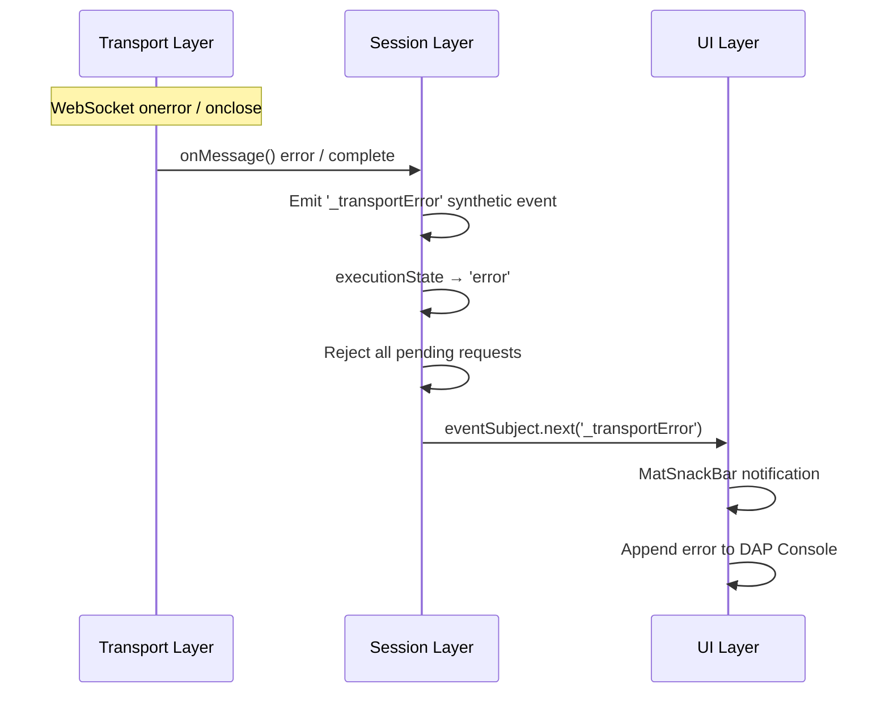
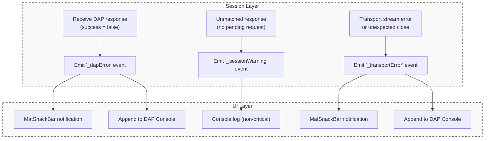

# Error Handling Architecture

This document corresponds to System Specification [§7.1](../system-specification.md#71-connection-error-handling) and [§7.2](../system-specification.md#72-dap-server-error-handling) error handling requirements, describing the responsibility division and event transmission mechanism across layers.

## 1. Connection Error Handling

Connection errors originate from the Transport layer, and the handling flow spans all three layers:

| Error Scenario | Transport Layer Behavior | Session Layer Behavior | UI Layer Behavior |
| --- | --- | --- | --- |
| **Connection timeout** | `connect()` Observable error | `startSession()` reject | `ErrorDialog` (retry / go back) |
| **Connection lost** | `connectionStatus$` → `false` `onMessage()` complete | Emit `_transportError` event `executionState` → `error` | `MatSnackBar` notification + Console log |
| **WebSocket error** | `onerror` → `connectionStatus$` `false` `onMessage()` error | Emit `_transportError` event `executionState` → `error` | `MatSnackBar` notification + Console log |

**Recovery flow**: Users must use the Restart/Reconnect button in the UI layer to call `disconnect()` + `startSession()` to reconnect. If in `error` state, `disconnect()` internally calls `reset()` to return to `idle`.

## 2. DAP Server Error Handling

DAP protocol-level errors are detected by the Session layer and transmitted to the UI layer for display via the **Synthetic Event** pattern, adhering to R7 (Services must not inject UI components):

| Error Scenario | Session Layer Behavior | UI Layer Behavior |
| --- | --- | --- |
| **DAP error response** (`success=false`) | Emit `_dapError` synthetic event Reject corresponding Promise | `MatSnackBar` displays command + error message. **Exception**: Silent requests (e.g., `evaluate`) bypass the event and toast; error is handled locally by the caller. |
| **Invalid DAP response** (unknown `request_seq`) | Emit `_sessionWarning` synthetic event | Console log (non-critical) |
| **Unexpected process termination** (`exited` event, exit code ≠ 0) | Forward `exited` event normally | Console log |
| **Unexpected disconnect** (Transport stream interrupted) | Emit `_transportError` synthetic event `executionState` → `error` | `MatSnackBar` notification + Console log |

### 2.1 Synthetic Event Naming Convention

To avoid conflicts with standard DAP event names, all synthetic events generated by the Session layer are prefixed with an underscore `_`:

| Synthetic Event | Trigger Condition | Body Structure |
| --- | --- | --- |
| `_dapError` | DAP Response `success=false` | `{ command: string; message: string }` |
| `_transportError` | Transport stream error / complete | `{ reason: 'error' \| 'disconnected'; message: string }` |
| `_sessionWarning` | Session-layer internal protocol anomaly (e.g., unknown `request_seq`) | `{ message: string }` |
