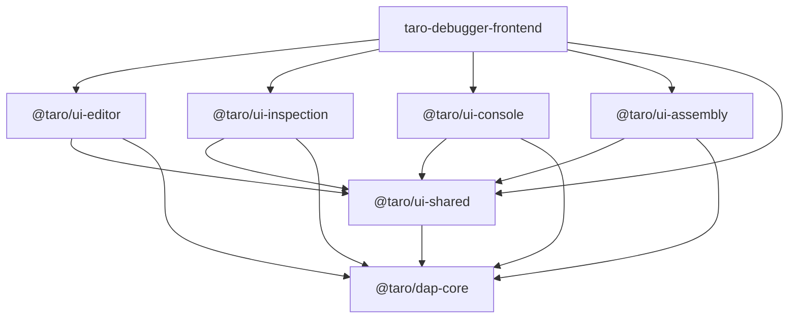

# Monorepo Build & Resolution Standards

This document defines the architectural standards for managing the workspace structure, library resolution, and build-time constraints within the taro-debugger monorepo.

## 1. Library Resolution Strategy: Binary-Linked (Dist-Based)

As of April 2026, the project has transitioned from Source-Linked to **Binary-Linked (Dist-Based)** path mappings for all internal `@taro/*` libraries.

### 1.1 Decision: Use `./dist/` over `./projects/*/src/public-api.ts`

To ensure compiler stability and enforce strict modularity, all internal libraries must be resolved via their compiled artifacts in the `dist` folder.

| Feature | Requirement | Reason |
| :--- | :--- | :--- |
| **In-Workspace Resolution** | `tsconfig.json` paths must point to `./dist/<lib-name>` | Bypasses `ngtsc` internal reference tracking bugs in Angular 21/TS 5.9. |
| **Contract Enforcement** | Only symbols in `public-api.ts` are accessible | Prevents "module bleed" where internal implementation details are accidentally consumed. |
| **Build Prerequisite** | Libraries must be built before the consumer builds | Ensures that only valid, packagable libraries are integrated into the application. |

### 1.2 Impact on Development Workflow

1. **Fresh Workspace**: After a clean clone or `dist` sweep, you must run a full library build:
   `npx ng build dap-core && npx ng build ui-shared && npx ng build ui-editor && npx ng build ui-console && npx ng build ui-assembly && npx ng build ui-inspection`
2. **Active Library Development**: When modifying a library, use `--watch` to maintain the `dist` artifact:
   `ng build <lib-name> --watch`
3. **Application Serve**: The `ng serve` command remains the entry point for frontend development but depends on the presence of existing `dist` bundles for all imported `@taro/*` modules.

## 2. Dependency Hierarchy

To avoid circular dependencies and ensure a stable build order, libraries should follow this hierarchical dependency model:

1. **Core Domain Layer**: `@taro/dap-core` (No internal dependencies)
2. **Shared UI Utilities**: `@taro/ui-shared` (Layout tokens, generic panels, dialogs)
3. **Functional UI Layers**: `@taro/ui-editor`, `@taro/ui-console`, `@taro/ui-assembly`, `@taro/ui-inspection`
4. **Application Layer**: `taro-debugger-frontend` (Consumes all of the above)

> [Diagram: Monorepo library dependency graph. The application depends on all internal libraries. Functional UI libraries (Editor, Inspection, Console, Assembly) depend on the Shared library. All internal libraries depend on the Core domain library.]

---

## 3. Exclusion Boundaries

- This document does NOT cover the implementation logic of the libraries (see specific `docs/architecture/*.md` files).
- This document does NOT cover the CI/CD pipeline configuration (see GitHub Actions or specific build scripts).

## 4. Cascading Watch Strategy (Dist-Based Development)

To ensure that the development environment exactly mirrors production behavior (Binary-Linked), the workspace supports a **Cascading Watch** mechanism. This is required because intermediate libraries must be consumed in their compiled Angular Package Format.

### 4.1 Execution Sequence

The cascading watch follows a strict sequence dependency based on the [Dependency Hierarchy](#2-dependency-hierarchy):

1. **Layer 1 (Bottom)**: Start the core dependency watch: `ng build dap-core --watch`.
2. **Layer 2 (Shared)**: Once Core is compiled, start the foundation watch: `ng build ui-shared --watch`.
3. **Layer 3 (Functional)**: Once Shared is compiled, start the functional library watches (e.g., `ng build ui-inspection --watch`).
4. **Layer 4 (Host)**: Once all libraries are stable, start the host application: `ng serve taro-debugger-frontend`.

### 4.2 Performance Considerations

- **Cascading Trigger**: Modifying a file in `dap-core` triggers a "domino effect": Core compiles -> Disk write -> UI-Shared detects change -> UI-Shared compiles -> Disk write -> UI-Inspection detects change -> Host reloads.
- **Resource Intensity**: This mode significantly increases CPU and Disk I/O load.
- **Reliability (Failure Modes)**:
  - **File Locking**: Rapid sequential writes across layers can cause OS-level file access conflicts (EPERM/EBUSY), which may cause library watchers to hang or crash.
  - **Partial State Reloads**: The host application may trigger a browser reload while intermediate libraries are still re-compiling. This often results in runtime errors due to mismatched code versions.
  - **Recovery**: While the `ng serve` process usually recovers automatically once the disk stabilizes, the browser-side HMR may crash. **Manual browser refresh (F5)** is typically required to restore application state.
