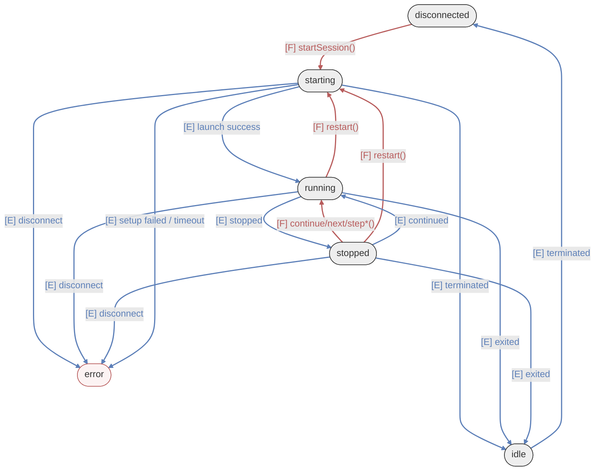
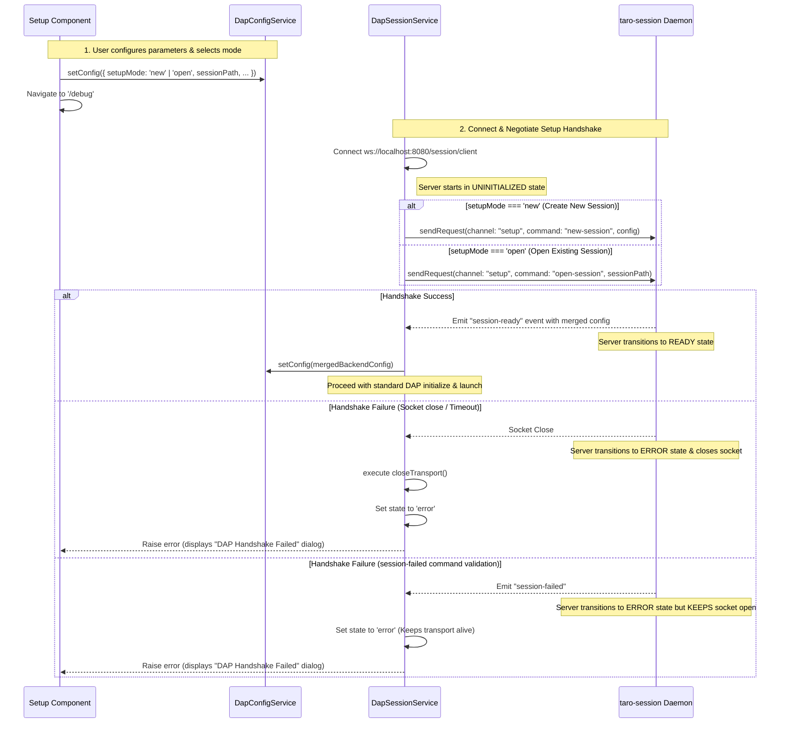

# Session Layer Architecture

## 1. Responsibilities

- Manage the **DAP session lifecycle** (initialize → launch/attach → debug → disconnect)
- Manage **Transport instances** (lazy creation based on config, destruction on disconnect)
- Delegate **request/response pairing**, sequence number generation, and timeout bookkeeping to the standalone `DapRequestBroker` service
- Manage the **execution state machine** (`ExecutionState`)
- **Intercept and process Transport events**, including the generation of **Synthetic Events** (`_dapError`, `_transportError`)
- Maintain **Single Source of Truth (SSOT)** for verified breakpoints across all source files
- Manage **Thread state** (thread list tracking, active thread selection, stop reasons)
- Publish **Session-level Observables** (`connectionStatus$`, `executionState$`, `breakpoints$`, `threads$`). Note: Execution state consumption is strictly reactive; the synchronous getter is prohibited to ensure SSOT integrity.

## 2. Execution State Machine

The state machine is driven by two distinct types of inputs: **Imperative Functions** (User intent) and **Asynchronous Events** (Adapter status).



> [!NOTE]
> **Diagram: Execution State Machine Flow**
> The state machine transitions between five primary states: `idle`, `starting`, `running`, `stopped`, and `error`.
> - **Imperative transitions (Red)** are triggered by User functions like `startSession()`, `continue()`, `next()`, and `stepIn/Out()`.
> - **Asynchronous transitions (Blue)** are triggered by Adapter events like `stopped`, `continued`, and `terminated`.
> - **Error state** is reached via unexpected disconnections or setup handshake failures during starting state. The public recovery path is `stop()`, which returns early (no request sent) when in `error` state, allowing `restart()` or `startSession()` to be called next.

<!-- -->

> [!IMPORTANT]
> **R-ERR1 — Mandatory Transport Close on Error Entry**: Any code path that transitions the execution state to `error` **MUST** call `closeTransport()` before setting the new state. This guarantees that no stale transport subscriptions or dangling socket references survive past the error boundary.

### 2.1 Trigger Types

To ensure predictable state transitions, the Session layer distinguishes between the "User's intent" and the "Target's reality":

| Type | Color Code | Description |
| :--- | :--- | :--- |
| <font color="#B85C5C">**[F] Function**</font> | **Muted Red** | **Active Input**: Imperative methods called by the UI or User (e.g., `startSession()`, `continue()`). These initiate state changes and usually return a `Promise`. |
| <font color="#5C7FB8">**[E] Event**</font> | **Muted Blue** | **Passive Input**: Asynchronous notifications from the Debug Adapter (e.g., `stopped`, `terminated`). These inform the Session of the actual state of the debugged process. |

> [!NOTE]
> Some transitions can be triggered by both. For example, moving from `stopped` to `running` can occur via a user calling `continue()` (**[F]**) or the adapter autonomously resuming execution and sending a `continued` event (**[E]**).

### 2.2 State Definitions

`ExecutionState` type definition and descriptions:

```typescript
type ExecutionState = 'idle' | 'starting' | 'running' | 'stopped' | 'error';
```

| State | Description |
| :--- | :--- |
| `idle` | No connection established, or final state after target exit. Re-running requires `startSession()`. |
| `starting` | Transitional: establishing connection, `initialize` handshake, and `launch`/`attach` flow. |
| `running` | The debug target is executing. DAP is busy; inspection requests (stack/vars) are discouraged. |
| `stopped` | Program paused (breakpoint/step). Thread, stack, and variable queries are available. |
| `error` | Unexpected anomaly (e.g., transport crash). The public recovery path is `stop()`, which returns early without sending any DAP request (same as `idle`). The internal `disconnect()` also treats `error` as a safe early-return since the transport is already closed. **Invariant (R-ERR1)**: `closeTransport()` is always called before this state is set, ensuring no dangling transport references. |

## 3. Event Processing & Synthetic Events

Raw events from the Transport layer are processed by Session's `handleTransportEvent()` before being emitted to the UI. Additionally, the Session layer generates **Synthetic Events** to bridge protocol-level or infrastructure-level issues to the UI without polluting the core DAP event stream:

| Synthetic Event | Trigger | Purpose | Exception |
| :--- | :--- | :--- | :--- |
| `_dapError` | DAP response `success: false` | Notify UI of command failures (e.g., "Step failed"). | **Silent Protocol**: Commands sent with `silentError: true` (e.g., `evaluate`) do NOT emit this event. |
| `_transportError` | Socket close or timeout | Notify UI of connection loss after debug session is established or during handshake. | None |
| `_sessionWarning` | Request timeout or unknown response | Diagnostic warnings for mismatched sequences. | None |

## 4. Connection Status Bridging

The `DapSessionLifecycle` service acts as a stable proxy for the volatile lifecycle of transport instances. Since transport instances are lazily created during `startSession()` and destroyed during `disconnect()`, direct UI subscriptions to the transport would be fragile and prone to memory leaks.

The `DapSessionLifecycle` service bridges the Transport's `connectionStatus$` via an internal `BehaviorSubject<boolean>` to provide the following architectural guarantees:

- **Lifecycle Decoupling**: UI components can subscribe to `connectionStatus$` as soon as the application starts. They do not need to worry about whether a transport instance currently exists or is being re-instantiated during a restart.
- **Consistent Initial State**: By using a `BehaviorSubject` initialized to `false`, the UI receives a valid connection state immediately upon subscription, preventing "undefined" UI flickers during the startup handshake.
- **Stable Observable Reference**: When a new transport is created (e.g., switching from WebSocket to IPC), the `DapSessionLifecycle` service internally manages the re-subscription logic. It pipes the new transport's status into the same subject, ensuring that external UI subscriptions remain valid and uninterrupted throughout the application's runtime.
- **Single Source of Truth (SSOT)**: This bridging ensures that all components see a unified connection state, even if the underlying transport is in a transitional state during a handshake.

## 5. Transport Lifecycle

Transport instances are **lazily created** via `TransportFactoryService` during `startSession()`.

| Timing | Operation |
| --- | --- |
| `constructor()` | Transport is `undefined`. |
| `startSession()` | Created based on `config.transportType`. |
| `stop()` (public) | Sends `terminate`, awaits the `terminated` event, then internally calls `disconnect()`. Returns immediately (no request sent) when state is `idle`, `disconnected`, or `error`. |
| `disconnect()` (private) | Sends a DAP `disconnect` request, clears message subscriptions, and resets state to `disconnected`. Only reachable via the `terminated` event handler or the `idle`-state internal path. |
| Error entry (R-ERR1) | **`closeTransport()` is called before the state is set to `error`** — this unsubscribes the message stream, calls `transport.disconnect()`, nulls the transport reference, and sets `connectionStatus$` to `false`. This invariant applies to all active-session error code paths (`handleIncomingTransportError`, `handleIncomingTransportComplete`). During the `'starting'` handshake phase, transport errors are caught by `startSession()` and reset state to `'error'` (see §9.3). |

## 6. Breakpoint Management (SSOT)

The Session layer maintains a global map of verified breakpoints (`breakpointsMap`) which serves as the Single Source of Truth for the entire application.

### 6.1 System Breakpoints (WI-123)

To facilitate standardized "Stop on Entry" behavior, the Session layer manages **System Breakpoints**:
- **Mechanism**: Symbolic breakpoints set via `setFunctionBreakpoints` (e.g., for `main`).
- **Isolation**: Verified IDs for these breakpoints are stored in a private `systemBreakpointIds` set.
- **Stop Reasoning**: When execution stops at a system breakpoint, the Session layer overrides the generic stop reason with a specific description (e.g., "Paused at entry (main)").
- **UI Filtering**: These breakpoints are intentionally excluded from the user-facing `breakpointsMap` to prevent cluttering the UI with infrastructure-level stops.

### 6.2 Per-File Serialization (R-CS4)

To prevent race conditions when the user rapidly toggles breakpoints, the Session implements **last-write-wins serialization** per file:
- If a `setBreakpoints` request is in-flight for `file_A.c`, subsequent requests for the same file are queued.
- Only the **latest** requested state is sent once the current request completes; intermediate states are discarded.

### 6.2 Data Flow

1. UI calls `setBreakpoints(path, lines)`.
2. Session filters for enabled-only breakpoints and sends to Adapter.
3. Adapter returns `VerifiedBreakpoint[]` (potentially relocated lines).
4. Session updates `breakpointsMap` and emits via `breakpoints$`.

## 7. Thread & Inspection Management

The Session layer automates thread and context management to simplify UI implementation:

### 7.1 Thread Selection

- **DapThreadSession Object Representation**: Injected threads are managed as rich `DapThreadSession` instances. To prevent circular dependencies, each instance is injected with a narrow `DapRequestSender` interface (exposing only `sendRequest()` and `executionState`) instead of the full `DapSessionService`. Each instance encapsulates its own thread identity, in-flight request coalescing promise, and transient stack frame cache to prevent redundant traffic.
- **Thread Event Storm Mitigation**: On multi-threaded targets, GDB can flood the adapter with rapid thread `started` / `exited` event waves. `DapThreadManager` buffers these event storms over a **50ms temporal window** and flushes them to the UI in a single reactive transaction, preventing DOM thrashing.
- **Automatic Thread Refresh**: On every `stopped` event, `DapThreadManager` queries the adapter's threads and updates `threadsSubject` with batch-instantiated `DapThreadSession` objects.
- **Active Thread Selection**: If the `stopped` event contains a `threadId`, the corresponding `DapThreadSession` is automatically set as the `activeThread`.
- **Contextual Stop Reason**: `DapThreadManager` extracts `description` or `reason` from the `stopped` event body and writes it to the corresponding `DapThreadSession` via `setStopReason()`. Consumers read it via the `stopReason` getter on each thread object.
- **Manual Selection**: `setCurrentThread(thread)` allows the user to switch inspection context, triggering a synthetic `stopped` event to force UI components to reload their stacks.
- **Cache Invalidation**: Upon any stepping command (`next`, `continue`, `stepIn`, `stepOut`) or receiving a `'continued'` event, `DapThreadManager` automatically clears the transient caches of all active `DapThreadSession` objects.

> [!NOTE]
> **Multi-Threaded Execution (Non-Stop Mode)**: While the Session layer is designed to track multiple threads, advanced Non-Stop mode behavior (independent thread control) is currently a planned feature. See [Non-Stop Mode UI Integration](../archive/specs/non-stop-mode-ui.md) for the design specification.

### 7.2 Context Switching (R-CS3)

When the user switches between call stack frames, the system enforces a **"Latest Selection Wins"** policy.
- **Mechanism**: The UI uses `switchMap` on the frame selection stream.
- **Behavior**: Selecting a new frame automatically cancels any in-flight `scopes` or `variables` requests for the previous frame. Stale responses are discarded to prevent rendering incorrect data for the active context.

## 8. Public API

### 8.1 Observables (Reactive State)

| API | Type | Description |
| --- | --- | --- |
| `connectionStatus$` | `Observable<boolean>` | Connection status (defaults to `false`). |
| `executionState$` | `Observable<ExecutionState>` | Current debug execution state. |
| `breakpoints$` | `Observable<Map<string, VerifiedBreakpoint[]>>` | SSOT for verified breakpoints. |
| `threads$` | `Observable<DapThreadSession[]>` | List of rich `DapThreadSession` objects available. |
| `activeThread$` | `Observable<DapThreadSession \| null>` | The thread currently active/selected for inspection. |
| `onEvent()` | `Observable<DapEvent>` | Processed event stream (includes synthetic events). |
| `onTraffic$` | `Observable<any>` | Raw diagnostic DAP traffic. |
| `commandInFlight$` | `Observable<boolean>` | True while any control command is in-flight. |

### 8.2 Methods (Commands)

| API | Type | Description |
| --- | --- | --- |
| `startSession()` | `Promise<DapResponse>` | Connect → Initialize → Launch/Attach flow. |
| `stop()` | `Promise<void>` | Sends `terminate` and awaits the `terminated` event. Returns early (no-op) if state is `idle`, `disconnected`, or `error`. |
| `restart()` | `Promise<void>` | Soft restart: `stop()` → `startSession()`. Returns early if state is `idle` or `starting`. |
| `continue() / next() / ...` | `Promise<DapResponse>` | Standard debug control commands. |
| `nextInstruction()` | `Promise<DapResponse>` | Instruction-level step over. |
| `setBreakpoints(p, l)` | `Promise<VerifiedBreakpoint[]>` | Sync breakpoints with serialization logic. |
| `toggleBreakpointEnabled()` | `Promise<void>` | Toggle local state and re-sync with adapter. |
| `setFunctionBreakpoints(b)` | `Promise<any[]>` | Sync symbolic breakpoints with the adapter. |
| `setCurrentThread(thread)` | `void` | Set active thread and trigger UI context refresh. |
| `clearAllThreadCaches()` | `void` | Force eviction of transient cached frames on all threads. |
| `source(args)` | `Promise<DapResponse>` | Fetch source content (semantic wrapper). |
| `loadedSources()` | `Promise<DapResponse>` | Fetch all loaded sources (semantic wrapper). |
| `readMemory(args)` | `Promise<ReadMemoryResponse>` | Low-level protocol memory read. |
| `writeMemory(args)` | `Promise<WriteMemoryResponse>` | Low-level protocol memory write. |

## 9. Configuration Flow (DapConfig) & Setup Handshake

To prevent premature DAP initializations before backend readiness, the frontend establishes a loopback WebSocket connection and completes a custom `"setup"` channel handshake protocol before initiating the standard DAP connection cycle.

### 9.1 Handshake Sequence Diagram



> [Diagram: Configuration flow and setup handshake sequence. Demonstrates how `SetupComponent` stores parameters in `DapConfigService` before routing to `/debug`. `DapSessionService` then creates a WebSocket connection and executes either a `new-session` or `open-session` command. Upon receiving `session-ready`, the backend config is merged back to the client, and DAP initialization commences. If the handshake fails, the transport is transitioned to `'error'`. If setup validation fails, the socket is kept alive to support fast retries.]

### 9.2 Dynamic Configuration Synchronizations

- **Mode Selection**: The client configuration defines a `setupMode` which can be `'new'` (creating a new session directory) or `'open'` (loading an existing session directory).
- **Properties Merging**: Upon a successful `session-ready` response, the backend returns the authoritative launch configuration persisted in the session folder. `DapSessionLifecycle` merges these properties back into the client-side `DapConfigService` to ensure a single source of truth (SSOT).
- **Executable Bypass Guard**: Under `'open'` mode, the debugger starts with an empty executable path configuration on boot, since settings are resolved dynamically from the backend handshake. `DebuggerComponent.ngOnInit()` bypasses empty executable validation guards when `setupMode === 'open'`, preventing startup locking.

### 9.3 Handshake Reliability & Error Recovery

- **Starting to Error Transition**: If setup fails (either via a `session-failed` event or a transport timeout), `DapSessionService` transitions the execution state from `'starting'` directly to `'error'`.
- **Fast Retry Socket Retention**: To prevent unnecessary socket teardown/reconnect cycles when a setup command fails validation (e.g., creating a new session on a path that already exists):
  1. The `taro-session` backend broadcasts the `session-failed` event and transitions to `'ERROR'`, but keeps the WebSocket connection alive.
  2. The client transitions to `'error'` and bubbles up the exception to open the failure dialog, while leaving the transport connected.
  3. If the user clicks **RETRY**, `startSession()` reuses the active WebSocket connection to transmit the updated setup command. The backend (configured to accept setup commands in the `'ERROR'` state) transitions back to `'INITIALIZING'` to re-attempt execution, bypassing socket reconnect latency.
- **Graceful Resource Reclamation**: If the user clicks **GO BACK** instead of retrying:
  1. The `DebuggerComponent.goBack()` method executes `dapSession.stop()`.
  2. Because the active transport is still open, the `'error'` case in `stop()` calls `closeTransport()` to terminate the connection cleanly and resets the execution state to `'disconnected'`, preventing background socket or timer leaks.

### 9.4 Electron Specifics (Bridge Management)

- **HashLocationStrategy**: Uses `withHashLocation()` to ensure reloads work within Electron's `file://` protocol.
- **Main Process Isolation**: Native logic is gated behind the Electron Preload bridge.
- **WebSocket Relay**: The Main process relay requires binary payloads to be `Blob` instances.
