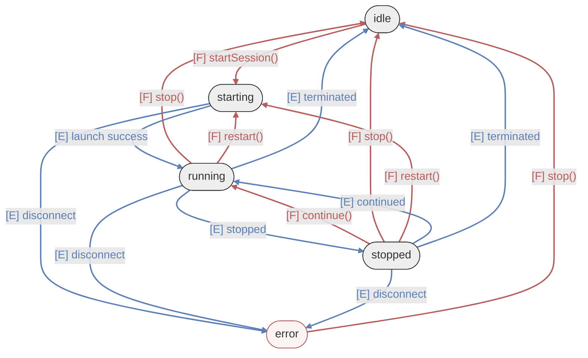
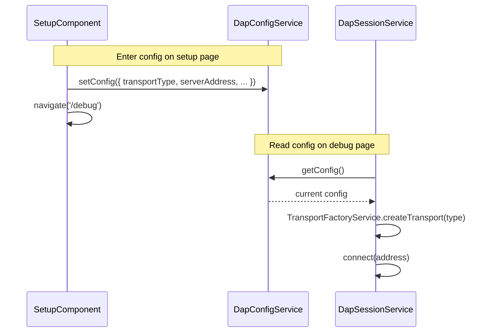

# Session Layer Architecture

## 1. Responsibilities

- Manage the **DAP session lifecycle** (initialize → launch/attach → debug → disconnect)
- Manage **Transport instances** (lazy creation based on config, destruction on disconnect)
- Maintain **request/response pairing** (seq → pending request mapping)
- Manage the **execution state machine** (`ExecutionState`)
- **Intercept and process Transport events**, including the generation of **Synthetic Events** (`_dapError`, `_transportError`)
- Maintain **Single Source of Truth (SSOT)** for verified breakpoints across all source files
- Manage **Thread state** (thread list tracking, active thread selection, stop reasons)
- Publish **Session-level Observables** (`connectionStatus$`, `executionState$`, `breakpoints$`, `threads$`). Note: Execution state consumption is strictly reactive; the synchronous getter is prohibited to ensure SSOT integrity.

## 2. Execution State Machine

The state machine is driven by two distinct types of inputs: **Imperative Functions** (User intent) and **Asynchronous Events** (Adapter status).



### 2.1 Trigger Types

To ensure predictable state transitions, the Session layer distinguishes between the "User's intent" and the "Target's reality":

| Type | Color Code | Description |
| :--- | :--- | :--- |
| <font color="#B85C5C">**[F] Function**</font> | **Muted Red** | **Active Input**: Imperative methods called by the UI or User (e.g., `startSession()`, `continue()`). These initiate state changes and usually return a `Promise`. |
| <font color="#5C7FB8">**[E] Event**</font> | **Muted Blue** | **Passive Input**: Asynchronous notifications from the Debug Adapter (e.g., `stopped`, `terminated`). These inform the Session of the actual state of the debugged process. |

> [!NOTE]
> Some transitions can be triggered by both. For example, moving from `stopped` to `running` can occur via a user calling `continue()` (**[F]**) or the adapter autonomously resuming execution and sending a `continued` event (**[E]**).

### 2.2 State Definitions

`ExecutionState` type definition and descriptions:

```typescript
type ExecutionState = 'idle' | 'starting' | 'running' | 'stopped' | 'error';
```

| State | Description |
| :--- | :--- |
| `idle` | No connection established, or final state after target exit. Re-running requires `startSession()`. |
| `starting` | Transitional: establishing connection, `initialize` handshake, and `launch`/`attach` flow. |
| `running` | The debug target is executing. DAP is busy; inspection requests (stack/vars) are discouraged. |
| `stopped` | Program paused (breakpoint/step). Thread, stack, and variable queries are available. |
| `error` | Unexpected anomaly (e.g., transport crash). Requires calling `stop()` to return to `idle`. |

## 3. Event Processing & Synthetic Events

Raw events from the Transport layer are processed by Session's `handleTransportEvent()` before being emitted to the UI. Additionally, the Session layer generates **Synthetic Events** to bridge protocol-level or infrastructure-level issues to the UI without polluting the core DAP event stream:

| Synthetic Event | Trigger | Purpose |
| :--- | :--- | :--- |
| `_dapError` | DAP response `success: false` | Notify UI of command failures (e.g., "Step failed"). |
| `_transportError` | Socket close or timeout | Notify UI of connection loss or handshake failure. |
| `_sessionWarning` | Request timeout or unknown response | Diagnostic warnings for mismatched sequences. |

## 4. Connection Status Bridging

The `DapSessionService` acts as a stable proxy for the volatile lifecycle of transport instances. Since transport instances are lazily created during `startSession()` and destroyed during `disconnect()`, direct UI subscriptions to the transport would be fragile and prone to memory leaks.

The Session layer bridges the Transport's `connectionStatus$` via an internal `BehaviorSubject<boolean>` to provide the following architectural guarantees:

- **Lifecycle Decoupling**: UI components can subscribe to `connectionStatus$` as soon as the application starts. They do not need to worry about whether a transport instance currently exists or is being re-instantiated during a restart.
- **Consistent Initial State**: By using a `BehaviorSubject` initialized to `false`, the UI receives a valid connection state immediately upon subscription, preventing "undefined" UI flickers during the startup handshake.
- **Stable Observable Reference**: When a new transport is created (e.g., switching from WebSocket to IPC), the Session layer internally manages the re-subscription logic. It pipes the new transport's status into the same subject, ensuring that external UI subscriptions remain valid and uninterrupted throughout the application's runtime.
- **Single Source of Truth (SSOT)**: This bridging ensures that all components see a unified connection state, even if the underlying transport is in a transitional state during a handshake.

## 5. Transport Lifecycle

Transport instances are **lazily created** via `TransportFactoryService` during `startSession()`.

| Timing | Operation |
| --- | --- |
| `constructor()` | Transport is `undefined`. |
| `startSession()` | Created based on `config.transportType`. |
| `disconnect()` | Calls `transport.disconnect()`, clears message subscriptions, and resets state. |

## 6. Breakpoint Management (SSOT)

The Session layer maintains a global map of verified breakpoints (`breakpointsMap`) which serves as the Single Source of Truth for the entire application.

### 6.1 Per-File Serialization (R-CS4)

To prevent race conditions when the user rapidly toggles breakpoints, the Session implements **last-write-wins serialization** per file:
- If a `setBreakpoints` request is in-flight for `file_A.c`, subsequent requests for the same file are queued.
- Only the **latest** requested state is sent once the current request completes; intermediate states are discarded.

### 6.2 Data Flow

1. UI calls `setBreakpoints(path, lines)`.
2. Session filters for enabled-only breakpoints and sends to Adapter.
3. Adapter returns `VerifiedBreakpoint[]` (potentially relocated lines).
4. Session updates `breakpointsMap` and emits via `breakpoints$`.

## 7. Thread & Inspection Management

The Session layer automates thread and context management to simplify UI implementation:

- **Automatic Thread Refresh**: On every `stopped` event, the Session automatically calls `threads()` and updates `threadsSubject`.
- **Active Thread Selection**: If the `stopped` event contains a `threadId`, it is automatically set as the `activeThreadId`.
- **Contextual Stop Reason**: The Session extracts `description` or `reason` from the `stopped` event body and exposes it via `stopReason$`.
- **Manual Selection**: `setCurrentThread(id)` allows the user to switch inspection context, triggering a synthetic `stopped` event to force UI components to reload their stacks.

## 8. Public API

### 8.1 Observables (Reactive State)

| API | Type | Description |
| --- | --- | --- |
| `connectionStatus$` | `Observable<boolean>` | Connection status (defaults to `false`). |
| `executionState$` | `Observable<ExecutionState>` | Current debug execution state. |
| `breakpoints$` | `Observable<Map<string, VerifiedBreakpoint[]>>` | SSOT for verified breakpoints. |
| `threads$` | `Observable<DapThread[]>` | List of threads available in the adapter. |
| `activeThreadId$` | `Observable<number \| null>` | The thread currently selected for inspection. |
| `stopReason$` | `Observable<string \| null>` | Reason for the current stop (e.g., "breakpoint"). |
| `onEvent()` | `Observable<DapEvent>` | Processed event stream (includes synthetic events). |
| `onTraffic$` | `Observable<any>` | Raw diagnostic DAP traffic. |
| `commandInFlight$` | `Observable<boolean>` | True while any control command is in-flight. |

### 8.2 Methods (Commands)

| API | Type | Description |
| --- | --- | --- |
| `startSession()` | `Promise<DapResponse>` | Connect → Initialize → Launch/Attach flow. |
| `stop()` | `Promise<void>` | Terminate (if supported) → Disconnect fallback. |
| `restart()` | `Promise<void>` | Restart (if supported) → Soft restart fallback. |
| `disconnect(options?)` | `Promise<void>` | Calm disconnect with `terminateDebuggee` control. |
| `continue() / next() / ...` | `Promise<DapResponse>` | Standard debug control commands. |
| `nextInstruction()` | `Promise<DapResponse>` | Instruction-level step over. |
| `setBreakpoints(p, l)` | `Promise<VerifiedBreakpoint[]>` | Sync breakpoints with serialization logic. |
| `toggleBreakpointEnabled()` | `Promise<void>` | Toggle local state and re-sync with adapter. |
| `setCurrentThread(id)` | `void` | Set active thread and trigger UI context refresh. |
| `source(args)` | `Promise<DapResponse>` | Fetch source content (semantic wrapper). |
| `loadedSources()` | `Promise<DapResponse>` | Fetch all loaded sources (semantic wrapper). |

## 9. Configuration Flow (DapConfig)



### 9.1 Electron Specifics (Bridge Management)

- **HashLocationStrategy**: Uses `withHashLocation()` to ensure reloads work within Electron's `file://` protocol.
- **Main Process Isolation**: Native logic is gated behind the Electron Preload bridge.
- **WebSocket Relay**: The Main process relay requires binary payloads to be `Blob` instances.
