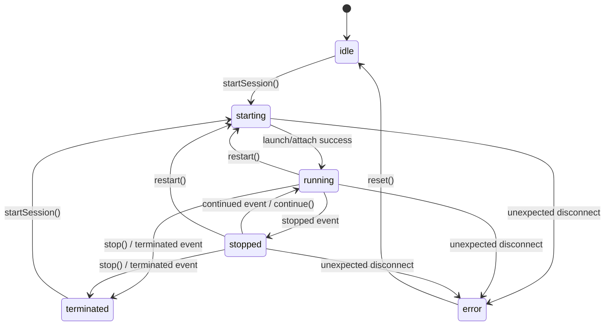
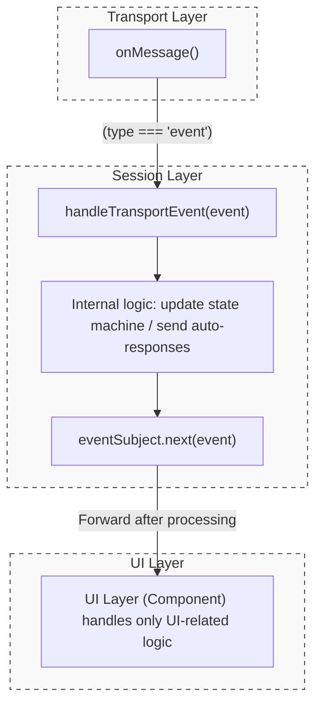
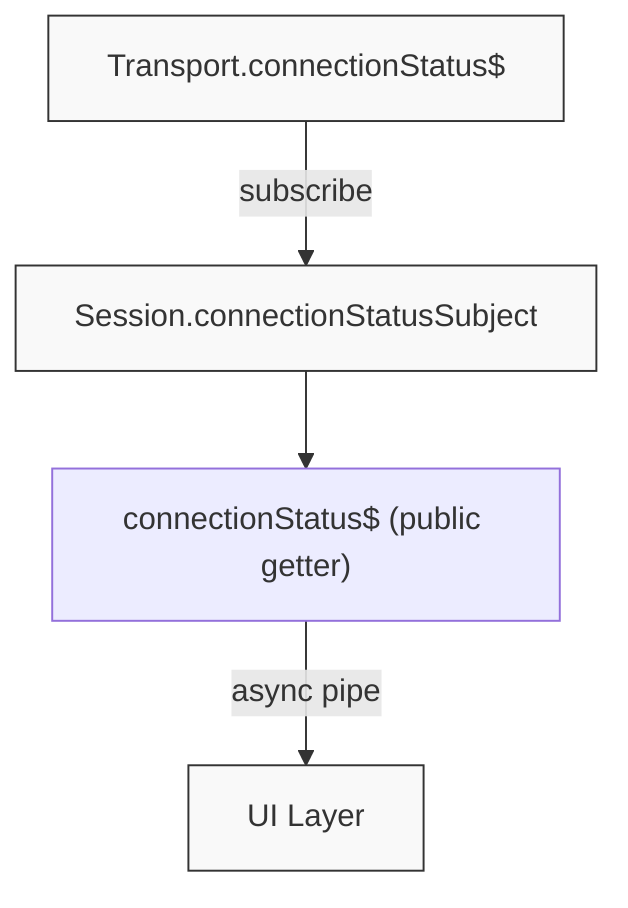
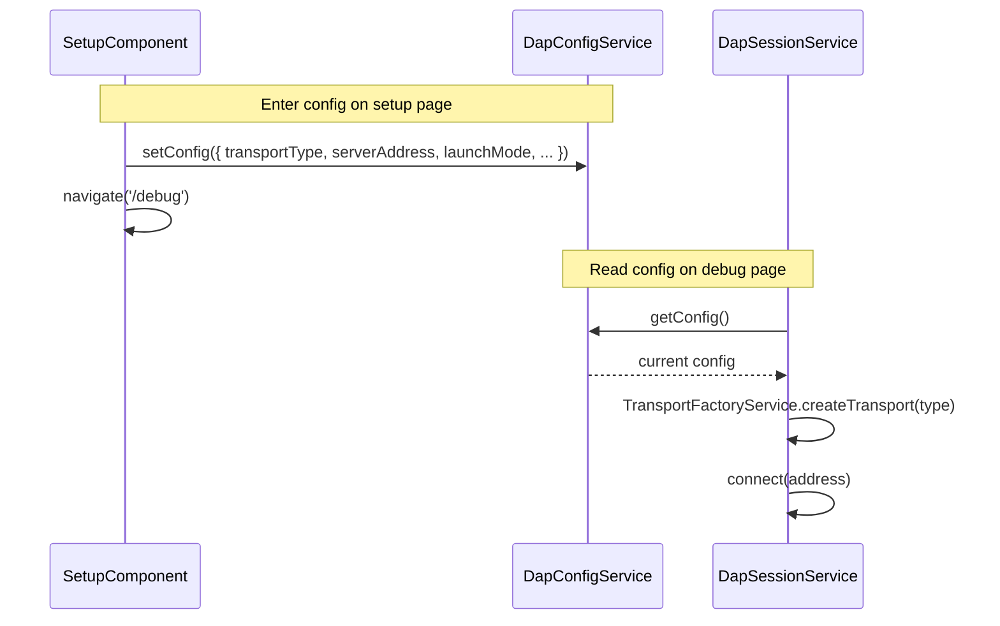

# Session Layer Architecture

## 1. Responsibilities

- Manage the **DAP session lifecycle** (initialize → launch/attach → debug → disconnect)
- Manage **Transport instances** (lazy creation based on config, destruction on disconnect)
- Maintain **request/response pairing** (seq → pending request mapping)
- Manage the **execution state machine** (`ExecutionState`)
- **Intercept and process Transport events**, then forward to the UI layer
- Publish **Session-level Observables** (`connectionStatus$`, `executionState$`, `onEvent()`)

## 2. Execution State Machine



`ExecutionState` type definition and state descriptions:

```typescript
type ExecutionState = 'idle' | 'starting' | 'running' | 'stopped' | 'terminated' | 'error';
```

| State | Description |
| --- | --- |
| `idle` | No connection established, or the initial state after a safe disconnect. |
| `starting` | Transitional state: establishing the connection, sending `initialize`, sending `launch`/`attach`, and waiting for handshake completion. |
| `running` | The debug target is executing. DAP is in a busy state and does not accept `stackTrace` or `variables` query requests. |
| `stopped` | The program has stopped due to a breakpoint, step execution, or pause operation. Thread, stack, and variable queries are available. |
| `terminated` | The target program has finished executing or was forcefully terminated. Requires closing the session via `disconnect()` and calling `startSession()` to re-enter `starting` state. |
| `error` | An unexpected connection interruption or communication anomaly occurred. Requires `reset()` to clean up resources and return to `idle` before a new connection can be established. |

## 3. Event Processing Flow

Raw events from the Transport layer are **not directly exposed** to the UI. Instead, they are first processed by Session's internal `handleTransportEvent()`:



## 4. Connection Status Bridging

The Session layer bridges the Transport's `connectionStatus$` via a `BehaviorSubject<boolean>`. This allows UI to safely subscribe before the Transport is created (initial value is `false`):



## 5. Transport Lifecycle

Transport instances are **lazily created** by Session via `TransportFactoryService`, not hardcoded in the constructor:

| Timing | Operation |
| --- | --- |
| `constructor()` | Transport is not created (`transport = undefined`) |
| `startSession()` | Created via `TransportFactoryService.createTransport()` based on `config.transportType` |
| `disconnect()` | Calls `transport.disconnect()` then sets to `undefined`, resets all state |

## 6. Public API

| API | Type | Description |
| --- | --- | --- |
| `connectionStatus$` | `Observable<boolean>` | Connection status (defaults to `false` before Transport is created) |
| `executionState$` | `Observable<ExecutionState>` | Debug execution state |
| `onEvent()` | `Observable<DapEvent>` | Processed event stream |
| `onTraffic$` | `Observable<any>` | Diagnostic traffic stream for raw DAP protocol messages |
| `capabilities` | `any` | Capabilities obtained from the Server |
| `startSession()` | `Promise<DapResponse>` | Complete startup flow (connect → initialize → launch) |
| `continue() / next() / stepIn() / stepOut() / pause()` | `Promise<DapResponse>` | Debug control commands |
| `nextInstruction() / stepInInstruction()` | `Promise<DapResponse>` | Instruction-level stepping commands (granularity = 'instruction') |
| `setBreakpoints(path, lines)` | `Promise<VerifiedBreakpoint[]>` | Synchronize all breakpoints for a file; returns verified results from adapter |
| `threads() / stackTrace() / scopes() / variables()` | `Promise<DapResponse>` | Thread and variable exploration commands (available in `stopped` state) |
| `disassemble(args)` | `Promise<DapResponse>` | Retrieve disassembly instructions; available in `stopped` state |
| `sendRequest()` | `Promise<DapResponse>` | Generic DAP request |
| `disconnect()` | `Promise<void>` | Disconnect and clean up resources; sends `disconnect` request with `terminateDebuggee: true` fallback. |
| `terminate()` | `Promise<void>` | **Deprecated**: Use `stop()`. |
| `stop()` | `Promise<void>` | Terminate the debug target. Hierarchy: `terminate` (if supported) → `disconnect({ terminateDebuggee: true })`. |
| `restart()` | `Promise<void>` | Restart the debug session. Hierarchy: `restart` (if supported) → Soft restart (`disconnect` + `startSession`). |
| `reset()` | `void` | Force reset Session to `idle` (cleans up all resources) |
| `commandInFlight$` | `Observable<boolean>` | Emits `true` while any control command is in-flight. See [command-serialization.md §2](command-serialization.md#2-r-cs1-control-button-serialization). |
| `cancelRequest(requestId)` | `Promise<void>` | Dispatches a DAP `cancel` request. Pre-condition: `capabilities.supportsCancelRequest`. See [command-serialization.md §3](command-serialization.md#3-r-cs2-evaluate-command). |
| `evaluate(expression, frameId?)` | `Promise<DapResponse>` | Evaluate with built-in 30 s timeout. Rejects with `EvaluateCancelledError` on cancel/timeout. See [command-serialization.md §3](command-serialization.md#3-r-cs2-evaluate-command). |

## 7. Configuration Flow (DapConfig)



`TransportType` type definition:

```typescript
type TransportType = 'websocket' | 'ipc' | 'serial';
```

`DapConfig` full interface:

```typescript
interface DapConfig {
  serverAddress: string;       // DAP Server connection address (e.g., localhost:4711)
  transportType: TransportType; // Transport type
  launchMode: 'launch' | 'attach'; // Launch mode
  executablePath: string;      // Path to the debugged executable
  sourcePath: string;          // Source code root directory path
  programArgs: string;         // Command-line arguments passed to the debuggee
}
```

### 7.1 Electron Specifics (Bridge Management)

To ensure compatibility with Electron's `file://` protocol and multi-mode architecture:

- **HashLocationStrategy**: The application uses `withHashLocation()` in `app.config.ts` to prevent "file not found" errors when reloading inside Electron.
- **Main Process Isolation**: All native Node.js logic is abstracted into the Electron Main Process (`electron/main.ts`) and accessed via the secure Preload bridge (`electron/preload.ts`).
- **WebSocket Relay & Strict Binary Contract**: The Electron main process connects to the DAP Server via a WebSocket relay. It strictly requires all binary payloads from the Relay Server to be `Blob` instances.
