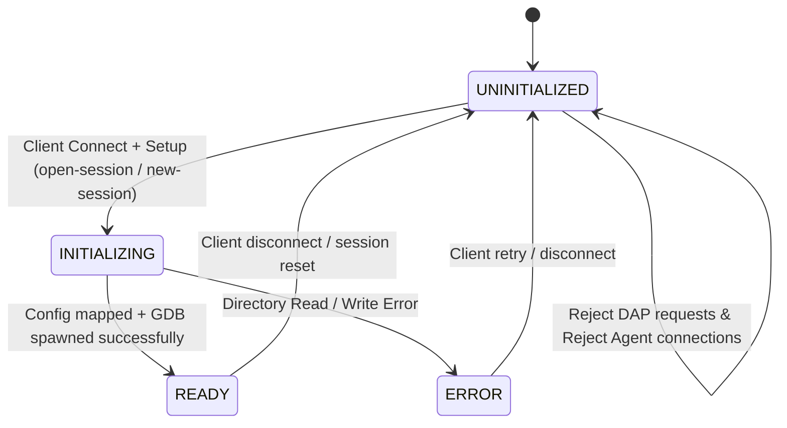

# taro-session Daemon — Architecture & Lifecycle

`taro-session` is a lightweight Node.js CLI daemon that acts as the physical host of the GDB subprocess. It bridges the Angular frontend to the local debugging environment via a multiplexed WebSocket server, and persists session state to the `.tarodb` directory.

---

## 1. Core Responsibilities

| Responsibility | Detail |
| :--- | :--- |
| **Subprocess Isolation** | Spawns `gdb --interpreter=dap` as an isolated child process, preventing frontend pauses from blocking I/O. |
| **Orphan Prevention** | Monitors `/session/client` socket health. On unexpected disconnect, triggers graceful termination followed by a 2-second forced `SIGKILL`. |
| **Unified Persistence** | Owns the `.tarodb` directory — flat JSON/Markdown files: `config.json`, `breakpoints.json`, `chat.json`, `memory.md`, and `logs/`. |
| **Telemetry Brokering** | Multiplexes raw GDB stdout events simultaneously to the frontend client (`/session/client`) and the Agentic AI companion (`/session/agent`). |
| **Intelligent Diagnostics (MCP)** | Hosts a Model Context Protocol server offering workspace inspection, compilation diagnostics, and Z3 SMT solver constraint-checking. |
| **Session Logging** | Writes three append-only log streams per connection cycle. See [§4 Logging](#4-logging). |

---

## 2. Connection State Machine

The daemon implements a formal state machine governing each `/session/client` socket connection. This prevents premature DAP messages from reaching an uninitialized GDB process and enables dynamic session directory loading at runtime.



> [Diagram: Connection State Machine Flow — The daemon starts in UNINITIALIZED. A setup channel command transitions it to INITIALIZING, which loads configuration and spawns GDB. Success moves to READY; errors move to ERROR. Both ERROR and READY return to UNINITIALIZED on socket close.]

### State Reference

| State | Entry Condition | Allowed Client Actions |
| :--- | :--- | :--- |
| `UNINITIALIZED` | Socket connected to `/session/client` | Only `setup` channel commands (`open-session`, `new-session`) |
| `INITIALIZING` | Valid setup command received | None — all messages blocked |
| `READY` | Session loaded + GDB running | Full DAP traffic + `/session/agent` connections |
| `ERROR` | Setup or validation failure | Socket closed immediately (Fail-Fast Policy) |

### Key Protocol Rules

- Any DAP message sent before `session-ready` is **rejected** with a diagnostic error response.
- Connections to `/session/agent` are **closed with code `4005`** unless state is `READY`.
- On `ERROR`, the server closes the client WebSocket and resets to accept a new connection (**Reconnect-Retry Only** — no socket reuse).
- The DAP `launch` request validates that `arguments.program` is non-empty before forwarding to GDB.
- The `new-session` command validates that the target session directory does not already exist on the filesystem. If it does, the command **fails-fast** and returns a setup error to prevent silent configuration overrides.

> [!NOTE]
> For complete message schemas (`open-session`, `new-session`, `session-ready`, `session-failed`) and Acceptance Criteria (AC-1 through AC-5), see 👉 [archive/specs/setup-handshake-protocol.md](../archive/specs/setup-handshake-protocol.md).

---

## 3. Graceful Disconnect & Orphan Sweeper

If the frontend disconnects (tab close, navigation, or fatal error), `taro-session` initiates cascading cleanup:

1. **DAP Disconnect**: Sends a `disconnect` DAP request to GDB.
2. **Grace Period**: Waits up to `2000ms` for GDB to terminate cleanly.
3. **Cascading Kill**: If not terminated within the grace period, issues `SIGTERM` → `SIGKILL` to reclaim OS resources.

This guarantees zero orphan debugger processes on the host machine.

---

## 4. Logging

The daemon writes three append-only log streams per connection cycle:

| File | Content |
| :--- | :--- |
| `stdout.log` | General lifecycle events (startup, state transitions, client connections) |
| `stderr.log` | Error and warning messages (setup failures, GDB spawn errors) |
| `dap.log` | Raw DAP protocol traffic — prefixed with `[IN]` / `[OUT]` and ISO 8601 timestamp |

**Default log path:**

```text
<os.tmpdir()>/taro-session-logs-<PID>/logs/
```

- `<PID>` is `process.pid` — each daemon instance writes to an isolated directory.
- Example on Linux: `/tmp/taro-session-logs-12345/logs/stdout.log`

**Override:** Pass `--log-path <directory>` at startup. All three streams redirect to `<directory>/logs/`.

---

## 5. CLI Reference

```bash
taro-session [--port <number>] [--gdb-path <path>] [--one-shot] [--log-path <directory>]
```

| Option | Default | Description |
| :--- | :--- | :--- |
| `--port` | `8080` | Local loopback WebSocket port |
| `--gdb-path` | `gdb` | Path to the GDB executable |
| `--log-path` | `os.tmpdir()/taro-session-logs-<PID>` | Directory for session log files |
| `--one-shot` | `true` | Terminate daemon after client disconnect. Use `--no-one-shot` to loop. |

The daemon binds strictly to `127.0.0.1` (loopback only). WAN hosting is out of scope.
