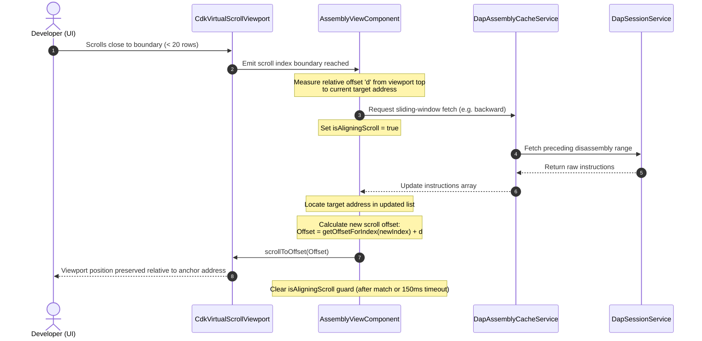

# Assembly View (Disassembly)

The Assembly View provides a low-level inspection interface for machine instructions, enabling debugging when source code is unavailable or instruction-level precision is required.

## 1. Component Architecture

### 1.1 AssemblyViewComponent (`app-assembly-view`)

- **Library**: `@taro/ui-assembly`
- **Responsibility**: Render the disassembled instruction list and synchronized Instruction Pointer (IP) highlight.
- **Performance**: Utilizes `cdk-virtual-scroll-viewport` to handle large address ranges with minimal DOM overhead.
- **Custom Virtual Scroll Strategy**: Uses a custom scroll strategy to support **inline function headers** within the list. Because function label rows are twice the height of normal instruction rows (`rowHeight() * 2` vs `rowHeight()`), a custom viewport offset calculation is implemented to prevent scrollbar jumping and layout jitter.

### 1.2 DapAssemblyCacheService

- **Scope**: App-scoped (provided in `DapCoreModule` via `provideDapCore()`).
- **Storage Model**: Instructions are embedded directly within self-contained `CachedRange` objects. Each range holds a strictly ascending `instructions: DapDisassembledInstruction[]` array. Merge cost is $O(K+M)$ per incoming batch; pruning drops an entire range object.
- **Responsibility**:
  - Unified caching logic for `disassemble` responses with gap-filling.
  - BigInt-based binary search within per-range instruction arrays.
  - Invalidation logic triggered by `module` load events or session resets.
  - **Range-Level Symbol Propagation**: During instruction cache merges, symbols are propagated forward across the cached range to compute cumulative relative bytecode offsets (e.g., `<+4>`, `<+8>`).
  - **GDB info symbol Fallback**: If a newly loaded range starts without symbols, the service issues a DAP `evaluate` request for `info symbol <address>` and parses GDB's CLI response to resolve the symbol name and offset, flowing it forward via propagation.

### 1.3 Reactive Lifecycle Management

- **Cleanup**: Uses `DestroyRef` and `takeUntilDestroyed()` to automatically close RxJS streams (instructions, loading, scroll events) upon component destruction.
- **Timer Safety**: Explicitly manages and clears `setTimeout` IDs (e.g., `scrollTimeout`, `aligningTimeout`) to prevent asynchronous errors when navigating away from the view.

---

## 2. UI/UX Standards

### 2.1 Layout (Material Design 3 High Density)

| Element | Description | Styling |
| :--- | :--- | :--- |
| **Gutter** | Leftmost column for IP and breakpoint indicators. | Widened to 32px, featuring pulsing IP arrow. |
| **Inline Label** | Demangled function name header (e.g. `main:`). | `var(--mat-sys-primary)`, 2x standard row height. |
| **Address** | 16-character hex memory address. | Monospaced, muted (`var(--mat-sys-outline)`). |
| **Offset** | Instruction offset from function start (e.g., `<+16>`). | `var(--mat-sys-tertiary)`, monospaced. |
| **Opcode** | Raw machine bytes. | `var(--mat-sys-secondary)`, monospaced. |
| **Instruction** | Human-readable assembly mnemonic. | `var(--weight-medium)`, monospaced. |
| **Annotation** | Associated symbol or source line comments. | Italic, very muted. |

### 2.2 Navigation Features

The component maintains two independent address references to decouple the execution state from the viewport position:

```text
instructions[0]  ← window start         instructions[2000]  ← window end
    │────────────────────┬──────────────────────│
                     viewAnchor (center)
                    ┌────┴────┐
                    │ visible │  ← ~16 rows (viewport height)
                    └─────────┘
                         ↕
          scroll threshold triggers forward/backward fetch
```

> [Diagram: A 2001-instruction sliding window is centered on the `viewAnchor` address. The visible viewport shows ~16 rows. When the user scrolls within 20 rows of either edge, `onViewportScroll` triggers a `forward` or `backward` fetch to extend the window.]

- **Return to PC Button**: A floating `mat-mini-fab` (icon: `my_location`) in the bottom right corner. Clicking it resets the `viewAnchor` signal to match `currentPc()`, triggering a smooth-scroll to center the active Instruction Pointer.
- **Viewport Decoupling**: The component separates the **Execution PC** (for highlighting) from the **Viewport Anchor** (for navigation). This allows the user to manually "Jump to Address" without losing their focus when the debugger steps or when switching UI tabs.
- **Unified Scroll Alignment**: During sliding-window page transitions (forward and backward auto-fetches), the custom scroll strategy measures the exact pixel distance from the top of the viewport to the triggering anchor address and aligns the new viewport post-render. A programmatic alignment guard (`isAligningScroll`) suppresses redundant fetch triggers to eliminate infinite auto-fetch loops.
- **Fast-Path Stepping**: Bypasses DAP disassemble requests if the target IP is already within the loaded UI stream, ensuring zero-latency stepping for function-local execution.

---

## 3. Behavior Specification

### 3.1 Range-Level Symbol Propagation

When a new block of disassembled instructions is merged into the cache, symbols (demangled function names) may only be defined at explicit entry points. The system propagates symbols forward to provide contiguous offsets across the entire merged cached range:

1. **Initialize**: Loop through instructions in ascending address order within the `CachedRange` object.
2. **Detection**:
   - If an instruction has an explicit `symbol` or is marked `isFunctionStart`, set `currentSymbol = instruction.symbol` and reset `cumulativeOffset = 0`.
   - If an instruction has no symbol but `currentSymbol` is defined, propagate the symbol:
     $$\text{instruction.symbol} = \text{currentSymbol}$$
     $$\text{instruction.byteOffset} = \text{cumulativeOffset}$$
3. **Accumulate**: Add the instruction size to the relative offset:
   $$\text{cumulativeOffset} += \text{instruction.size}$$

### 3.2 GDB 'info symbol' Fallback Resolution

When scrolling to unmapped or sparse regions, newly fetched ranges might not start with a resolved symbol. The system implements a dynamic query fallback:

1. **Validation**: Check that the starting physical address is a valid hexadecimal string matching `^0x[0-9a-fA-F]+$` before generating CLI commands.
2. **Query**: Issue a DAP `evaluate` request for the CLI command:
   ```text
   info symbol <address>
   ```
3. **Parser**: Parse the GDB stdout string using the pattern:
   ```regex
   ^([^\s+]+)(?:\s*\+\s*([^\s]+))?
   ```
   * Match Group 1: Extracted symbol name (e.g., `main`).
   * Match Group 2: Offset in bytes (e.g., `16`, defaults to `0` if undefined).
4. **Resolution**: Set the parsed symbol and offset on the first instruction of the fetched range, then execute range-level propagation.

### 3.3 Unified Scroll Alignment & Loop Prevention



> [Diagram: Sliding-window scroll alignment flow — Scrolling near the viewport boundary triggers a background instruction fetch. The component measures the anchor's pixel offset, updates the array, re-applies the offset, and uses an alignment guard to suppress redundant scroll events.]

1. **Trigger Boundary**: Scroll triggers fire when the viewport visible range enters the upper or lower `20` instruction rows of the loaded `2001`-instruction sliding window.
2. **Anchor Offset Formula**:
   Before updating instructions, measure:
   $$d = \text{viewport.measureScrollOffset()} - \text{scrollStrategy.getOffsetForIndex(anchorIndex)}$$
   After updating instructions, scroll the viewport to:
   $$\text{Offset}_{\text{New}} = \text{scrollStrategy.getOffsetForIndex(newAnchorIndex)} + d$$
3. **Loop Suppression**: The scroll listener enforces a strict guard (`isAligningScroll = true`) during programmatic scrolls. It ignores all scroll events until the viewport's measured offset matches the expected target offset (within a $\pm 2\text{px}$ tolerance) or the `150ms` safety timeout expires.

---

## 4. Protocol & Data Flow

### 4.1 Disassembly Request

`AssemblyViewComponent` calls `DapAssemblyCacheService.fetchInstructions()` with the following fixed window parameters:

| Parameter | Value | Effect |
| :--- | :--- | :--- |
| `instructionCount` | `201` (`ASSEMBLY_WINDOW_SIZE`) | Total instructions requested per window load. |
| `instructionOffset` | `-100` (`ASSEMBLY_WINDOW_OFFSET`) | Anchors the fetch 100 instructions before the reference address. |

This produces a symmetric `[-100, +101]` window around the anchor address, ensuring the user has approximately 100 instructions of backward context (for stepping up call stacks) and 101 instructions of forward context on every window load.

Because some DAP adapters reject negative `instructionOffset` values, `DapAssemblyCacheService.fetchInstructionsDirect()` splits negative-offset requests into two separate `disassemble` calls:
1. **Neg leg** — fetches `negCount + 20` instructions starting from a byte-estimated address preceding the anchor (`guessBytes = negCount * 6 + 64`).
2. **Pos leg** — fetches the `posCount` instructions starting from the exact anchor address.

A gap-fill loop bridges any address discontinuity between the two legs (up to 1,000 gap instructions). All `disassemble` requests set `resolveSymbols: true`.

### 4.2 GDB-Style Function Grouping

The application applies post-processing to normalize the display of function blocks:
- **Base Address Tracking**: Detects symbol boundaries to calculate relative offsets.
- **Inline Function Labels**: Inline labels are injected immediately preceding any instruction marked as `isFunctionStart`. This replaces sticky headers, ensuring function contexts scroll naturally and reflect accurate names across memory boundary crossings.

---

## 5. Technical Constraints

- **Capability Guard**: The view is disabled if the Debug Adapter does not support the `disassemble` capability.
- **Cache Policy**: Instructions are cached in self-contained `CachedRange` objects. The cache is **preserved across thread switches** (since threads share memory) but is **invalidated on `module` events** to account for dynamic library loading.
- **Capacity**: Maintained via a spatial pruning watermark and hard ceiling defined in the authoritative [DapAssemblyCacheService Specification](../core/dap-core.md#23-session-layer). When the ceiling is exceeded, the `CachedRange` farthest from the current IP is evicted atomically — no per-address iteration is required.


