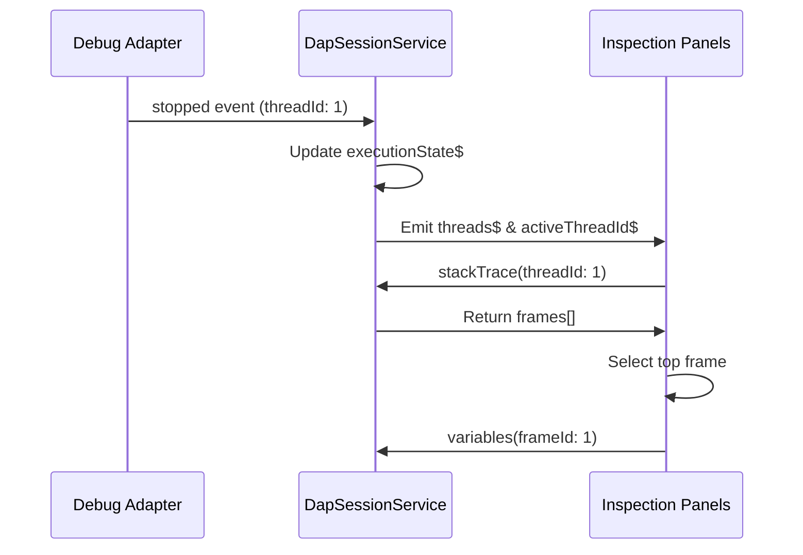

# Inspection Panels

The `@taro/ui-inspection` library contains the suite of panels used to inspect the debuggee's execution state, including threads, call stacks, variables, and breakpoints.

## 1. Architectural Strategy

- **Three-Layer Pattern**: Enforces strict modularity by decoupling inspection views from the host application shell.
- **Consolidated Logic**: Centralizes all state-inspection components into a single library to maintain a consistent reactive data flow.
- **SSOT Binding**: Every component in this library subscribes directly to the reactive streams in `DapSessionService` or specialized domain services (e.g., `DapVariablesService`).

## 2. Component Portfolio

### 2.1 Thread Call Stack Panel

Consolidates threads and stack frames into a single hierarchical tree view (Process > Thread > Frame).
- **Data Source**: Reactive streams from `DapSessionService` (`threads$`, `activeThreadId$`, `stoppedThreads$`, `allThreadsStopped$`).
- **Dynamic Loading**: Threads are loaded globally; stack frames are fetched on-demand when a thread node is expanded.
- **Selection Mode**: Decouples tree navigation from thread selection. Clicking a thread row label toggles expansion only. Selection (Focus) is performed via a dedicated **"Focus"** icon button, ensuring navigational clicks don't inadvertently switch the session's active thread.
- **Auto-Expansion**: Automatically expands the active thread and fetches its call stack upon any `stopped` event. This ensures the current execution context is immediately visible after any interrupt (breakpoint, step, etc.).
- **Visuals**: Displays dynamic pause icons with tooltips pulled from `stopReason$`. Active threads are prominently marked with an "ACTIVE" badge.

### 2.3 Variables Panel

A hierarchical tree view for inspecting local and global variables.
- **Data Source**: Managed by `DapVariablesService`.
- **Persistence**: Scopes and variable states are cleared automatically when execution resumes.

### 2.4 Breakpoints Panel

Provides a centralized list of all breakpoints across the workspace.
- **Data Source**: `DapSessionService.breakpoints$`.
- **Status**: Visualizes the "Verified" status returned by the Debug Adapter.

## 3. UI Layout & Styling

Every inspection panel MUST utilize the standardized structural patterns from `@taro/ui-shared`:

- **Container**: Wrapped in `PanelComponent` for consistent headers and collapsing behavior.
- **Title**: Fixed `32px` height with a `1px` bottom border.
- **Empty States**: Uses `TaroEmptyStateComponent` when no data is available (e.g., "No active threads").

## 4. Reactive Data Flow

> [Diagram: Sequential flow from a DAP 'stopped' event through thread updates, stack trace fetching, and final variable inspection.]
