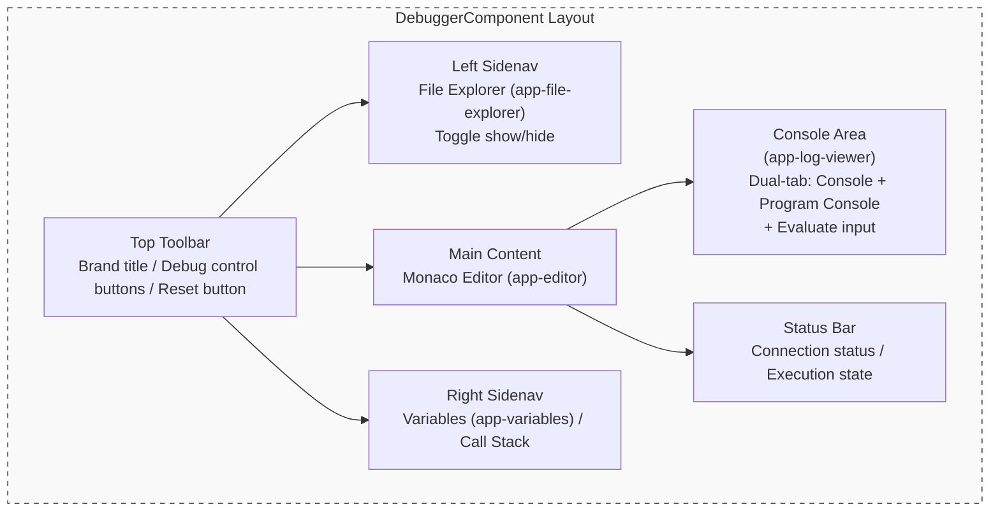

# UI Layer Architecture

## 1. Responsibilities

- **Bind Session Observables** to templates (`connectionStatus$`, `executionState$`)
- Handle **pure UI logic**: log output, snackbar notifications, dialog display
- Manage **user interactions**: button clicks → call Session methods
- Manage **layout state**: sidebar widths, visibility, console height (including persistence to localStorage)
- **Must not directly operate** Transport or manage session state

## 2. Responsibility Separation Reference

| Responsibility | Layer | Description |
| --- | --- | --- |
| `configurationDone` auto-response | **Session** | Automatically executed after receiving `initialized` event |
| `executionState` state transition | **Session** | Event-driven, UI only subscribes |
| DAP Log / Program Log output | **UI** | Managed via `DapLogService` dual console log stream |
| Snackbar notifications (termination, errors) | **UI** | Displays user notifications upon receiving events |
| Error retry dialog | **UI** | Displays `ErrorDialog` on connection failure (retry / go back) |
| Debug control button states | **UI** | disabled/enabled based on `executionState` |
| File tree display & collapse | **UI** | `FileExplorerComponent` fetches via `dapSession.fileTree`, emits `fileSelected` |
| File source loading & editor update | **UI** | `DebuggerComponent.onFileSelected()` calls DAP `source`, updates `EditorComponent` |
| Layout size persistence | **UI** | Sidebar widths, visibility, console height stored in localStorage |

## 3. DebuggerComponent Layout Structure



## 4. Component Lifecycle (DebuggerComponent)

The following table is the **authoritative specification** for dependency injection scoping and state destruction inside `DebuggerComponent`.

**Strict Dependency Rule:** Only the objects explicitly listed in the "Root-Level Injected Services" table below are permitted to come from the `root` injector. **Every other object reference, service, or piece of state must be component-scoped** and cleared according to the `DebuggerComponent` destruction state. (e.g. `DapSessionService`, `DapVariablesService`, `DapLogService` MUST be destroyed).

**Root-Level Injected Services** (Whitelisted Singletons):

| Service / Object | Scope | Responsibility | Restriction |
| :--- | :--- | :--- | :--- |
| `DapConfigService` | `root` | Global read-only configuration | Must not hold active session or transport state. |
| `Router` | `root` | Angular navigation | Framework provided. |
| `MatSnackBar` | `root` | Global UI popups | Framework provided. |
| `MatDialog` | `root` | Global UI popups | Framework provided. |

> [!CAUTION]
> **Implementation Enforcement**: Any service NOT listed in the Root-Level table above
> MUST be registered exclusively via `@Component({ providers: [...] })` in
> `DebuggerComponent`. Using `@Injectable({ providedIn: 'root' })` for session-scoped
> services is an architectural violation that will cause state to persist across sessions.

**Intentionally Persisted State** (not cleared — by design):

| Storage | Key | Reason |
| :--- | :--- | :--- |
| `localStorage` | `taro-debugger-layout-sizes` | User layout preference — survives sessions intentionally |

## 5. Logging Architecture (DapLogService + LogViewerComponent)

`DapLogService` manages two independent log streams:

| Stream | Observable | Purpose |
| --- | --- | --- |
| **Console Log** | `consoleLogs$` | System status, DAP protocol events, general console messages |
| **Program Log** | `programLogs$` | The debugged program's stdout / stderr output |

Log Category definitions (corresponding to `LogCategory` type):

| Category | Description |
| --- | --- |
| `system` | Frontend system internal messages (e.g., "Connecting...", "Session started") |
| `dap` | DAP protocol events (e.g., "[Event] stopped") — may carry a structured `data` payload |
| `console` | General Debugger Console messages |
| `stdout` | Debugged program standard output |
| `stderr` | Debugged program standard error output |

Log memory cap is **1 MB** (approximate); oldest records are automatically evicted when exceeded.

### 5.1 LogEntry Structured Payload

The `LogEntry` interface supports an optional `data?: any` field for attaching a raw structured object (e.g., a raw DAP event) to a log entry. This payload is **display-only** and is never used for state management:

```typescript
interface LogEntry {
  timestamp: Date;
  message: string;
  category: LogCategory;
  level: 'info' | 'error';
  data?: any; // Optional structured payload for UI inspection only
}
```

### 5.2 LogViewerComponent (UI Rendering)

`LogViewerComponent` (`<app-log-viewer>`) is the dedicated standalone component responsible for rendering all console output. It adheres to the following architecture constraints:

- **Injects `DapLogService` directly** — does not receive log data via `@Input()` from the parent `DebuggerComponent` (R_SM4 compliance).
- **Injects `DapSessionService`** — for sending `evaluate` requests from the command input field.
- **Manages expanded/collapsed state locally** via `private readonly expandedLogs = new Set<string>()`, keyed by `log.timestamp.getTime().toString()`. This UI state is **never** stored in any Service.
- **Clears `expandedLogs` in `ngOnDestroy()`** per R_SM5 to prevent orphan key accumulation on component teardown.

## 6. Diagnostic Traffic Stream (onTraffic$)

To prevent high-frequency raw protocol telemetry from polluting the core business event pipeline (`onEvent`), the Session Layer (`DapSessionService`) exposes a dedicated `onTraffic$` observable.

- **Isolation**: All outgoing requests (`sendRequest`) and incoming messages (`handleIncomingMessage`) are emitted to the internal `trafficSubject` immediately upon sending/receiving, before any state machine processing.
- **Opt-in Telemetry**: The UI Layer (`DebuggerComponent`) subscribes to `onTraffic$` and forwards these raw payloads to `DapLogService` as structured `LogEntry` items with the `dap` category.
- **Separation of Concerns**: This ensures the core `onEvent()` stream only emits structurally significant state events (e.g., `stopped`, `terminated`) required for state machine updates, while `onTraffic$` purely serves diagnostic logging purposes.

## 7. Variable & Scope State Management

The inspection of program variables follows a lazy-loading, reactive pattern to handle complex data structures efficiently without blocking the UI.

### 7.1 Data Model & Rendering

- **Hierarchical-to-Flat Transformation**: To support **Virtual Scrolling** (`cdk-virtual-scroll-viewport`), the `VariablesComponent` converts the nested DAP variable structure into a flattened array of `FlatVariableNode` items.
- **Lazy Loading**: Nodes with `variablesReference > 0` are rendered with an expansion toggle. Children are only fetched from `DapVariablesService` (triggering a DAP `variables` request) upon the first user expansion.

### 7.2 State & Caching (`DapVariablesService`)

- **SSOT for Runtime Inspectables**: The `DapVariablesService` acts as the SSOT for derived variable states, exposing a `scopes$` Observable updated on every `stopped` event.
- **Result Caching**: Successfully fetched variable sets are cached by their `variablesReference` ID within the service level.
- **Implicit Lifecycle Cleanup (R_SM5)**: To prevent memory leaks and stale data display, the service automatically clears its internal cache and resets `scopes$` to an empty state whenever `executionState$` transitions out of `stopped` (e.g., to `running`, `terminated`, or `error`).

## 8. Visual Design & Density System

> **Guiding Principle: Flush IDE Layouts & Material Design 3 (M3)**
> When architecting the visual layer, we resolve the conflict between modern IDE aesthetics and default Material Design 3 (M3) paradigms through two core rules:
> 1. **Adopt M3 Colors, Reject M3 Shapes**: We fully adhere to M3's System Color Tokens (`--mat-sys-surface`, `--mat-sys-outline`) to ensure flawless Light/Dark mode transitions. Conversely, we aggressively strip away M3's default large rounded corners (`border-radius`) and floating shadows (`elevation`), forcing components back to the sharp, orthogonal geometries expected in professional developer tools.
> 2. **Maximum Spatial Efficiency (Flush-fit)**: Zero-pixel margins and simple 1px dividers are mandated between side panels and the core editor. This edge-to-edge architecture eliminates wasted peripheral whitespace, maximizing the readable area for critical debugging data.

To optimize the reading experience across different usage contexts, the interface implements an environment-aware **UI Density Scale System** utilizing CSS Custom Properties combined with Angular components.

### 8.1 Responsive Density Scaling (Zero-JS Architecture)

**Mechanism**: The UI Density system is completely decoupled from the runtime environment and requires absolutely no manual CSS class binding (e.g., no `.ui-density-panel` states to manage).

Instead, it relies inherently on **CSS Media Queries (RWD)**. Both the Desktop and Web versions of the application utilize standard, comfortable layouts by default. When the viewport width drops below a predefined breakpoint (e.g., `800px`), the global CSS Custom Properties automatically scale down. This triggers an instant compression of structural padding, block gaps, and base body text to maximize information density in narrow layouts.

**CSS Custom Properties (Design Tokens)**
The global `styles.scss` defines root CSS variables representing dynamic spacing and dimensions:
- `--sys-density-toolbar-height`
- `--sys-density-panel-padding`
- `--sys-density-variable-row`
- `--sys-density-item-gap`
- `--text-base` *(overridden per density mode — see §8.2)*

The base `:root` values assume a comfortable layout constraint. Under `@media (max-width: 800px)`, these tokens are redefined to significantly compress physical dimensions, maximizing information density for confined screen real estate.

**TypeScript Synchronization & Integration**
Select Angular CDK / Material components require TypeScript-level synchronization rather than pure CSS, particularly due to internal math and viewport estimations. Instead of checking the OS/Environment, components must use the Angular CDK `BreakpointObserver` matching the same `800px` threshold:
- **Virtual Scroll Computations**: `VariablesComponent` evaluates the viewport width via `BreakpointObserver` to dynamically bind the `[itemSize]` property. This guarantees that `cdk-virtual-scroll` height calculations precisely track the CSS `.variable-row` rendering height to prevent spatial jitter.
- **Material Tree Indentation**: `FileExplorerComponent` binds `[matTreeNodePaddingIndent]` dynamically (`8px` for narrow viewports vs `12px` for wide ones). This tightly constrains deep-nested folder structures from exhausting horizontal space.

### 8.2 Typography System

All UI type must use the tokens defined in `styles.scss`. The following table defines the **authoritative semantic mapping** and viewport-driven density scaling — hardcoding any font scalar is a style guide violation.

| Token | Semantic Usage | Wide (>=800px) | Compact (<800px) |
| :--- | :--- | :--- | :--- |
| `--text-xs` | Reserved for badges, chip labels, or peripheral metadata | `0.75rem` | `0.75rem` (fixed) |
| `--text-sm` | Status bar text, log timestamps, file tree secondary labels | `0.8125rem` | `0.8125rem` (fixed) |
| **`--text-base`** | **Default body text: log content, variable values, editor UI** | **`0.875rem`** | **`0.75rem`** |
| `--text-lg` | Panel section headers (Variables, Call Stack, Explorer) | `1rem` | `1rem` (fixed) |
| `--text-xl` | Toolbar title / app branding label | `1.125rem` | `1.125rem` (fixed) |
| `--text-2xl` | Reserved for empty-state headings or modal titles | `1.375rem` | `1.375rem` (fixed) |

> [!IMPORTANT]
> All derived typographic scale tokens (`--text-sm`,  etc.) are **ratio-fixed** in `styles.scss` and do **not** change per density — only `--text-base` shifts. Components that use `--text-sm` for timestamps or `--text-lg` for panel titles automatically inherit the density-appropriate visual weight by virtue of the base cascade.

**Authoritative Weight Semantics:**

| Token | Value | Semantic Usage |
| :--- | :--- | :--- |
| `--weight-regular` | 400 | Code content, log body text, file names, variable values |
| `--weight-medium` | 500 | Panel section titles (Variables, Call Stack), active tab labels |
| `--weight-bold` | 700 | Critical error badges, primary CTA buttons |

> [!CAUTION]
> **`font-weight: 600` (Semi-Bold) is explicitly rejected** from this design system. It falls outside the closed three-value token set and is not permitted in any component SCSS. Panel titles that require emphasis must use `--weight-medium` (500).

### 8.3 Spacing & Grid Rules

The UI adheres to an **8px base grid** as its canonical spacing modulus.

| Rule | Value | Notes |
| :--- | :--- | :--- |
| Base grid modulus | `8px` | All spacing values must be multiples of 4px or 8px |
| Panel internal padding | `12px` | Maps to `--sys-density-panel-padding`. Applied at content level. Container padding must be restricted to top-only (`padding-top`) to anchor content; lateral bounds must remain 0 to permit edge-to-edge separators. |
| Panel header bar height | `32px` (Desktop/Panel) | Fixed. Do NOT bind to `--sys-density-toolbar-height` (which is reserved exclusively for the top-level `mat-toolbar`). |
| Editor side margins | `0px` | The editor area must be flush with sidebars to maximize readability (§8.5) |
| File tree node indent | `16px` per level | Fixes readability regression for deep paths |

### 8.4 Divider & Border Standards

All panel boundaries and section dividers must use **Material Design system tokens**, not hardcoded color values. This ensures correct behavior in both light and dark themes.

| Use Case | Required Token / Rule |
| :--- | :--- |
| Sidebar Shapes | `border-radius: 0 !important` (Removes Material 3 default round corners to enforce sharp IDE block aesthetics) |
| Section divider lines | `border: 1px solid var(--mat-sys-outline-variant)` |
| Panel-to-panel background separation | `background-color: var(--mat-sys-surface-variant)` |
| **Forbidden** | `border: 1px solid #CCC` or any hardcoded `rgba(0,0,0,0.x)` color |

### 8.5 Component-Specific Layout Rules

#### Editor Component Rules

These rules govern the Monaco Editor integration in `EditorComponent`.

| Rule | Specification | Priority |
| :--- | :--- | :--- |
| **Opaque overlay removal** | Any non-transparent overlay `div` or backdrop obscuring the code area must be eliminated | 🔴 Critical (Bug Fix) |
| **Execution line highlight** | Background must use an `rgba`-based semi-transparent tint (opacity ≤ 0.12) applied via `deltaDecorations` | High |
| **Highlight z-index** | The decoration layer's `z-index` must be positioned **below** the text rendering layer. Using inline style or className decoration that creates a new stacking context above text is forbidden | High |
| **Scrollbar Consistency** | Monaco's built-in scrollbar must be configured and CSS-forced to visually mimic the global `::-webkit-scrollbar` (14px track, 6px thumb, constant opacity, no shadows) to prevent behavioral drift from the native panels | High |

#### Right Panel (Variables & Call Stack) Rules

| Element | Rule |
| :--- | :--- |
| Side-to-Side Flush | The editor area and sidebars must have **zero external margins** between them. |
| Edge-to-Edge Separator | `border-bottom` on panel titles must span the full 100% width of the sidebar. |
| Content Padding | Individual content items (Variable rows, Call Stack frames) must implement internal `--sys-density-panel-padding` to prevent text from touching edges. |
| Section title spacing | Minimum `8px` vertical padding between the title separator and the first data row. |
| Variable name color | Must use `var(--mat-sys-on-surface)` (primary foreground — typically dark) |
| Variable value color | Must use `var(--mat-sys-primary)` (Material primary accent — typically blue/teal) |
| Value color fallback | Never hardcode hex/rgb values for variable name or value text |

#### Console (LogViewerComponent) Rules

| Property | Rule | Rationale |
| :--- | :--- | :--- |
| Log row line-height | `line-height: 1.5` (unitless ratio) | Eliminate visual crowding in high-frequency log output |
| Timestamp color | `color: var(--mat-sys-outline)` | De-emphasize timestamps; direct focus to message content |
| Log content font | `font-family: var(--font-mono)` | Monospaced for DAP protocol data readability |
| Timestamp font size | `font-size: var(--text-sm)` | Smaller than body to reinforce visual hierarchy |
