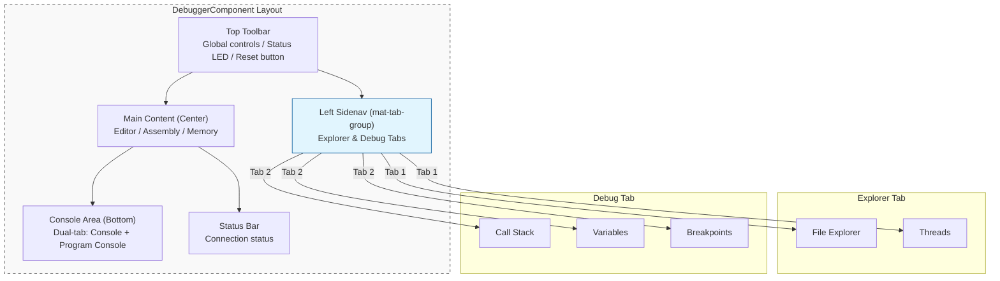

# UI Layer Architecture

## 1. Responsibilities

- **Bind Session Observables** to templates (`connectionStatus$`, `executionState$`)
- Handle **pure UI logic**: log output, snackbar notifications, dialog display
- Manage **user interactions**: button clicks → call Session methods
- Manage **layout state**: sidebar widths, visibility, console height (including persistence to localStorage)
- **Must not directly operate** Transport or manage session state

## 2. UI Shared Foundation (@taro/ui-shared)

The UI layer leverages a centralized foundation library to ensure visual consistency and flatten the dependency graph.

- **Design Tokens**: Centralized HSL-based color palettes and responsive layout tokens (e.g., `LAYOUT_COMPACT_MQ`).
- **Generic Components**: Reusable UI patterns like `PanelComponent` (collapsible/resizable containers) and `ErrorDialog`.
- **Modularity Benefit**: Functional libraries like `ui-inspection` can depend on the shared foundation without pulling in the heavy `ui-editor` (Monaco) library.

## 2. Responsibility Separation Reference

| Responsibility | Layer | Description |
| --- | --- | --- |
| `configurationDone` auto-response | **Session** | Automatically executed after receiving `initialized` event |
| `executionState` state transition | **Session** | Event-driven, UI only subscribes |
| DAP Log / Program Log output | **UI** | Managed via `DapLogService` dual console log stream |
| Snackbar notifications (termination, errors) | **UI** | Displays user notifications upon receiving events |
| Error retry dialog | **UI** | Displays `ErrorDialog` on connection failure (retry / go back) |
| Debug control button states | **UI** | disabled/enabled based on `executionState` |
| File tree display & collapse | **UI** | `FileExplorerComponent` fetches via `DapFileTreeService`, emits `fileSelected` |
| File source loading & editor update | **UI** | `DebuggerComponent.onFileSelected()` calls `DapFileTreeService.readFile()`, updates `EditorComponent` |
| Layout size persistence | **UI** | Sidebar widths, visibility, console height stored in localStorage |

## 3. DebuggerComponent Layout Structure

The system follows a **Flush IDE** aesthetic with a consolidated left-to-right interaction flow. All navigation and inspection panels are hosted in a multi-tabbed Left Sidenav, maximizing horizontal space for code and memory inspection.



### 3.1 Consolidated Sidenav

- **Activity Bar**: The left sidenav uses a `mat-tab-group` to toggle between **Explorer** (File context) and **Debug** (Runtime context).
- **Expansion Panels**: Individual features (Variables, Call Stack, etc.) are housed in `mat-expansion-panel` elements within a `mat-accordion`, allowing them to share vertical space and be collapsed independently.

### 3.2 Top Toolbar & App Frame

The application provides a unified global control surface that bridges the native desktop environment (Electron) and the internal UI.

| Element | Responsibility | Visual Detail |
| :--- | :--- | :--- |
| **Native Menu** | File/Edit/View/Debug actions | Offloaded to Electron in desktop mode. |
| **Status LED** | High-frequency session feedback | Pulse (Running), Static (Paused), Dim (Idle). |
| **Debug Controls** | Execution lifecycle (Step, Pause) | Horizontally centered capsule. |
| **Layout Toggles** | Toggle Left Sidenav / Console | Hidden in Electron mode (redundant with native menu). |

---

## 4. Component Lifecycle (DebuggerComponent)

The following table is the **authoritative specification** for dependency injection scoping and state destruction inside `DebuggerComponent`.

**Strict Dependency Rule:** Only the objects explicitly listed in the "Root-Level Injected Services" table below are permitted to come from the `root` injector. **Every other object reference, service, or piece of state must be component-scoped** and cleared according to the `DebuggerComponent` destruction state. (e.g. `DapSessionService`, `DapVariablesService`, `DapLogService` MUST be destroyed).

**Root-Level Injected Services** (Whitelisted Singletons):

| Service / Object | Scope | Responsibility | Restriction |
| :--- | :--- | :--- | :--- |
| `DapConfigService` | `root` | Global read-only configuration | Must not hold active session or transport state. |
| `Router` | `root` | Angular navigation | Framework provided. |
| `MatSnackBar` | `root` | Global UI popups | Framework provided. |
| `MatDialog` | `root` | Global UI popups | Framework provided. |

> [!CAUTION]
> **Implementation Enforcement**: Any service NOT listed in the Root-Level table above
> MUST be registered exclusively via `@Component({ providers: [...] })` in
> `DebuggerComponent`. Using `@Injectable({ providedIn: 'root' })` for session-scoped
> services is an architectural violation that will cause state to persist across sessions.

**Intentionally Persisted State** (not cleared — by design):

| Storage | Key | Reason |
| :--- | :--- | :--- |
| `localStorage` | `taro-debugger-layout-sizes` | User layout preference — survives sessions intentionally |

## 5. Logging Architecture (DapLogService + LogViewerComponent)

`DapLogService` manages two independent log streams:

| Stream | Observable | Purpose |
| --- | --- | --- |
| **Console Log** | `consoleLogs$` | System status, DAP protocol events, general console messages |
| **Program Log** | `programLogs$` | The debugged program's stdout / stderr output |

Log Category definitions (corresponding to `LogCategory` type):

| Category | Description |
| --- | --- |
| `system` | Frontend system internal messages (e.g., "Connecting...", "Session started") |
| `dap` | DAP protocol events (e.g., "[Event] stopped") — may carry a structured `data` payload |
| `console` | General Debugger Console messages |
| `stdout` | Debugged program standard output |
| `stderr` | Debugged program standard error output |

Log memory cap is **1 MB** (approximate); oldest records are automatically evicted when exceeded.

### 5.1 LogEntry Structured Payload

The `LogEntry` interface supports an optional `data?: any` field for attaching a raw structured object (e.g., a raw DAP event) to a log entry. This payload is **display-only** and is never used for state management:

```typescript
interface LogEntry {
  timestamp: Date;
  message: string;
  category: LogCategory;
  level: 'info' | 'error';
  data?: any; // Optional structured payload for UI inspection only
}
```

### 5.2 LogViewerComponent (UI Rendering)

`LogViewerComponent` (`<app-log-viewer>`) is the dedicated standalone component responsible for rendering all console output. It adheres to the following architecture constraints:

- **Injects `DapLogService` directly** — does not receive log data via `@Input()` from the parent `DebuggerComponent` (R_SM4 compliance).
- **Injects `DapSessionService`** — for sending `evaluate` requests from the command input field.
- **Manages expanded/collapsed state locally** via `private readonly expandedLogs = new Set<string>()`, keyed by `log.timestamp.getTime().toString()`. This UI state is **never** stored in any Service.
- **Clears `expandedLogs` in `ngOnDestroy()`** per R_SM5 to prevent orphan key accumulation on component teardown.

## 6. Diagnostic Traffic Stream (onTraffic$)

To prevent high-frequency raw protocol telemetry from polluting the core business event pipeline (`onEvent`), the Session Layer (`DapSessionService`) exposes a dedicated `onTraffic$` observable.

- **Isolation**: All outgoing requests (`sendRequest`) and incoming messages (`handleIncomingMessage`) are emitted to the internal `trafficSubject` immediately upon sending/receiving, before any state machine processing.
- **Opt-in Telemetry**: The UI Layer (`DebuggerComponent`) subscribes to `onTraffic$` and forwards these raw payloads to `DapLogService` as structured `LogEntry` items with the `dap` category.
- **Separation of Concerns**: This ensures the core `onEvent()` stream only emits structurally significant state events (e.g., `stopped`, `terminated`) required for state machine updates, while `onTraffic$` purely serves diagnostic logging purposes.

## 7. Variable & Scope State Management

The inspection of program variables follows a lazy-loading, reactive pattern to handle complex data structures efficiently without blocking the UI.

### 7.1 Data Model & Rendering

- **Hierarchical-to-Flat Transformation**: To support **Virtual Scrolling** (`cdk-virtual-scroll-viewport`), the `VariablesComponent` converts the nested DAP variable structure into a flattened array of `FlatVariableNode` items.
- **Lazy Loading**: Nodes with `variablesReference > 0` are rendered with an expansion toggle. Children are only fetched from `DapVariablesService` (triggering a DAP `variables` request) upon the first user expansion.

### 7.2 State & Caching (`DapVariablesService`)

- **SSOT for Runtime Inspectables**: The `DapVariablesService` acts as the SSOT for derived variable states, exposing a `scopes$` Observable updated on every `stopped` event.
- **Result Caching**: Successfully fetched variable sets are cached by their `variablesReference` ID within the service level.
- **Implicit Lifecycle Cleanup (R_SM5)**: To prevent memory leaks and stale data display, the service automatically clears its internal cache and resets `scopes$` to an empty state whenever `executionState$` transitions out of `stopped` (e.g., to `running`, `terminated`, or `error`).
