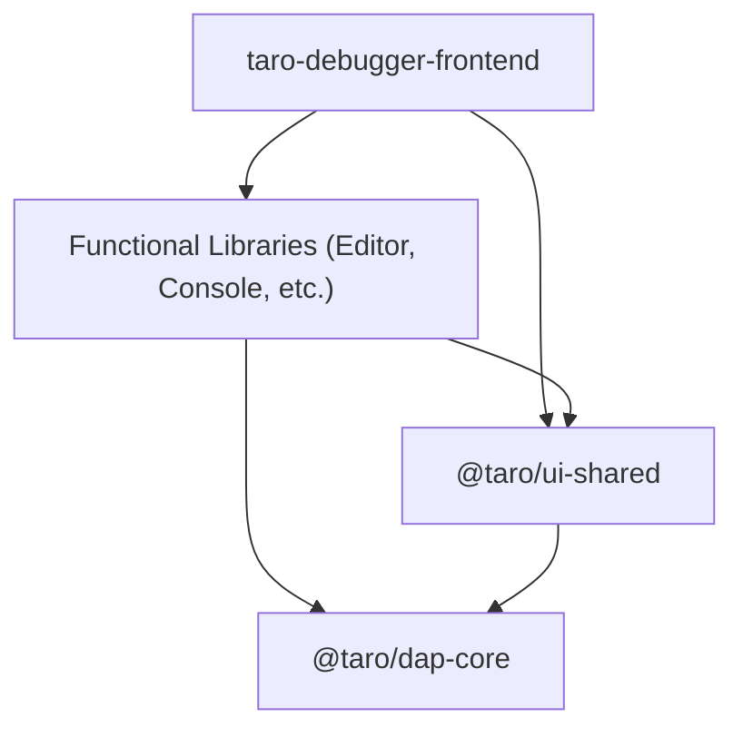

# UI Shared Foundation

The `@taro/ui-shared` library serves as the foundational layer for all UI components in the Taro Debugger workspace. It centralizes reusable components, layout tokens, and generic services to enforce visual consistency and optimize the dependency graph.

## 1. Core Responsibilities

- **Strict Modularity**: Provides a clean location for foundational utilities, decoupling them from functional UI libraries (e.g., Editor, Inspection).
- **Dependency Flattening**: Serves as a bridge between `dap-core` and the UI layer, preventing heavy dependencies (like Monaco Editor) from leaking into lightweight panels.
- **Visual Consistency**: Hosts the SSOT (Single Source of Truth) for design tokens, typography, and standard UI patterns.

## 2. Design Tokens & Configuration

### 2.1 Layout Tokens

Shared layout constants are defined in `projects/ui-shared/src/lib/layout.config.ts`. All functional libraries MUST consume these tokens instead of hardcoding values.

| Token | Purpose |
| :--- | :--- |
| `LAYOUT_COMPACT_MQ` | Media query for compact/mobile view state. |
| `SIDEBAR_MIN_WIDTH` | Minimum width for resizable side panels. |

### 2.2 Shared SCSS

Global SCSS variables and mixins are located in `projects/ui-shared/src/styles/`.

## 3. Standard UI Components

### 3.1 Generic Panel (`PanelComponent`)

A reusable container for all side-panel features.
- **Features**: Supports collapsible headers, action buttons via `ng-content`, and consistent spacing.
- **Usage**: Mandatory for all features in the Left and Right sidenavs.

### 3.2 Empty States (`TaroEmptyStateComponent`)

Unifies the visual pattern for empty data states across the IDE.

**API Contract:**
- `icon`: Material Symbol name (e.g., `'visibility_off'`, `'info'`).
- `message`: Primary status text.
- `description`: Optional multi-line explanation.
- `centered`: Boolean (default `true`) for vertical/horizontal centering.

**Standard Mapping:**

| Domain | Message | Icon |
| :--- | :--- | :--- |
| **Breakpoints** | No breakpoints set | `visibility_off` |
| **Variables** | No variables available | `inventory_2` |
| **Threads** | No active threads | `format_list_bulleted` |
| **Call Stack** | No call stack information available | `reorder` |
| **File Explorer** | File tree cannot be displayed | `info` |

## 4. Shared Dialogs

### 4.1 Error Dialog

A centralized error reporting system accessible to all libraries. It provides a unified UI for displaying DAP errors and transport failures.

---

## 5. Dependency Model

> [Diagram: Dependency hierarchy where both the App and Functional Libraries depend on the UI Shared library, and everything ultimately depends on the DAP Core library.]
