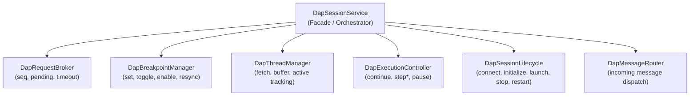
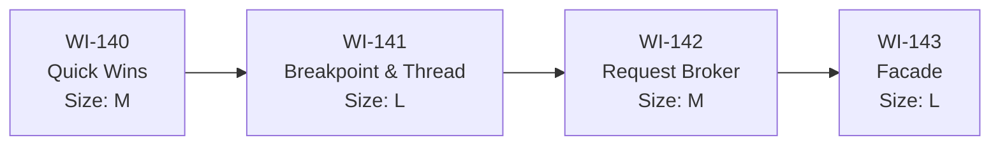

# DapSessionService Structural Refactor — Design Document

`DapSessionService` (1537 lines, 54 KB) has grown into a God Object combining 8 responsibilities. This document defines the decomposition strategy to restore SRP compliance.

> [!IMPORTANT]
> **Exclusion Boundary**: This document covers the structural decomposition of `DapSessionService` only. It does not cover DAP protocol specification changes, transport layer modifications, or UI component changes.

---

## 1. Problem Statement

The current `DapSessionService` owns all of the following responsibilities:

| # | Responsibility | Approximate Lines |
|---|---|---|
| 1 | Transport lifecycle (connect, disconnect, reconnect) | L129–200, L144–151 |
| 2 | DAP handshake & session setup (initialize, launch, configurationDone) | L206–407 |
| 3 | Execution control (continue, next, stepIn, stepOut, pause + instruction variants) | L530–904 |
| 4 | Breakpoint management (set, toggle, enable/disable, resync, function BPs) | L696–883 |
| 5 | Thread management (fetch, buffer, flush, active thread tracking) | L909–971, L1494–1536 |
| 6 | Message dispatch & protocol routing (incoming response/event demux) | L1181–1461 |
| 7 | Request/response bookkeeping (seq counter, pending map, timeouts) | L1114–1159 |
| 8 | Data inspection (scopes, variables, evaluate, disassemble, memory R/W) | L978–1106 |

### 1.1 Symptoms

- **~140 lines** of duplicated boilerplate across 7 step/continue methods.
- A **145-line switch statement** in `handleTransportEvent` mixing abstraction levels.
- **Circular dependency** between `DapThreadSession` and `DapSessionService`.
- `sendRequest` is `public`, allowing arbitrary DAP commands from any consumer.
- Inconsistent state guards — only `continue()` calls `assertState`.
- Untyped `capabilities: any` bag.
- Orphaned JSDoc blocks and a 500-second default timeout.

---

## 2. Target Architecture

After full decomposition, `DapSessionService` becomes a thin facade (~200 lines) delegating to focused sub-services.

> [Diagram: DapSessionService delegates to six sub-services — RequestBroker handles protocol I/O, BreakpointManager owns breakpoint state, ThreadManager owns thread lifecycle, ExecutionController owns step/continue/pause commands, SessionLifecycle owns connect/initialize/stop/restart flows, and MessageRouter dispatches incoming events.]

### 2.1 Dependency Direction

All sub-services depend on `DapRequestBroker` for sending DAP requests. `DapThreadSession` depends on a narrow `DapRequestSender` interface rather than the full facade.

---

## 3. Issue Catalog

### Issue 1 — God Object: SRP Violation

- **Severity**: Critical
- **Impact**: Entire file (1537 lines)
- **Addressed by**: WI-141, WI-142, WI-143

### Issue 2 — Step Command Code Duplication

- **Severity**: High
- **Lines**: L530–685 (~140 lines duplicated)
- **Root Cause**: 7 methods share identical boilerplate for `commandInFlight` guard, state transition guard, and error recovery. Only the DAP command name, resumption semantics, and optional `StepArguments` vary.
- **Fix**: Extract `executeStepCommand(command, allThreadsContinued, extraArgs?)`.
- **Addressed by**: WI-140

### Issue 3 — Mixed Abstraction in handleTransportEvent

- **Severity**: High
- **Lines**: L1316–1461 (145-line switch)
- **Root Cause**: High-level state transitions, low-level data mutations, and business logic interleaved in a single method.
- **Fix**: Delegate each `case` to the respective sub-manager.
- **Addressed by**: WI-141

### Issue 4 — Circular Dependency (Thread ↔ Session)

- **Severity**: Medium
- **Lines**: L940–947 in session, L52–54 in `dap-thread.ts`
- **Root Cause**: `DapThreadSession` holds a direct reference to `DapSessionService` and calls `sendRequest` and `executionState` on it.
- **Fix**: Define `DapRequestSender` interface; inject it instead of the full service.
- **Addressed by**: WI-142

### Issue 5 — Public sendRequest (Leaky Abstraction)

- **Severity**: Medium
- **Lines**: L1114
- **Root Cause**: `public sendRequest(command: string, args?: any)` allows any consumer to bypass state guards.
- **Fix**: Restrict to `private` or `protected`; expose only typed public methods.
- **Addressed by**: WI-140

### Issue 6 — Inconsistent State Guards

- **Severity**: Medium
- **Lines**: L558–685
- **Root Cause**: Only `continue()` calls `assertState(['stopped'])`. All other step methods skip this check.
- **Fix**: Add `assertState` to all step methods (unified via `executeStepCommand`).
- **Addressed by**: WI-140

### Issue 7 — Untyped capabilities

- **Severity**: Low
- **Lines**: L88
- **Fix**: Define `DapCapabilities` interface in `dap.types.ts`.
- **Addressed by**: WI-140

### Issue 8 — Orphaned JSDoc & Timeout Default

- **Severity**: Low
- **Lines**: L161–168 (orphaned doc), L1114 (500000ms default)
- **Fix**: Remove orphaned block; change default to 5000ms.
- **Addressed by**: WI-140

---

## 4. Phased Delivery Plan

### Phase 0: Quick Wins (WI-140, Size M, No Dependencies)

No architectural changes. Mechanical improvements:

1. Extract `executeStepCommand` generic method.
2. Add `assertState` to all step methods.
3. Restrict `sendRequest` visibility.
4. Type `capabilities` with `DapCapabilities` interface.
5. Remove orphaned JSDoc; fix default timeout.

### Phase 1: Extract Breakpoint & Thread Managers (WI-141, Size L, Depends on WI-140)

Extract two new Angular services:

- **`DapBreakpointManager`**: Owns `breakpointsMap`, `breakpointFileState`, `systemBreakpointIds`, all public breakpoint APIs, and breakpoint event handling from `handleTransportEvent`.
- **`DapThreadManager`**: Owns `threadObjects`, `threadEventsBuffer`, flush logic, active thread tracking, and thread event handling from `handleTransportEvent`.

### Phase 2: Extract Request Broker & Interface (WI-142, Size M, Depends on WI-141)

- **`DapRequestBroker`**: Owns `seq`, `pendingRequests`, timeout logic, and raw `sendRequest`.
- **`DapRequestSender` interface**: Narrow API for `DapThreadSession` dependency injection, breaking the circular reference.

### Phase 3: Extract Execution Controller & Facade (WI-143, Size L, Depends on WI-142)

- **`DapExecutionController`**: Owns `continue`, `next`, `stepIn`, `stepOut`, `pause`, instruction-level variants, and `commandInFlight` state.
- **`DapSessionLifecycle`**: Owns `connectTransport`, `initializeSession`, `startSession`, `stop`, `restart`, `disconnect`, and the execution state machine.
- **`DapSessionService`** becomes a thin facade (~200 lines).

---

## 5. Dependency Chain

> [Diagram: Linear dependency chain — WI-140 feeds WI-141, which feeds WI-142, which feeds WI-143.]
