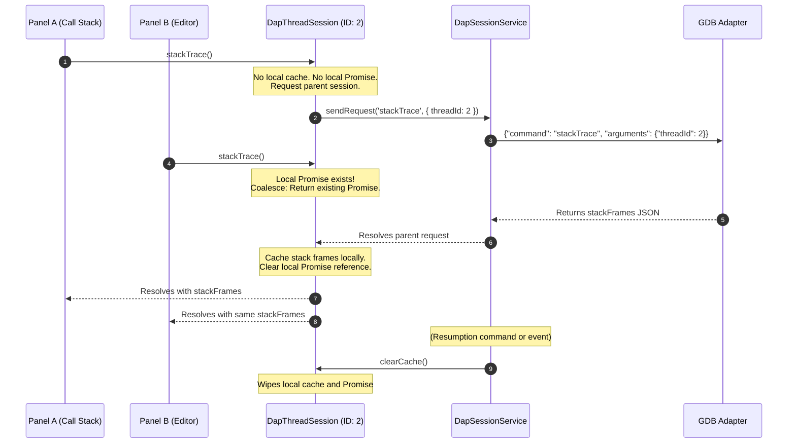

# Implement execution-scoped stackTrace cache and request coalescing in DapSessionService via ThreadObjects (WI-126)

> [NOTE]
> **Source Work Item**: Implement execution-scoped stackTrace cache and request coalescing in DapSessionService
> **Description**: Optimize DAP stackTrace communication by encapsulating thread-specific state inside rich ThreadObjects (`DapThreadSession`) that coalesce concurrent in-flight requests, manage an execution-scoped cache, and debounce high-frequency thread lifecycle events.

## Purpose

The GDB debugger adapter experiences stepping latency on C++ multi-threaded targets due to two primary bottlenecks:
1. **Redundant Parallel Queries**: Frontend components (e.g., Monaco Editor line highlight, Call Stack tree, and Threads panel) concurrently query thread frames on target stop events, generating duplicate network requests.
2. **Thread Event Storms**: In multi-threaded programs (e.g., spawning 20+ threads), GDB floods the adapter with rapid, sequential `thread` events (`started` / `exited`). Processing each event individually causes rapid, redundant reactive updates down to the UI, leading to massive DOM layout calculations and frozen UI states.

To eliminate duplicate network traffic and DOM thrashing, we adopt a modular, object-oriented **ThreadObject** architecture. The `DapSessionService` exclusively exposes rich `DapThreadSession` instances. Each `DapThreadSession` encapsulates its own identity, in-flight coalescing promise, and transient cache. All UI consumers are contractually restricted to interacting with threads through these `DapThreadSession` instances.

## Scope

### In-Scope (Inclusions)

- **`DapThreadSession` Class**: Introduce a new domain class wrapping the standard `DapThread` type, which manages the local cache and in-flight request Promise.
- **Exclusion of Raw Thread Exposure**: Restrict `DapSessionService` to **only** expose `DapThreadSession` objects publicly (e.g., typing `threads$` as `Observable<DapThreadSession[]>` and removing raw session-level thread methods from the public API).
- **Request Coalescing**: Pool parallel calls to `DapThreadSession.stackTrace()` into a single active GDB request.
- **Transient Cache**: Store successful stack trace frames inside the `DapThreadSession` instance.
- **Session Layer Integration**: `DapSessionService` manages the lifecycle of these thread objects (creating them on demand, updating thread lists, and clearing caches on resumption).
- **Thread Event Debouncing**: Buffer rapid thread `started` / `exited` event waves over a small temporal window (e.g., 50ms) and dispatch them as a single, consolidated batch update to the UI.
- **Frontend Refactoring**: Refactor `DebuggerComponent` and `ThreadCallStackComponent` to query stack traces via the thread object rather than flat session methods.

### Out-of-Scope (Exclusions)

- **Variables/Scopes Caching**: This work item is strictly limited to thread stack traces. Local variables and scopes are managed separately by `DapVariablesService`.
- **Persistent Caching**: Caches must remain in-memory and be completely cleared on any thread step, run, resumption, or session tear-down.

## Behavior

### ThreadObject Request Coalescing Flow



> [Diagram: Chronological request coalescing flow using ThreadObjects. Two UI panels concurrently request the stack trace of `DapThreadSession` (ID: 2). The thread object coalesces the requests into a single parent session query. On reply, the cache is populated and both panels resolve. Resumption signals from GDB trigger `clearCache()` on the thread object.]

### Technical Design Details

#### The `DapThreadSession` Domain Class

A lightweight class introduced under `projects/dap-core/src/lib/session/dap-thread.ts`:

```typescript
import { DapThread, DapResponse } from '../dap.types';
import { DapSessionService } from './dap-session.service';

export class DapThreadSession implements DapThread {
  public readonly id: number;
  public readonly name: string;

  private stackTraceCache: DapResponse | null = null;
  private stackTracePromise: Promise<DapResponse> | null = null;

  constructor(
    private readonly session: DapSessionService,
    thread: DapThread
  ) {
    this.id = thread.id;
    this.name = thread.name;
  }

  /**
   * Returns the cached stack trace or coalesces parallel requests into a single promise.
   */
  public async stackTrace(): Promise<DapResponse> {
    if (this.stackTraceCache) {
      return this.stackTraceCache;
    }

    if (this.stackTracePromise) {
      return this.stackTracePromise;
    }

    // Call underlying session request directly
    this.stackTracePromise = this.session.sendRequestDirect('stackTrace', { threadId: this.id })
      .then((response) => {
        if (response.success) {
          this.stackTraceCache = response;
        }
        this.stackTracePromise = null;
        return response;
      })
      .catch((err) => {
        this.stackTracePromise = null;
        throw err;
      });

    return this.stackTracePromise;
  }

  /**
   * Clears the execution-scoped cache when the target resumes.
   */
  public clearCache(): void {
    this.stackTraceCache = null;
    this.stackTracePromise = null;
  }
}
```

#### Thread Event Debouncing (Temporal Buffer)

To protect the Angular UI from event storms, `DapSessionService` collects rapid thread events and flushes them as a single reactive transaction:

```typescript
private threadEventsBuffer: any[] = [];
private threadEventTimeout: any = null;

/**
 * Handles incoming DAP 'thread' events by buffering them.
 */
public handleThreadEvent(eventBody: any): void {
  this.threadEventsBuffer.push(eventBody);

  if (!this.threadEventTimeout) {
    this.threadEventTimeout = setTimeout(() => {
      this.flushThreadEventsBuffer();
    }, 50); // 50ms buffering window
  }
}

private flushThreadEventsBuffer(): void {
  this.threadEventTimeout = null;
  const events = [...this.threadEventsBuffer];
  this.threadEventsBuffer = [];

  let currentThreads = [...this.threadsSubject.value];
  const stopped = new Set(this.stoppedThreadsSubject.value);
  let stoppedChanged = false;

  for (const body of events) {
    const reason = body.reason;
    const threadId = body.threadId;
    if (threadId === undefined) continue;

    if (reason === 'started') {
      if (!currentThreads.some(t => t.id === threadId)) {
        // Instantiate the rich ThreadObject immediately
        const threadObj = this.getOrCreateThreadObject({ id: threadId, name: `Thread ${threadId}` });
        currentThreads.push(threadObj);
      }
    } else if (reason === 'exited') {
      currentThreads = currentThreads.filter(t => t.id !== threadId);
      this.threadObjects.delete(threadId);
      if (stopped.delete(threadId)) {
        stoppedChanged = true;
      }
    }
  }

  // Publish consolidated changes to reactive streams in a single batch
  this.threadsSubject.next(currentThreads);
  if (stoppedChanged) {
    this.stoppedThreadsSubject.next(stopped);
    if (stopped.size === 0) {
      this.executionStateSubject.next('running');
      this.allThreadsStoppedSubject.next(false);
    }
  }
}
```

#### `DapSessionService` Integration & Exclusion

`DapSessionService` restricts raw thread collections, exposing ONLY the `DapThreadSession` instances:

```typescript
// Maps raw ID to active ThreadObject instances
private readonly threadObjects = new Map<number, DapThreadSession>();

// RESTRICTION: BehaviorSubject is strictly typed to hold DapThreadSession[]
private readonly threadsSubject = new BehaviorSubject<DapThreadSession[]>([]);
public readonly threads$ = this.threadsSubject.asObservable(); // Exposes Observable<DapThreadSession[]>

/**
 * Returns or creates the rich ThreadObject for the raw thread payload.
 */
public getOrCreateThreadObject(thread: DapThread): DapThreadSession {
  let obj = this.threadObjects.get(thread.id);
  if (!obj) {
    obj = new DapThreadSession(this, thread);
    this.threadObjects.set(thread.id, obj);
  }
  return obj;
}

/**
 * Convenience lookup by raw threadId
 */
public getThreadById(threadId: number): DapThreadSession | undefined {
  return this.threadObjects.get(threadId);
}
```

#### Cache Eviction Points

Upon stepping commands (`next`, `continue`, `stepIn`, `stepOut`) or receiving a `'continued'` event from the debugger adapter, `DapSessionService` invalidates all caches:

```typescript
public clearAllThreadCaches(): void {
  this.threadObjects.forEach((thread) => thread.clearCache());
}
```

## Acceptance Criteria

### 1. Exclusive ThreadObject Exposure

- The `DapSessionService.threads$` observable MUST be typed as `Observable<DapThreadSession[]>`.
- No raw `DapThread` list is publicly accessible through `DapSessionService`.

### 2. Unified Consumption Path

- All calls in both `DebuggerComponent` and `ThreadCallStackComponent` that query stack traces MUST use `DapThreadSession.stackTrace()` rather than executing raw session-level `stackTrace(threadId)` requests.

### 3. Request Coalescing Verification

- Invoking `threadObject.stackTrace()` parallelly three times concurrently resulting from tree/editor updates MUST fire exactly one network request to the backend GDB adapter.

### 4. Thread Event Storm Mitigation

- Simulating a storm of 20 rapid `thread` started events (emitted within 20ms) MUST result in exactly **one** emission of the `threads$` observable, proving effective temporal buffering.

### 5. Reactive Eviction Verification

- Sending stepping commands or receiving a `'continued'` event completely clears all cached frames on the `DapThreadSession` object, forcing the next stop to run a fresh query.
