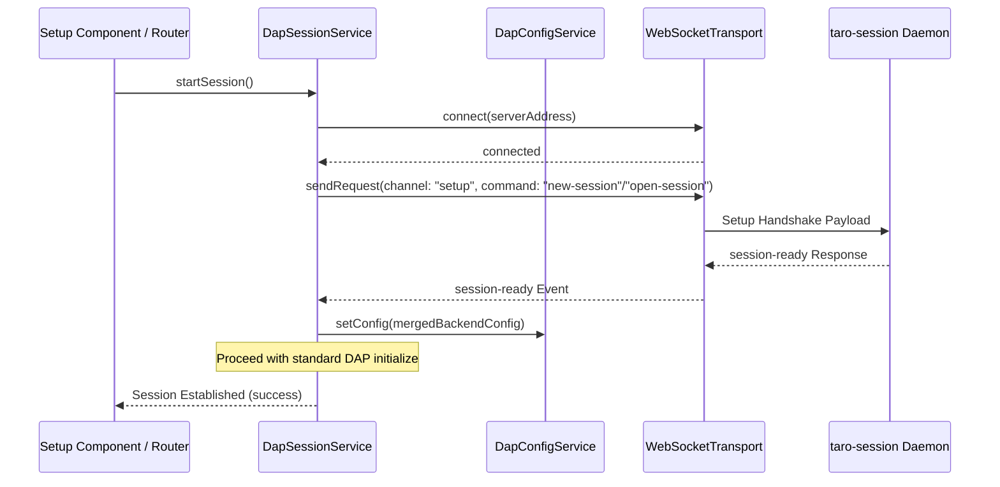

# Integrate Frontend Setup Handshake with Dynamic sessionPath and Connection States (WI-137)

> [!NOTE]
> **Source Work Item**: Integrate Frontend Setup Handshake with Dynamic sessionPath and Connection States
> **Description**: Integrate the client-side setup handshake flow within Setup components, enabling dynamic session path and connection state orchestration.

## Purpose

The purpose of this specification is to integrate the client-side setup handshake flow within the GDB/LLDB Taro Debugger frontend. By implementing a stateful transition sequence during session connection, the frontend ensures that:
- The WebSocket client connects and completes the `"setup"` handshake protocol (either `open-session` or `new-session`) before standard DAP initialization.
- The UI provides an explicit selection mechanism (e.g., via Button Toggle or Radio Button) letting the user choose between **opening an existing session path** (loading its `config.json` dynamically) or **creating/initializing a new session path** (writing new launch configurations to disk).
- The single source of truth configurations in `DapConfigService` are synchronized with loaded launch properties returned from the backend upon successful connection.
- The UI handles connection setup errors robustly, displaying actionable feedback in the setup view instead of throwing silent connection exceptions.

## Scope

### In-Scope

- **Setup UI Component Choice:** Adding an explicit interactive control in `SetupWebComponent` and `SetupElectronComponent` to choose between opening an existing session or creating a new one.
- **`DapSessionService` Handshake Workflow:** Modifying `startSession()` to dynamically determine the appropriate command (`new-session` or `open-session`) based on user choice.
- **Dynamic Configuration Synchronization:** Parsing successful `session-ready` responses and updating the client-side `DapConfigService` to ensure consistency.
- **Error State UX Gating:** Propagating `session-failed` event payloads or WebSocket termination errors back to the Setup views to show concrete, clear errors.
- **Command Parameter Construction:** Generating standard DAP launch structures properly under the `new-session` config payload.

### Out-of-Scope

- **Backend Setup Handshake Logic:** The backend implementation of the setup protocol handler is managed exclusively by the `taro-session` service (WI-136).
- **Other Transport Types:** The setup handshake protocol is designed exclusively for WebSocket loopback bridges.

## Behavior

### 1. Setup Request Command Mapping Strategy

When `DapSessionService.startSession()` is executed:
- The service checks the user's selected mode (either explicit mode variable or whether a new configuration is being written).
- If the user selects **Create New Session**:
  - It sends a `new-session` request. The payload layout matches:

    ```typescript
    interface NewSessionMessage {
      channel: 'setup';
      command: 'new-session';
      arguments: {
        sessionPath: string;
        config: {
          program: string;
          args?: string[];
          cwd?: string;
          env?: Record<string, string>;
        }
      }
    }
    ```

- If the user selects **Open Existing Session**:
  - It sends an `open-session` request with only `sessionPath` specified:

    ```typescript
    interface OpenSessionMessage {
      channel: 'setup';
      command: 'open-session';
      arguments: {
        sessionPath: string;
      }
    }
    ```

- The service filters incoming messages on the `"setup"` channel for either `session-ready` or `session-failed` events with a 10-second timeout limit.

### 2. Configuration Synchronization State Flow



[Diagram: Setup integration message and configuration sync sequence flow. Describes how startSession initiates a connection, negotiates the setup protocol command with the daemon, maps incoming configuration values back to the local config store, and then executes standard DAP initialization.]

### 3. Error Handling and Fail-Fast Cleanups

- If the backend emits `session-failed` or the socket terminates abruptly during the handshake phase:
  1. `DapSessionService` unsubscribes from the transport's stream and calls `closeTransport()`.
  2. The service raises a readable error message describing the failure (e.g. `Session setup failed: <backend_error_message>`).
  3. The Setup view component catches this error and presents the warning clearly in the UI.

## Acceptance Criteria

| ID | Operational Test | Expected Behavior | Verification Command / Target |
| :--- | :--- | :--- | :--- |
| **AC-1** | Start a debug session after choosing "Create New Session". | `DapSessionService` transmits a `new-session` command containing corresponding configuration arguments. | Check outbound setup channel messages. |
| **AC-2** | Start a debug session after choosing "Open Existing Session". | `DapSessionService` transmits an `open-session` command containing only the session path. | Check outbound setup channel messages. |
| **AC-3** | Receive `session-ready` success event. | The loaded configuration parameters are successfully merged back into `DapConfigService`. | Inspect `DapConfigService.getConfig()`. |
| **AC-4** | Receive `session-failed` or socket close during handshake. | Service terminates the transport and throws a descriptive error. | Catch error in Setup component and verify warning. |
