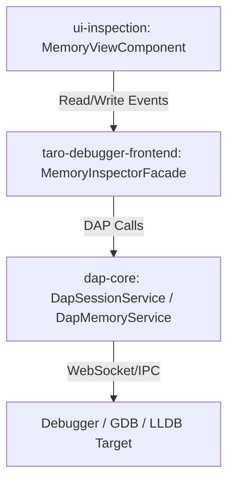
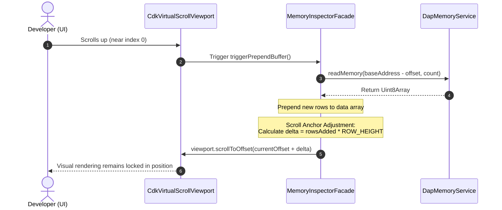
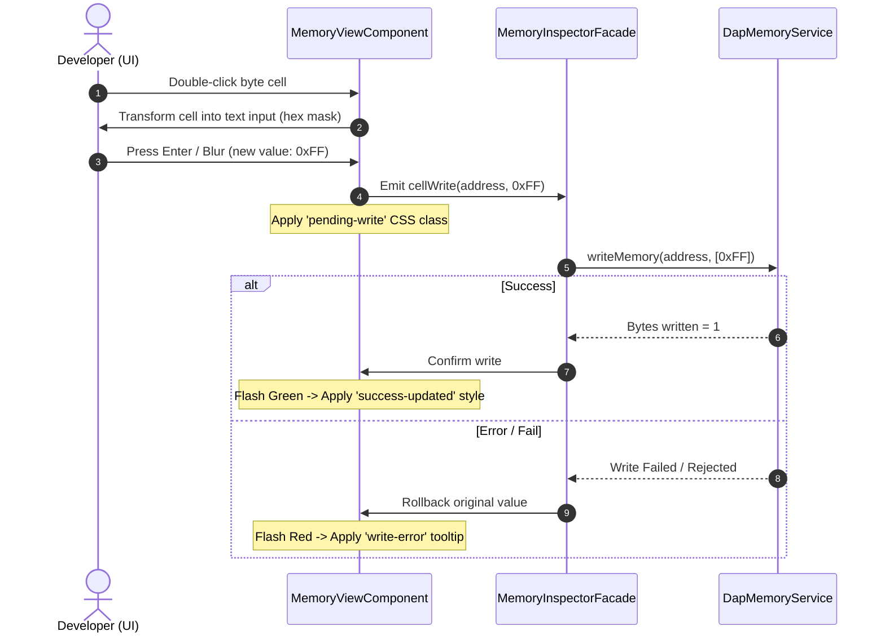

# Specification: Memory View (Hex Dump & Layout Inspector)

## 1. Purpose

The Memory View provides low-level memory inspection (Hex Dump) and editing capabilities for debugging C/C++ applications. To support complex data structure debugging, it maps high-level object layout structures (structs/classes) onto the raw hex grid. 

To deliver a premium, fluid developer experience, this specification unifies core memory rendering with three advanced capabilities:
1. **Infinite Scroll**: On-demand, dynamic paging of memory blocks.
2. **Layout Visualization (WI-120)**: Interactive multi-color struct layout shading, member probing, and alignment padding detection.
3. **Inline Memory Editing (WI-121)**: Direct, cell-by-cell binary modification.

---

## 2. Scope

### In-Scope
* **Address-Based Coordinate System**: Absolute 64-bit virtual address calculations (`bigint`) for memory rendering, scrolling, editing, and layout highlighting.
* **Scroll Anchoring**: Smooth viewport offset calculations when dynamically prepending memory chunks.
* **Object Layout Visualization**: Probing struct member layout via the DAP `evaluate` address-of (`&`) operator, detecting padding, and rendering multi-color shading.
* **Inline Editing**: Live byte modification triggering DAP `writeMemory` requests with transaction-like rollback states.
* **Virtualization**: CDK Virtual Scroll optimized to prevent DOM bloat during long-running exploration.

### Out-of-Scope
* **Persistent Shading Caching**: Struct layouts are tied to the execution session state; they do not persist in `localStorage` across debugger sessions.
* **Unmapped Writes**: Modifying bytes in unmapped pages is rejected by GDB/LLDB; we do not implement synthetic memory mocking.
* **Multi-Thread Concurrent Editing**: Editing operations assume a single target-paused thread context.

---

## 3. Layer Architecture & Monorepo Boundaries



> [Diagram: Architectural flow — The Standalone UI Component in `ui-inspection` communicates via inputs/outputs with the orchestrating Host Facade, which accesses GDB/LLDB capabilities using the agnostic `dap-core` transport layer.]

To satisfy monorepo isolation standards, the component structure is strictly decoupled:

| Component / Layer | Project / Path | Architectural Responsibility |
| :--- | :--- | :--- |
| **`MemoryViewComponent`** | `projects/ui-inspection` | Pure, testable UI component. Receives raw bytes, absolute physical addresses, active selection states, and layout metadata maps. Standard standalone component using Angular 21. |
| **`DapMemoryService`** | `projects/dap-core` | Framework-agnostic protocol wrapper. Serializes and deserializes DAP `readMemory` and `writeMemory` Base64 payloads. |
| **`MemoryInspectorFacade`** | `projects/taro-debugger-frontend` | Host orchestration orchestrator. Listens to UI scrolling triggers, queries variables, runs member-probing flows, and updates the reactive streams. |

### 3.1 Work Item Mapping

| WI ID | Feature Area | Responsibility | Project / Path |
| :--- | :--- | :--- | :--- |
| **WI-104** | Core Protocol | `DapMemoryService` | `projects/dap-core` |
| **WI-105** | UI Component | `MemoryViewComponent` baseline | `projects/ui-inspection` |
| **WI-106** | UI Integration | `MemoryInspectorFacade` base wiring | `projects/taro-debugger-frontend` |
| **WI-130** | Infinite Scroll | Dynamic paging & scroll anchoring | `projects/ui-inspection` |
| **WI-120** | Layout Visuals | Struct layout shading & member probing | `projects/ui-inspection` |
| **WI-121** | Inline Editing | Live byte modifications & rollback transaction | `projects/ui-inspection` |

---

## 4. Behavior Specification

### 4.1 Address-Based Coordinate System
To prevent layout drift, highlighting offsets, and scroll mismatches, all operations are governed by physical memory addresses (`bigint`).

1. **Cell Mapping**: Each byte in the grid is uniquely mapped by `row.address + BigInt(byteIndex)`.
2. **Decoupled Highlighting**: Shading lookup is done via `LayoutOverlayMap` using the target cell's absolute `bigint` key. Prepending or appending data dynamically does not shift highlight positions.

### 4.2 Infinite Scroll & Anchoring



> [Diagram: Infinite scroll prepend flow — When scrolling near index 0, the facade reads preceding memory blocks, prepends them, and adjusts the viewport offset dynamically to keep the user's scroll position anchored without jumping.]

1. **Trigger Boundaries**: Trigger dynamic reads when the viewport scroll position is within `THRESHOLD_ROWS` (default: `10` rows, or `240px` at `24px` per row) of the loaded buffer's boundaries.
2. **Anchor Equation**:
   $$\text{Offset}_{\text{New}} = \text{Offset}_{\text{Current}} + (\text{Rows}_{\text{Added}} \times \text{RowHeight})$$
   Applying this delta synchronously after prepending data prevents the viewport from jumping.
3. **Unmapped Rendering**: If a DAP `readMemory` request fails or reports unreadable bytes, the view renders greyed-out `??` cells with a custom tooltip indicating `Unreadable Memory Segment`.

### 4.3 Struct Layout Shading & Member Probing (WI-120)

To map a complex structure in memory:
1. **Member Address Probing**:
   Execute `evaluate` requests for the struct base address and each member path using the C++ address-of operator:
   ```typescript
   // Request absolute address of member
   const baseAddr = await session.evaluate({ expression: "&obj" });
   const memberAddr = await session.evaluate({ expression: "&obj.age" });
   const offset = BigInt(memberAddr) - BigInt(baseAddr);
   ```
2. **Padding Detection Algorithm**:
   For a sorted list of members by offset:
   $$\text{Gap} = \text{Offset}_{[i+1]} - (\text{Offset}_{[i]} + \text{Size}_{[i]})$$
   If $\text{Gap} > 0$, mark the address range as `[padding]` using a diagonal CSS hatch pattern.
3. **Shading Visualization**:
   The component binds cells to corresponding member styles using a multi-color HSL palette to clearly differentiate adjacent variables. Floating labels indicating member names (`_age`, `*ptr`) are pinned to the starting byte cell of the member span.

### 4.4 Inline Memory Editing (WI-121)



> [Diagram: Inline memory editing transaction flow — Double-clicking a byte opens a hex-masked text input. Submission triggers writeMemory. Success triggers a green flash; failure rolls back to the original byte and flashes red.]

1. **Input Validation**: Text input is constrained by a regular expression mask: `/^[0-9A-Fa-f]{2}$/`.
2. **State Transaction**: During the `writeMemory` round-trip, the cell transitions to a `pending-write` visual state (semi-transparent pulsing spinner).
3. **Rollback Integrity**: If writing to target memory fails (due to write protections or process resumption), the local UI rolls back the cell value to the original byte and applies a temporary red failure border with a descriptive error tooltip.

---

## 5. API Contracts

### 5.1 Dynamic Data Interfaces

```typescript
export interface MemberLayout {
  name: string;
  typeName: string;
  offset: number;
  size: number;
  colorHex: string;
}

export interface ObjectLayoutMetadata {
  baseAddress: bigint;
  totalSize: number;
  members: MemberLayout[];
  paddingRanges: { startOffset: number; length: number }[];
}

export interface RenderedMemoryCell {
  address: bigint;
  value: string; // 2-char hex or '??'
  isPending: boolean;
  layoutMetadata?: {
    memberName: string;
    isPadding: boolean;
    colorHex: string;
    isStartOfMember: boolean;
  };
}
```

### 5.2 Facade & Service Contracts

```typescript
/**
 * DapMemoryService - Framework agnostic layer (dap-core)
 */
export interface IDapMemoryService {
  read(memoryReference: string, offset: bigint, count: number): Promise<Uint8Array>;
  write(memoryReference: string, offset: bigint, data: Uint8Array): Promise<number>;
}

/**
 * MemoryInspectorFacade - Orchestration Layer (taro-debugger-frontend)
 */
export interface IMemoryInspectorFacade {
  readonly visibleBytes$: Observable<RenderedMemoryCell[]>;
  readonly currentLayout$: Observable<ObjectLayoutMetadata | null>;
  
  loadMemoryRange(base: bigint, size: number): void;
  prependMemory(size: number): Promise<void>;
  appendMemory(size: number): Promise<void>;
  writeCell(address: bigint, newValue: number): Promise<void>;
  probeObjectLayout(expression: string): Promise<void>;
}
```

---

## 6. Technical Constraints & Performance Boundaries

1. **Change Detection**: The `MemoryViewComponent` must strictly use `ChangeDetectionStrategy.OnPush` with trackBy on absolute address strings (`trackBy: trackByAddress`).
2. **Debounced Fetching**: Dynamic scroll triggers must be debounced by a minimum of `150ms` to prevent GDB bridge saturation during rapid scroll wheel actions.
3. **Memory Limits**: The viewport must hold a maximum buffer of `16KB` (1024 rows). If prepending or appending exceeds this limit, rows furthest from the visible window must be pruned to preserve low memory footprint.

---

## 7. Acceptance Criteria

### WI-104 & WI-105 Baseline
* [x] `MemoryViewComponent` renders the baseline hex grid and ASCII preview with zero layout shift during standard scrolling.
* [x] Emits a clean `jumpToAddress` event when the jump FAB is triggered.

### Infinite Scroll (Tracked in WI-130)
* [ ] Scrolling within `10` rows of the top successfully fetches preceding memory blocks, prepending rows seamlessly.
* [ ] Prepending data does not cause the viewport to jump or flicker (verified via Scroll Anchoring offset adjustment).
* [ ] Unreadable or unmapped segments display muted `??` marks with no console errors or crashed sessions.

### Struct Layout & Probing (Tracked in WI-120)
* [ ] Contextual "Inspect Memory Layout" menu action on variables correctly loads struct dimensions.
* [ ] Struct member byte cells are shaded using dedicated HSL colors matching the probed offsets.
* [ ] Alignment gaps are visually hatched and labeled as `[padding]`.
* [ ] Floating labels displaying member names (`_age`) are rendered above the starting cell of their corresponding offset.

### Inline Editing (Tracked in WI-121)
* [ ] Double-clicking a byte cell loads a text input with strict two-character hexadecimal formatting.
* [ ] Pressing `Enter` or clicking outside triggers a DAP `writeMemory` event.
* [ ] Successful modifications display a temporary green highlight transition.
* [ ] Failed modifications rollback instantly, display the original data value, and highlight the error via a red warning border.
