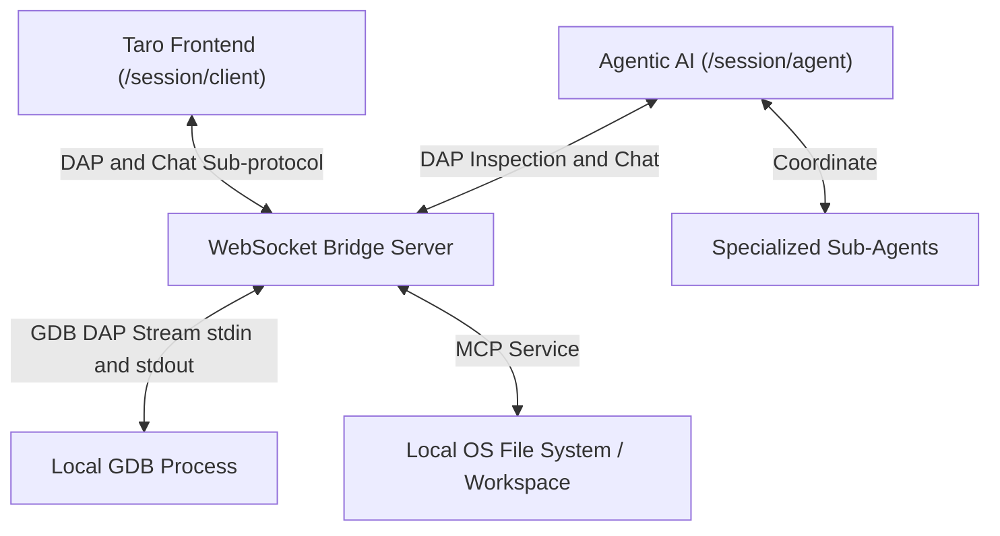

# Implement Node.js WebSocket Bridge (WI-09)

> [!NOTE]
> **Source Work Item**: Implement Node.js WebSocket Bridge
> **Description**: Implement a simple Node.js server that receives frontend WebSocket connections and forwards them to the local DAP executable (e.g., `lldb-dap`)

## Purpose

Due to web browser sandbox limitations, a frontend running in web mode cannot directly spawn or communicate with local command-line executables like GDB. The **`taro-session`** server utility solves this by acting as a lightweight proxy and session persistence server. 

To enable modern, intelligent debugging workflows, **`taro-session`** implements a **Dual-Role Architecture**:
1. **Interactive Client (Human User)**: The standard frontend web UI which communicates with the GDB process via standard DAP messages.
2. **Agentic AI Debug Companion**: An LLM-driven agentic role that connects directly to the server to observe session events, interact with the user via conversational dialogue, query and inspect state via tool-calling, and coordinate complex diagnostic workflows using the Model Context Protocol (MCP) and multi-agent systems.

---

## Scope

### In Scope
- **Standalone `taro-session` Server**: A lightweight utility that can be run independently using Node.js:
  ```bash
  taro-session --session-path /path/to/session.tarodb
  ```
- **Dual-Channel WebSocket Routing**: Listens on standard ports (default `:8080`) and provides separate multiplexed connections:
  - `/session/client`: Dedicated channel for the frontend UI client.
  - `/session/agent`: Dedicated channel for the Agentic AI companion.
- **Stateful Event Broadcasting**: The server acts as a pub/sub broker. GDB output (DAP events, stdin/stdout logs) is broadcasted to both the client and the agent concurrently, ensuring the agent maintains real-time context of the debug state.
- **Agentic AI Chat Protocol**: Establoys a dedicated sub-protocol allowing direct, real-time message exchange between the frontend `/client` and the `/agent` channels for user-agent dialogue.
- **Tool-Calling DAP Interface**: Allows the agent to issue specific DAP requests (e.g. `stackTrace`, `variables`, `evaluate`) as tools to inspect execution state.
- **Model Context Protocol (MCP) Integration**: Implements a standard MCP host/server framework within the server, allowing agents to read source files, execute SAT solver and query compile-time targets.
- **Multi-Agent Coordination Framework**: Facilitates routing messages and sub-tasks between the main Agentic AI companion and specialized sub-agents (e.g., GDB diagnostics agent, code-fixer agent).
- **Robust Cleanup**: Detects socket termination (closings, crashes, or network disconnects) on any crucial channel and handles cleanup gracefully, terminating GDB and leaving no orphan processes.

### Out of Scope
- **Public WAN Hosting**: The `taro-session` server is designed exclusively for secure, local development loopback (`localhost`).

- **Authorization & Token Management**: Deep role-based access control or single sign-on systems.

---

## Behavior

### 1. Architectural Routing & Endpoints



The server provides two key HTTP/WS connection endpoints:
- **`ws://localhost:8080/session/client`**
- **`ws://localhost:8080/session/agent`**

### 2. Multiplexed Event Brokerage

The bridge routes and broadcasts messages according to the following matrix:

| Source | Target | Message Type | Bridge Behavior |
| :--- | :--- | :--- | :--- |
| **Client** | GDB | DAP Request | Forward directly to GDB `stdin`. |
| **Agent** | GDB | DAP Request (Inspection) | Verify permission, forward to GDB `stdin`. |
| **GDB** | Client & Agent | DAP Response/Event | Broadcast to both channels. |
| **Client** | Agent | User Chat Message | Route directly to `/session/agent`. |
| **Agent** | Client | Agent Chat Response | Route directly to `/session/client`. |

#### Multiplexing Server Logic Example:
```javascript
const ws = require('ws');
const { spawn } = require('child_process');

const wss = new ws.Server({ port: 8080 });
let clientSocket = null;
let agentSocket = null;
let gdbProcess = null;

wss.on('connection', (socket, req) => {
  const path = req.url;

  if (path === '/session/client') {
    clientSocket = socket;
    setupSession();
    
    socket.on('message', (message) => {
      const msg = JSON.parse(message);
      if (msg.channel === 'chat') {
        // Route chat message directly to the agent
        if (agentSocket) agentSocket.send(JSON.stringify(msg));
      } else {
        // Forward DAP request to GDB
        if (gdbProcess) gdbProcess.stdin.write(message);
      }
    });
  } 
  
  else if (path === '/session/agent') {
    agentSocket = socket;
    
    socket.on('message', (message) => {
      const msg = JSON.parse(message);
      if (msg.channel === 'chat') {
        // Route agent chat response to the client
        if (clientSocket) clientSocket.send(JSON.stringify(msg));
      } else if (msg.channel === 'dap') {
        // Allow the agent to perform tool-called DAP inspections (read-only)
        if (gdbProcess) gdbProcess.stdin.write(JSON.stringify(msg.data));
      }
    });
  }
});

function setupSession() {
  if (!gdbProcess) {
    gdbProcess = spawn('gdb', ['--interpreter=dap']);
    
    gdbProcess.stdout.on('data', (data) => {
      // Broadcast GDB events and responses to both Client and Agent
      if (clientSocket) clientSocket.send(data);
      if (agentSocket) agentSocket.send(data);
    });
  }
}
```

### 3. Chat Message Envelope & Context Schema

To facilitate conversational debugging, user-agent chat messages utilize a logically typed JSON envelope. The frontend client includes rich **session context** directly with user messages, allowing the Agentic AI companion to have full context of the active debug session without having to query state repeatedly.

```typescript
interface ChatMessageEnvelope {
  channel: 'chat';
  id: string;                 // Unique message identifier
  timestamp: string;          // ISO-8601 string timestamp
  sender: 'client' | 'agent'; // Message source
  content: string;            // Textual dialogue content (Markdown)
  context?: ChatDebugContext; // Attached session runtime state context
}

interface ChatDebugContext {
  activeSessionId: string;
  activeThreadId?: number;
  activeFrameId?: number;
  
  // Call stack trace at the moment the message was generated
  callStack?: {
    level: number;
    functionName: string;
    sourceFile: string;
    line: number;
  }[];

  // Variables evaluated in the current scopes
  variables?: {
    name: string;
    value: string;
    type: string;
    scope: 'local' | 'global' | 'register';
  }[];

  // Active breakpoints in the debug session
  breakpoints?: {
    sourceFile: string;
    line: number;
    verified: boolean;
  }[];

  // Code snippet surrounding the active program counter (PC)
  codeSnippet?: {
    sourceFile: string;
    startLine: number;
    lines: string[];
  };

  // Recent program stdout/stderr or DAP log entries for console context
  recentLogs?: {
    timestamp: string;
    category: 'system' | 'dap' | 'stdout' | 'stderr';
    message: string;
  }[];
}
```

### 4. Model Context Protocol (MCP) and Tool-Calling

The Agentic AI can call specific local host tools via the Bridge's **MCP interface** to perform local workspace actions or advanced formal verification:
* **`read_workspace_file`**: Read active code context to find local variables or source logic.
* **`get_build_errors`**: Retrieve recent local compilation outputs.
* **`run_local_test`**: Execute unit tests locally during debugging.
* **`solve_memory_corruption`**: A specialized diagnostic tool that integrates a formal verification or SAT/SMT solver (e.g., using Z3 or equivalent SMT-lib solver). The Agentic AI specifies a set of formal conditions, memory boundaries, or symbolic constraints (e.g., pointer base offsets, allocation sizes, loop invariant bounds). The solver then formally evaluates these conditions to find satisfying assignments that trigger memory corruption (such as buffer overflows, use-after-free, or double-free states), providing precise counter-examples to aid GDB diagnostics.

## Codebase Structure & Technical Details

To implement the **`taro-session`** utility as a high-density, maintainable Node.js daemon, the codebase is structured under `projects/taro-session/`. It utilizes TypeScript for strong typing and compiles down to vanilla ESM JavaScript targeting Node.js >= 20.

### 1. Proposed Directory Structure

```text
projects/taro-session/
├── src/
│   ├── index.ts           # Daemon entry point, parses CLI arguments & initializes host
│   ├── server.ts          # WebSocket server: routes /session/client and /session/agent
│   ├── session.ts         # Session state & filesystem read/write persistence manager
│   ├── gdb-process.ts     # Spawns GDB with --interpreter=dap, proxies I/O, prevents orphans
│   ├── mcp-host.ts        # Model Context Protocol host server & tool implementations
│   └── logger.ts          # Low-latency file stream appenders for logs/ directory
├── tsconfig.json          # TypeScript configuration for Node.js build
├── package.json           # npm dependencies (ws, typescript, @types/node, @types/ws)
└── README.md              # Setup and execution guide for human engineers
```

### 2. Component Technical Specifications

#### 2.1 Daemon Entry (`src/index.ts`)
- Parses command line parameters using a lightweight, zero-dependency parser:
  - `--session-path <path>` (Mandatory): Path to the `.tarodb` session database folder.
  - `--port <number>` (Optional, default `8080`): The local TCP port to bind the WebSocket server.
- Verifies that the designated `--session-path` exists or initializes the folder structure if it is a new debug session.
- Bootstraps the `SessionManager`, `GdbProcessManager`, and `WebSocketServer`.

#### 2.2 WebSocket Multiplexer (`src/server.ts`)
- Instantiates a `ws.Server` instance restricted strictly to `127.0.0.1`.
- Isolates endpoints through connection URL parsing:
  - `ws://localhost:8080/session/client`
  - `ws://localhost:8080/session/agent`
- Coordinates incoming messages and forwards requests:
  - **Client messages**: Forwards standard DAP commands directly to the GDB child process `stdin`. Chat messages (e.g. `channel: "chat"`) are routed directly to the active Agent channel.
  - **Agent messages**: Forwards read-only DAP diagnostic requests (`channel: "dap"`) to GDB `stdin`. Chat responses (e.g. `channel: "chat"`) are routed to the Client channel. MCP calls are processed locally by the MCP tool registry.

#### 2.3 Session Manager (`src/session.ts`)
- Manages the read/write transactions to the unified debug session directory (`.tarodb`).
- Loads `config.json` on startup to determine the executable binary, arguments, and working directory to spawn GDB.
- Loads `breakpoints.json` to extract pre-existing user breakpoints.
- Restores cognitive agent history from `memory.md` and provides it to the Agentic AI companion upon connection.
- Implements synchronous and asynchronous write-through utilities to save run state (e.g., active breakpoints, chat history, or memory updates) cleanly to the disk without file locks or contention.

#### 2.4 GDB Subprocess Manager (`src/gdb-process.ts`)
- Uses Node’s `child_process.spawn` to spin up GDB:
  ```typescript
  const gdb = spawn('gdb', ['--interpreter=dap'], { cwd: sessionConfig.cwd });
  ```
- Subscribes to `gdb.stdout` and `gdb.stderr` streams to parse continuous DAP frame packets.
- Broadcasts every incoming DAP event from GDB simultaneously to both `/session/client` and `/session/agent` WebSocket channels.
- **Orphan Prevention & Lifecycle Cleanup**: 
  - Monitors the lifetime of active sockets.
  - If the primary Client connection `/session/client` terminates unexpectedly (network drop, window closed), the manager immediately initiates cascading cleanup.
  - Sends a standard `disconnect` DAP request to GDB. If GDB does not terminate within a `2000ms` window, sends `SIGTERM` followed immediately by `SIGKILL` to clean the process table.

#### 2.5 MCP Host (`src/mcp-host.ts`)
- Implements a robust JSON-RPC 2.0 host layer to service cognitive tools over `/session/agent`:
  - `read_workspace_file`: Validates paths inside the designated workspace to prevent directory traversal, returning the content of target source files.
  - `get_build_errors`: Reads local terminal build outputs or compiler diagnostics.
  - `run_local_test`: Invokes local unit testing (e.g., executing `npm run test` or standard test suite) and returns the standard result.
  - `solve_memory_corruption`: Connects to SMT/SAT solver (e.g., Z3) to formally verify symbolic bounds and memory constraints.
  - `write_agent_memory` / `read_agent_memory`: Manages direct I/O for `memory.md`.

#### 2.6 Log Streamer (`src/logger.ts`)
- Opens low-latency append-only write streams to `logs/stdout.log`, `logs/stderr.log`, and `logs/dap.log`.
- Sanitizes incoming buffer chunks to remove terminal escape sequences or control sequences before writing to disk.
- Automatically rotates or truncates files when they exceed a configurable size ceiling to prevent host disk exhaustion.

---

## Acceptance Criteria

- [ ] A standalone Node.js server starts and successfully listens on standard ports (default `:8080`).
- [ ] Correctly handles and isolates `/session/client` and `/session/agent` WebSocket connections.
- [ ] GDB is successfully launched in DAP mode (`--interpreter=dap`) upon client connection.
- [ ] DAP requests from the client and authorized agent are successfully forwarded to GDB.
- [ ] DAP responses and event streams from GDB are broadcasted concurrently to both the client and the agent.
- [ ] Real-time user-agent chat messages are successfully routed between the `/client` and `/agent` endpoints.
- [ ] Agent can execute active DAP tool-calls (`stackTrace`, `variables`) over the socket and receive responses.
- [ ] The bridge exposes a functional Model Context Protocol (MCP) interface supporting workspace file inspection.
- [ ] The bridge implements and exposes the `solve_memory_corruption` MCP tool, accepting AI-defined constraints and returning formal SAT-solver solutions/counter-examples for debugging.
- [ ] Multiple specialized agents can coordinate diagnostics by exchanging structured sub-tasks.
- [ ] Disconnecting either the client or the agent triggers a complete cleanup, successfully terminating GDB and leaving no orphan processes.
- [ ] Verify standard error output from GDB is parsed and output to the client debug console.


