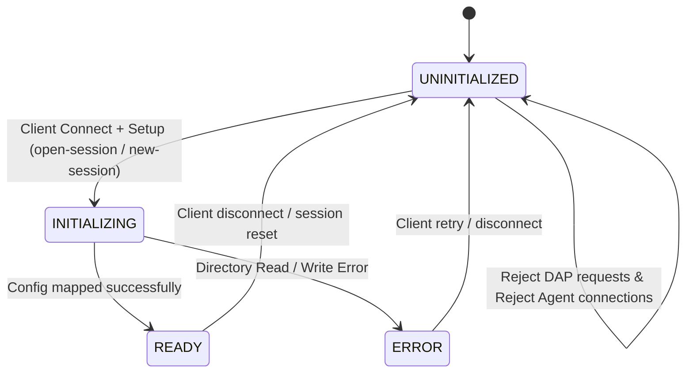

# Implement taro-session Connection State Machine & Setup Handshake (WI-136)

> [!NOTE]
> **Source Work Item**: Implement taro-session Connection State Machine & Setup Handshake
> **Description**: Introduce a formal connection state machine in taro-session and taro-debugger. Client performs setup handshake before standard DAP initialization.

---

## Purpose

The purpose of this specification is to establish a stateful, secure, and predictable initialization pipeline for the Taro Debugger local session daemon. By introducing a formal setup handshake prior to standard Debug Adapter Protocol (DAP) execution, we:
- Enable dynamic loading and dynamic creation of debug sessions at runtime.
- Coordinate debugger session configurations and breakpoints dynamically at runtime.
- Enforce strict connection guards preventing cognitive AI companions from attaching to raw, uninitialized processes.
- Validate execution payloads early to eliminate silent, unhandled startup crashes.

---

## Scope

### In-Scope
- **`taro-session` WebSocket Server Connection States:** Formal transition states (`UNINITIALIZED`, `INITIALIZING`, `READY`, `ERROR`) governing the `/session/client` connection.
- **Setup Handshake Envelope:** JSON-based setup protocol schemas for `open-session` and `new-session` commands sent via the `"setup"` channel.
- **GDB Process Lifecycle:** Clean management of the GDB child process spawned at daemon startup (cascading termination on client disconnect).
- **Agent Connection Guard:** Connection gating on `/session/agent` rejecting connections unless the session is in the `READY` state.
- **Parameter Validation:** Active verification of standard DAP `launch` arguments (checking for empty or missing `program` paths).

### Out-of-Scope (Exclusion Boundaries)
- **WAN Hosting and Multi-Tenancy Security:** This spec applies exclusively to loopback (`127.0.0.1`) boundaries. Authentication tokens, certificates, and WAN SSL/TLS wrapping are out of scope for v1.0.
- **TCP or Serial Transport Layers:** Handshake routing is designed strictly for WebSocket (`ws`) loopback bridges.

---

## Behavior

### 3.1 Connection State Machine Diagram



[Diagram: Connection State Machine Flow - Shows the lifecycle of a client socket connection. The daemon begins in the UNINITIALIZED state. Client setup commands transition it to INITIALIZING, which loads and maps the session's configuration parameters. Upon success, the state moves to READY, opening up DAP and Agent connection capability. Loading or configuration errors transition the system to the ERROR state.]

---

### 3.2 State Behavior & Transition Logic

#### 1. `UNINITIALIZED`
- **Trigger:** Sockets connected to `ws://localhost:8080/session/client` start in this state.
- **Allowed Actions:** Setup channel messages (`open-session` or `new-session`).
- **Gating Constraints:**
  - Any standard DAP message (e.g. `initialize`, `launch`) sent prior to setup completion will be intercepted and discarded, returning a DAP error response.
  - Any connection requests to `/session/agent` are immediately closed with socket status code `4005` ("Session not ready").

#### 2. `INITIALIZING`
- **Trigger:** Client sends a valid `open-session` or `new-session` command payload.
- **Allowed Actions:** None.
- **Execution Pipeline:**
  - Instantiates the physical `SessionManager` targeting the provided session directory.
  - Reads `config.json` (or writes it first for `new-session`).
  - Instantiates `McpHost` with the active `SessionManager`.

#### 3. `READY`
- **Trigger:** Session directory has been successfully loaded and state initialized.
- **Allowed Actions:**
  - Client DAP messages are actively forwarded to GDB standard input.
  - Connections to `/session/agent` are accepted.
  - Chat dialogues and MCP JSON-RPC messages are routed.

#### 4. `ERROR`
- **Trigger:** The session directory was unreadable or configuration structure was invalid.
- **Allowed Actions:** None (connection is terminated by the server).
- **Client Retry Behavior (Reconnect-Retry Only):**
  - **Fail-Fast Policy:** Upon entering the `ERROR` state, the server broadcasts the `session-failed` event (or standard DAP error response) and immediately closes the client WebSocket connection.
  - **Reconnection Requirement:** To retry, the client MUST close any remaining local transport instances, establish a completely fresh WebSocket connection to `/session/client` (which boots in `UNINITIALIZED` state), and re-send the setup payload. This prevents any stale or out-of-sync states from surviving on a reused socket connection.
- **Gating Constraints:**
  - Sets the state, terminates GDB (if active), sends the descriptive error to the client, closes the WebSocket connection, and resets the server to accept new connections.

---

### 3.3 Setup Protocol Message Schemas

All communication prior to transitioning to `READY` takes place over the `"setup"` channel.

#### A. Client `open-session` Command
```typescript
interface OpenSessionMessage {
  channel: 'setup';
  command: 'open-session';
  arguments: {
    sessionPath: string; // Absolute path to target .tarodb folder
  }
}
```

#### B. Client `new-session` Command
```typescript
interface NewSessionMessage {
  channel: 'setup';
  command: 'new-session';
  arguments: {
    sessionPath: string;
    config: {
      program: string;                  // Path to binary executable
      args?: string[];                  // Target arguments
      cwd?: string;                     // Working directory
      env?: Record<string, string>;     // Environment variables
    }
  }
}
```

#### C. Server Success Response (`session-ready`)
Emitted to the client on successful transition to the `READY` state. This returns the loaded launch properties to the client so that the frontend can synchronize its UI state.
```json
{
  "channel": "setup",
  "event": "session-ready",
  "body": {
    "status": "success",
    "sessionPath": "/root/taro-debugger/my-session.tarodb",
    "config": {
      "version": "1.0.0",
      "configuration": {
        "program": "/root/taro-debugger/build/app",
        "args": ["-v"],
        "cwd": "/root/taro-debugger",
        "env": {}
      }
    }
  }
}
```

#### D. Server Failure Response (`session-failed`)
Emitted on transition to the `ERROR` state.
```json
{
  "channel": "setup",
  "event": "session-failed",
  "body": {
    "error": "Failed to spawn GDB process: executable '/usr/bin/gdb' not found."
  }
}
```

---

### 3.4 Launch Parameter Validation

To ensure robust execution parameters in accordance with **Pattern A**, `taro-session` implements a strict check on the frontend's subsequent standard DAP `launch` request:
- **Rule:** The `launch` request arguments must not be empty or missing. Specifically, `arguments.program` must be a valid, non-empty string.
- **Action on Violation:** If the validation check fails, the daemon **marks a session error**:
  1. Immediately calls `closeTransport()` to terminate the GDB process cleanly.
  2. Sets the connection state to `ERROR`.
  3. Returns a descriptive DAP error response payload:
     ```json
     {
       "seq": 3,
       "type": "response",
       "request_seq": 3,
       "success": false,
       "command": "launch",
       "message": "Launch configuration missing or empty 'program' argument."
     }
     ```

---

### 3.5 Daemon Log Files

The `taro-session` daemon writes three append-only log streams per connection cycle:

| File | Content |
| :--- | :--- |
| `stdout.log` | General daemon lifecycle events (startup, state transitions, client connections) |
| `stderr.log` | Error and warning messages (setup failures, GDB errors) |
| `dap.log` | Raw DAP protocol traffic, prefixed with `[IN]` / `[OUT]` and an ISO 8601 timestamp |

**Default log path:**
```
<os.tmpdir()>/taro-session-logs-<PID>/logs/
```
- `<PID>` is the daemon's `process.pid`, providing isolation between concurrent daemon instances.
- Example on Linux: `/tmp/taro-session-logs-12345/logs/stdout.log`

**Override:** Pass `--log-path <directory>` at startup to redirect all three log streams to `<directory>/logs/`.

---

## Acceptance Criteria

| ID | Operational Test | Expected Behavior | Verification Command / Target |
| :--- | :--- | :--- | :--- |
| **AC-1** | Attempt socket connection to `/session/agent` while daemon is in `UNINITIALIZED` state. | Socket connection is immediately terminated with socket close status code `4005`. | Check server connection logs / inspect close code. |
| **AC-2** | Send a standard DAP `initialize` message to `/session/client` immediately after socket connect, before sending any setup commands. | Message is rejected with an error response; state remains `UNINITIALIZED`; message is not forwarded. | Verify response payload matches state-gating layout. |
| **AC-3** | Send `open-session` command payload containing a valid `.tarodb` session path. | State transitions `UNINITIALIZED` -> `INITIALIZING` -> `READY`. Daemon broadcasts `session-ready` containing the loaded configuration details. | Inspect websocket output buffer. |
| **AC-4** | Attempt socket connection to `/session/agent` after `session-ready` success has been emitted. | Connection is successfully accepted and handshakes complete. | Inspect agent console connection status. |
| **AC-5** | Send a standard DAP `launch` request containing empty or missing `program` arguments while in `READY` state. | Server closes the transport, terminates GDB, transitions state to `ERROR`, and returns a DAP error response. | Verify target process exits and state maps to `ERROR`. |
