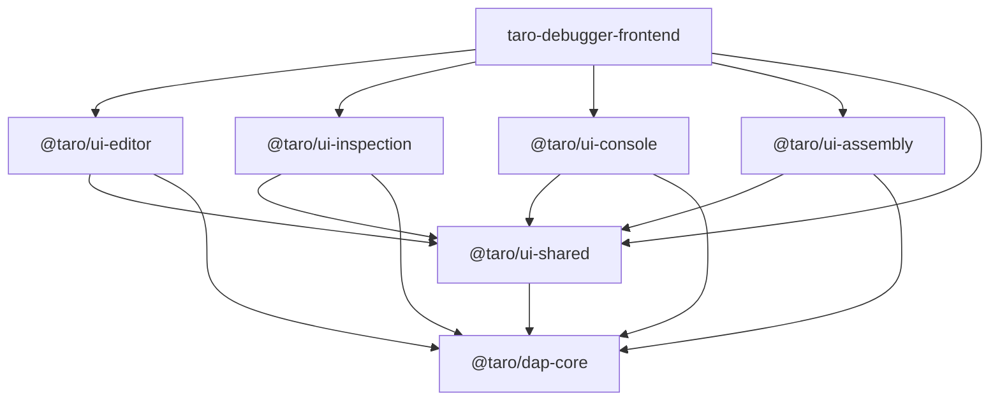

# Refactor: Extract @taro/ui-shared Foundation (WI-75)

> [!NOTE]
> **Source Work Item**: Refactor: Extract @taro/ui-shared Foundation
> **Description**: Centralize reusable UI components, layout tokens, and generic services into a dedicated foundation library to flatten the dependency graph and optimize the build process.

## Purpose

Currently, the workspace suffers from "module leakage" where `@taro/ui-editor` is incorrectly serving as a dumping ground for shared UI constants (e.g., `LAYOUT_COMPACT_MQ`). This forces other libraries like `ui-inspection` to depend on the heavy Monaco Editor library just to access a simple layout token.

The extraction of `@taro/ui-shared` aims to:
1. **Enforce Strict Modularity**: Separate functional UI logic from shared foundational utilities.
2. **Flatten Dependency Graph**: Remove the forced chain `ui-inspection -> ui-editor -> dap-core`.
3. **Optimize Build Times**: Reduce the number of prerequisite builds in `.vscode/tasks.json`.
4. **Promote Reuse**: Provide a clean location for generic components like `ErrorDialog` and `InspectionPanel`.

## Scope

### 1. New Library: `@taro/ui-shared`

- **Location**: `projects/ui-shared`
- **Responsibility**: Generic UI foundation (Pipes, Directives, Base Components, Design Tokens).

### 2. Extraction List

| Source Location | Target Location | Rationale |
| :--- | :--- | :--- |
| `projects/ui-editor/src/lib/layout.config.ts` | `projects/ui-shared/src/lib/layout.config.ts` | Shared by all side-panel components. |
| `projects/ui-inspection/src/lib/inspection-panel.component.*` | `projects/ui-shared/src/lib/inspection-panel.*` | Collapsible/Resizable container logic is generic. |
| `projects/taro-debugger-frontend/src/app/error-dialog/` | `projects/ui-shared/src/lib/dialogs/error-dialog/` | Should be accessible to all libraries for unified error reporting. |

### 3. Dependency Hierarchy Update

> [Diagram: Dependency hierarchy showing taro-debugger-frontend (App) as the root, depending on UI libraries (Editor, Inspection, Console, Assembly) and the new Shared library. All UI libraries depend on Shared, and everything depends on Core.]

## Behavior

### 1. Token Consolidation

- All SCSS variables and TypeScript layout tokens (like `LAYOUT_COMPACT_MQ`) will be moved to `ui-shared`.
- UI libraries will import these from `@taro/ui-shared` instead of `@taro/ui-editor`.

### 2. Generic UI Components

- `InspectionPanelComponent` will be renamed to `PanelComponent` or similar to reflect its generic nature.
- It will support `ng-content` for header actions and body content.

### 3. Build Task Optimization

- `.vscode/tasks.json` will be updated to utilize project-specific watch chains:
  - `watch:ui-inspection`: `ng build dap-core && ng build ui-shared && ng build ui-inspection --watch`
  - **Optimization**: This eliminates the `ng build ui-editor` (Monaco) prerequisite, significantly reducing incremental build times for inspection logic.

## Acceptance Criteria

- [ ] New library `@taro/ui-shared` is successfully generated and builds.
- [ ] `LAYOUT_COMPACT_MQ` is successfully moved and referenced by `ui-inspection`.
- [ ] `InspectionPanelComponent` is moved and correctly utilized by `ui-inspection`.
- [ ] `ErrorDialog` is moved and correctly utilized by the main application.
- [ ] All library watch tasks in `.vscode/tasks.json` are updated and functional.
- [ ] [Test] All unit tests for moved components/services pass in their new location.
- [ ] [Test] `ui-inspection` builds successfully without `dist/ui-editor` being present.
