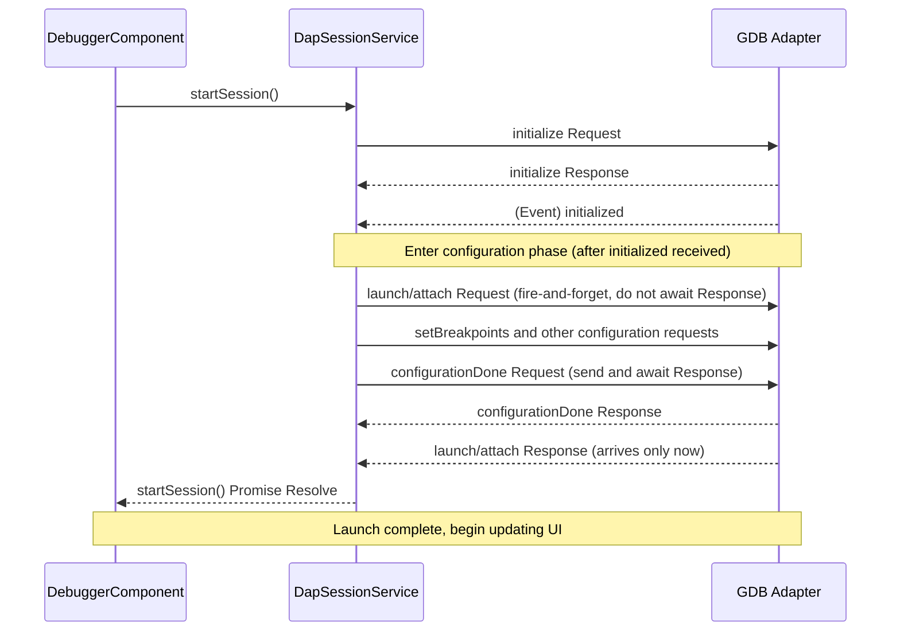

# Debug Adapter Protocol (DAP) — Technical Guide

## 1. Lifecycle Overview

This section describes session establishment, lifecycle management, and Launch Request behavior, and addresses common edge cases and developer concerns when implementing the `launch` request.

In DAP, a typical debug session begins with an `initialize` request, followed by a `launch` or `attach` request. This determines whether the Adapter will "launch" a new process or "attach" to an existing one.

### Q1: Can the `launch` request be sent multiple times within the same debug session?

**Answer:** In principle, **no**. In the DAP specification, the `launch` request is treated as a one-time action to start the debuggee. Once `launch` successfully returns a response, the session enters a running or paused state. Sending `launch` again under the same session identifier violates the protocol logic, and most Debug Adapters will return an Error Response for duplicate `launch` requests.

### Q2: If I need to "restart" the program being debugged, what should I do?

**Answer:** You should not reuse `launch`. Instead, use the **`restart` request**. When a user clicks "Restart" in the IDE (e.g., VS Code), the IDE first checks the `supportsRestartRequest` capability. If supported, it sends `restart`; if not, the IDE sends `disconnect` to end the current session, then creates a brand-new session and sends `launch` again.

### Q3: How do I declare support for the "restart" capability in my implementation?

**Answer:** In the `initialize` response, set `supportsRestartRequest` to `true` in the Capabilities object.

**JSON Example:**

```json
{
    "type": "response",
    "command": "initialize",
    "success": true,
    "body": {
        "supportsRestartRequest": true,
        "supportsConfigurationDoneRequest": true
    }
}
```

### Q4: Why isn't the `launch` request designed to be called multiple times?

**Answer:** This relates to **resource management** and **state machine** simplicity. Duplicate `launch` calls would result in multiple processes coexisting, leading to port conflicts or memory contention. Additionally, breakpoint configuration (`setBreakpoints`) typically occurs after `launch`; if multiple launches were allowed, the protocol would need to handle extremely complex state reset scenarios.

## 2. Initialization Sequence & Constraints

According to the official specification and implementation best practices, the initialization process must follow a strict order to ensure that "configuration" completes before "program execution." This section is heavily influenced by early development discussions; see [VS Code Issue #4902: Debug protocol: configuration sequence](https://github.com/microsoft/vscode/issues/4902).

### Key Constraints

#### Constraint 1: `initialized` Event Timing
The Debug Adapter must send the `initialized` event only **after** returning the `initialize` response.
* *Reason:* The `initialized` event notifies the IDE that the Adapter is ready to receive configuration (such as `setBreakpoints`). If sent too early, the IDE may not have finished processing the Capabilities from the `initialize` response.

#### Constraint 2: `launch`/`attach` Response Timing
The `launch` or `attach` **response** must be sent only **after** the `configurationDone` **response** has been sent to the IDE.
* *Reason:* When the IDE receives the `launch` response, it considers the "launch sequence complete" and begins displaying the debug interface. If `configurationDone` hasn't been processed by then, the program may start executing before breakpoints are fully loaded (Race Condition).

#### Constraint 3: `configurationDone` Request Must Follow `launch`/`attach` Request
The `configurationDone` **request** must be sent only **after** the `launch` or `attach` **request** has been sent.
* *Reason:* Many Debug Adapters check whether a `launch`/`attach` request has been received when they get `configurationDone`. If `configurationDone` arrives first, the Adapter will return an error (e.g., `"launch or attach not specified"`) because it doesn't yet know the debug target.
* *Common mistake:* Asynchronously sending `configurationDone` immediately upon receiving the `initialized` event, while the `launch`/`attach` send is delayed to later code execution, causing `configurationDone` to be sent first.

#### Standard Message Flow

1. **IDE → Adapter:** `initialize` request
2. **Adapter → IDE:** `initialize` response (declares capabilities)
3. **Adapter → IDE:** `initialized` event (triggers configuration phase)
4. **IDE → Adapter:** `launch`/`attach` request (do not return response at this point)
5. **IDE → Adapter:** Configuration requests (`setBreakpoints`, `setExceptionBreakpoints`, etc.)
6. **IDE → Adapter:** `configurationDone` request (signals configuration complete)
7. **Adapter → IDE:** `configurationDone` response
8. **Adapter → IDE:** `launch`/`attach` response (formally ends the launch sequence)

#### Initialization Sequence Diagram



### Annotated Message Flow with Async Control

```
IDE → Adapter:  initialize request
Adapter → IDE:  initialize response           ← await completion before continuing
Adapter → IDE:  initialized event             ← await this event before continuing
IDE → Adapter:  launch/attach request         ← send, do NOT await response
IDE → Adapter:  setBreakpoints and other configuration requests
IDE → Adapter:  configurationDone request     ← send and await
Adapter → IDE:  configurationDone response    ← await completion before continuing
Adapter → IDE:  launch/attach response        ← only NOW await this response
```

> **⚠️ Warning:** The `launch`/`attach` request must be sent in a "fire-and-forget" manner (send without immediately awaiting the response), because the Adapter will only reply with the `launch`/`attach` response after the `configurationDone` response. If you immediately await the `launch`/`attach` response, you'll deadlock because `configurationDone` hasn't been sent yet.

### Implementation Recommendations Summary

* **For IDE client developers:** Always prioritize the `restart` request for handling re-launch logic, and ensure you only start sending breakpoint configurations after receiving the `initialized` event.
* **For Debug Adapter implementers:** Strictly adhere to the above **constraints** — this is the only way to prevent race conditions during debug startup. Ensure the underlying debug engine is fully ready before sending the `launch` response.

## 3. `loadedSources` & Execution State

### Q1: Under what conditions can the `loadedSources` request succeed?
To successfully execute the `loadedSources` request, the following three conditions must be met:

1. **Capability Check**: The Debug Adapter must set `supportsLoadedSourcesRequest` to `true` in the `initialize` response. If not declared, the Client typically won't issue this request.
2. **Session Active**: Must be sent after the debug session has started (typically after `configurationDone`).
3. **Runtime Support**: The target environment (e.g., Python debugger, Node.js runtime) must be capable of tracking dynamically loaded modules for the DA to return an accurate list.

### Q2: When is `loadedSources` typically triggered?
In addition to explicit Client requests for updates, the most common trigger flow is:
* **Dynamic load event**: When the target program executes `import` or dynamically loads a script, the DA sends a `loadedSource` (reason: `'new'`) event to the Client.
* **UI update**: Upon receiving the above event, the Client sends a `loadedSources` request to get the latest source list and update the IDE interface (e.g., VS Code's "Loaded Scripts" view).

### Q3: How do you confirm the debuggee is currently paused?
In the DAP specification, state confirmation is not done through "polling" but through an **event-driven** mechanism:

1. **Listen for the `stopped` event**: When the debuggee hits a breakpoint or encounters an exception, the DA sends a `stopped` event.
   * Only after receiving this event does the Client consider the target to be in a paused state.
   * The `threadId` in the event indicates which thread stopped.
2. **Check the `allThreadsStopped` property**:
   * If `true`, the entire process is paused.
   * If `false`, only the specific thread has stopped; other threads may still be running.

### Q4: Will sending `loadedSources` fail when the debuggee is "running"?
**Not necessarily**, but behavior depends on the DA implementation:
* Many DAs allow returning the loaded source list while in the Running state.
* However, requests like `stackTrace`, `scopes`, or `variables` that need to access thread stack information **must** be sent while paused; otherwise, the DA will typically return an error message.

### Q5: If the debuggee hasn't sent a `stopped` event, can the Client force it to pause?
Yes. The Client can send a **`pause` request**.
* Note: After sending the `pause` request, you cannot immediately assume the target is paused.
* You must wait for the DA's `pause` **Response** and the subsequent **`stopped` event** before confirming the target has officially entered the paused state.

## 4. References

* [DAP Official Specification: Initialization](https://microsoft.github.io/debug-adapter-protocol/overview/#initialization)
* [GitHub Discussion: VS Code Issue #4902](https://github.com/microsoft/vscode/issues/4902) — Historical discussion on why the launch response must wait for configuration completion.