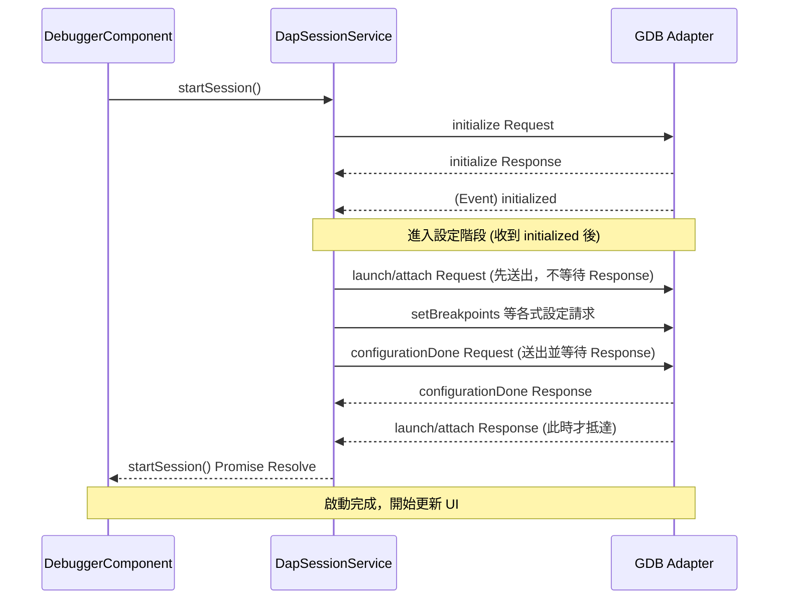

# **Debug Adapter Protocol (DAP) 技術指引**

## **1\. 生命週期概覽 (Lifecycle Overview)**

本節主要說明工作階段（Session）的建立、生命週期管理以及啟動請求（Launch Request）的行為規範，並針對實作 `launch` 請求時常見的邊界情況與開發者疑慮進行解答。

在 DAP 中，一個典型的除錯工作階段始於 initialize 請求，隨後是 launch 或 attach 請求。這決定了 Adapter 是要「啟動」一個新進程，還是「附加」到一個現有的進程上。

### **Q1: launch 請求可以在同一個除錯工作階段 (Debug Session) 中重複發送嗎？**

**回答：** 原則上 **不行**。在 DAP 規範中，launch 請求被視為「啟動」除錯目標（Debuggee）的單次行為。一旦 launch 成功返回 response，該 Session 就進入了運行或暫停狀態。在同一個 Session 識別碼下再次發送 launch 是不符合協議邏輯的，大多數的 Debug Adapter 會對重複的 launch 請求回傳錯誤（Error Response）。

### **Q2: 如果我需要「重新啟動」正在除錯的程式，應該如何操作？**

**回答：** 您不應重複使用 launch，而應該使用 **restart 請求**。當用戶在 IDE（如 VS Code）中點擊「重新啟動」按鈕時，IDE 會先檢查 supportsRestartRequest 能力。如果支援，則發送 restart；如果不支援，IDE 會先發送 disconnect 結束當前 Session，然後建立一個全新的 Session 並再次發送 launch。

### **Q3: 如何在實作中宣告支援「重新啟動」功能？**

**回答：** 在回應 initialize 請求時，必須在 Capabilities 物件中將 supportsRestartRequest 設為 true。

**JSON 範例：**

{  
    "type": "response",  
    "command": "initialize",  
    "success": true,  
    "body": {  
        "supportsRestartRequest": true,  
        "supportsConfigurationDoneRequest": true  
    }  
}

### **Q4: 為什麼 launch 請求不設計成可以多次調用？**

**回答：** 這涉及到 **資源管理** 與 **狀態機 (State Machine)** 的簡潔性。重複 launch 會導致多個進程並存，造成埠號（Port）衝突或記憶體競爭。此外，斷點設置（SetBreakpoints）通常發生在 launch 之後，若允許多次啟動，協議需要處理極度複雜的狀態重置問題。

## **2\. 初始化序列與順序約束 (Sequence & Constraints)**

根據官方規範與實作最佳實踐，初始化過程必須遵循嚴格的順序，以確保「配置（Configuration）」在「程式執行」之前完成。此章節邏輯深受早期開發討論影響，可參考 [VS Code Issue \#4902: Debug protocol: configuration sequence](https://github.com/microsoft/vscode/issues/4902)。

### **關鍵約束條件 (Key Constraints)**

#### **Constraint 1: Initialized 事件發送時機**  
   Debug Adapter 必須在回傳 initialize 請求的 **response 之後**，才能發送 initialized 事件 (event)。  
   * *原因：* initialized 事件是用來通知 IDE：Adapter 已經準備好接收設定（如 setBreakpoints）。若過早發送，IDE 可能尚未處理完 initialize 的能力宣告（Capabilities）。  
#### **Constraint 2: launch/attach 回應時機**  
   launch 或 attach 的 **response** 必須在 **configurationDone 的 response 發送之後** 才能送出給 IDE。  
   * *原因：* 當 IDE 收到 launch response 時，它會認為「啟動序列已完成」，並開始顯示除錯介面。如果在此之前 configurationDone 尚未處理完畢，可能會導致程式在斷點尚未完全載入時就開始執行（Race Condition）。

#### **Constraint 3: configurationDone 請求必須在 launch/attach 請求之後才能發送**

configurationDone 的 **request** 必須在 launch 或 attach 的 **request** 發送之後才能送出。
* *原因：* 許多 Debug Adapter 在收到 configurationDone 時，會檢查是否已經收到 launch/attach 請求。若 configurationDone 先到達，Adapter 會回傳錯誤（如 `"launch or attach not specified"`），因為它尚不知道要除錯的目標程式。
* *常見錯誤：* 在收到 initialized 事件後立即非同步發送 configurationDone，而 launch/attach 的發送延遲到後續程式碼執行，導致 configurationDone 搶先送出。

#### **正確的訊息流 (Standard Message Flow)**

1. **IDE \-\> Adapter:** initialize request  
2. **Adapter \-\> IDE:** initialize response (宣告功能)  
3. **Adapter \-\> IDE:** initialized event (觸發設定階段)  
4. **IDE \-\> Adapter:** launch/attach request (此時不回傳 response)  
5. **IDE \-\> Adapter:** 一系列設定請求 (setBreakpoints, setExceptionBreakpoints 等)  
6. **IDE \-\> Adapter:** configurationDone request (通知設定完成)  
7. **Adapter \-\> IDE:** configurationDone response  
8. **Adapter \-\> IDE:** launch/attach response (正式結束啟動序列)

#### **初始化時序圖 (Initialization Sequence Diagram)**



### **含非同步控制之完整訊息流 (Annotated Message Flow)**

```
IDE → Adapter:  initialize request
Adapter → IDE:  initialize response           ← 等待完成後繼續
Adapter → IDE:  initialized event             ← 等待此事件後繼續
IDE → Adapter:  launch/attach request         ← 送出，不等待 response
IDE → Adapter:  setBreakpoints 等設定請求
IDE → Adapter:  configurationDone request     ← 送出並等待
Adapter → IDE:  configurationDone response    ← 等待完成後繼續
Adapter → IDE:  launch/attach response        ← 此時才等待此 response
```

> **⚠️ 注意：** launch/attach request 必須以「fire-and-forget」方式送出（送出後不立即等待 response），因為 Adapter 會在 configurationDone response 之後才回覆 launch/attach response。若立即等待 launch/attach response，將因 configurationDone 尚未送出而造成死鎖 (Deadlock)。

### **實作建議總結**

* **對 IDE 客戶端開發者：** 請務必優先考慮 restart 請求來處理重複啟動邏輯，並確保在收到 initialized 事件後才開始發送斷點設定。  
* **對 Debug Adapter 實作者：** \* 嚴格遵守上述 **兩個約束條件**，這是防止除錯啟動時發生競爭條件（Race Condition）的唯一方法。  
  * 在 launch response 送出前，確保底層除錯引擎已完全準備就緒。

## **3\. `loadedSources` 與執行狀態 (Execution State)**

### **Q1: `loadedSources` 請求在什麼條件下才能成功執行？**
要成功執行 `loadedSources` 請求，必須滿足以下三個核心條件：

1. **功能宣告 (Capability Check)**：
   Debug Adapter (DA) 必須在 `initialize` 回應中將 `supportsLoadedSourcesRequest` 設為 `true`。如果未宣告，Client 通常不會發起此請求。
2. **階段合法 (Session Active)**：
   必須在偵錯工作階段啟動後（通常是 `configurationDone` 之後）發送。
3. **環境支援 (Runtime Support)**：
   目標環境（如 Python 偵測器、Node.js Runtime）必須具備追蹤動態載入模組的能力，DA 才能回傳正確的清單。

### **Q2: `loadedSources` 通常在什麼時機被觸發？**
除了 Client 主動請求更新外，最常見的觸發流程如下：
* **動態載入事件**：當目標程式執行 `import` 或動態載入腳本時，DA 會發送 `loadedSource` (reason: 'new') 事件給 Client。
* **UI 更新**：Client 接收到上述事件後，會發送 `loadedSources` 請求以獲取最新的原始碼清單並更新 IDE 介面（如 VS Code 的 "Loaded Scripts" 視圖）。

### **Q3: 如何確認偵錯目標 (Debuggee) 目前處於暫停 (Paused) 狀態？**
在 DAP 規範中，確認狀態並非透過「輪詢 (Polling)」，而是透過 **事件驅動 (Event-driven)** 機制：

1. **監聽 `stopped` 事件**：當 Debuggee 遇到中斷點或異常而停止時，DA 會發送 `stopped` 事件。
   * 收到此事件後，Client 才會認定目標處於暫停狀態。
   * 事件中的 `threadId` 會指明是哪個執行緒停止。
2. **檢查 `allThreadsStopped` 屬性**：
   * 若為 `true`，表示整個進程皆已暫停。
   * 若為 `false`，則只有特定執行緒停止，其他執行緒可能仍在運行。

### **Q4: 當 Debuggee 處於「執行中 (Running)」時，發送 `loadedSources` 會失敗嗎？**
**不一定會失敗**，但行為取決於 DA 的實作：
* 許多 DA 允許在 Running 狀態下回傳已載入的清單。
* 然而，像 `stackTrace`、`scopes` 或 `variables` 這種需要存取特定執行緒堆疊資訊的請求，**必須**在暫停狀態下發送，否則 DA 通常會回傳錯誤訊息。

### **Q5: 如果 Debuggee 沒有發送 `stopped` 事件，Client 可以強制它暫停嗎？**
可以。Client 可以發送 **`pause` 請求**。
* 注意：發送 `pause` 請求後，不能立即假設目標已暫停。
* 必須等到收到 DA 回傳的 `pause` **Response** 以及隨後的 **`stopped` 事件**，才能確認目標已正式進入暫停狀態。

## **4\. 參考資料 (References)**

* [DAP Official Specification: Initialization](https://www.google.com/search?q=https://microsoft.github.io/debug-adapter-protocol/overview/%23initialization)  
* [GitHub Discussion: VS Code Issue \#4902](https://github.com/microsoft/vscode/issues/4902) \- 關於為什麼啟動回應必須等待配置完成的歷史討論。