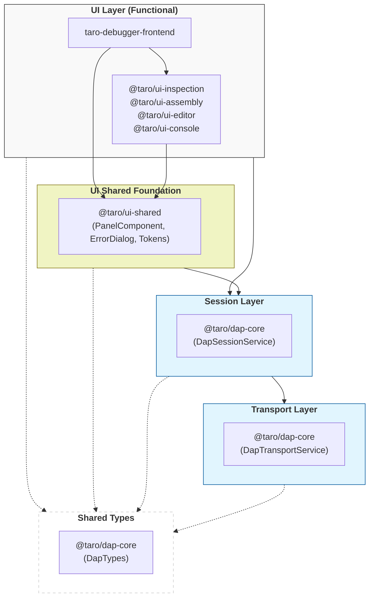

# Source File Responsibility Map

This is the **quick-reference cheat sheet** for locating which file to read or modify for a given feature area. All source files are under the `projects/` directory.

> [!WARNING]
> **For Autonomous Agents (LLMs):** Do NOT use terminal commands (like `find`, `ls`, or `tree`) to search for source file paths.
> All files listed in the tables below are relative to the project root. Please construct the absolute path directly and use your built-in file-reading/editing tools.
> **Note:** `{Repo-path}` resolves to the project root — the directory containing `package.json`.
> **Note:** Test files (`*.spec.ts`) are intentionally omitted from this map to reduce visual noise. For testing requirements and responsibilities, please refer to `docs/tests/test-plan-index.md` and the **Skill: `test-case-writing`** (`.agents/skills/test-case-writing/SKILL.md`).

## Application Bootstrap & Routing

| File | Responsibility | Key Exports |
| --- | --- | --- |
| `projects/taro-debugger-frontend/src/app/app.ts` | Root application component | `AppComponent` |
| `projects/taro-debugger-frontend/src/app/app.config.ts` | Application-level providers | `appConfig` |
| `projects/taro-debugger-frontend/src/app/app.routes.ts` | Route definitions (`/setup` → `/debug`) | `routes` |

## UI Layer (Components)

| File | Responsibility | Key Interfaces | Related Template/Style |
| --- | --- | --- | --- |
| `projects/taro-debugger-frontend/src/app/setup-web.component.ts` | Configuration form for Web mode, DAP connection setup, navigation to `/debug` | `onConnect()`, `form: FormGroup` | `setup-web.component.html`, `setup-web.component.scss` |
| `projects/taro-debugger-frontend/src/app/setup-electron.component.ts` | Configuration form for Electron mode (IPC), navigation to `/debug` | `onConnect()`, `form: FormGroup` | `setup-electron.component.html`, `setup-electron.component.scss` |
| `projects/taro-debugger-frontend/src/app/environment-detect.service.ts` | Detects whether the app is running in Electron or pure Web | `isElectron()` | - |
| `projects/taro-debugger-frontend/src/app/setup.validators.ts` | Shared form validators for connection settings | `serverAddressValidator` | - |
| `projects/taro-debugger-frontend/src/app/electron-redirect.guard.ts` | Route guard on `/setup` that redirects to web or electron setup page | `canActivate()` | - |
| `projects/taro-debugger-frontend/src/app/debugger.component.ts` | Main debug view: toolbar, three-panel layout, event subscriptions, file source loading, execution context tracking | **API:** `onEvent()`, `fileRevealTrigger` **RxJS:** `executionState$`, `connectionStatus$` | `debugger.component.html`, `debugger.component.scss` |
| `projects/taro-debugger-frontend/src/app/debug-control-group.component.ts` | Debug control toolbar: step/continue/stepi/nexti buttons; dynamically adjusts button weight based on active view (Source vs. Disassembly) | `@Input() executionState`, `@Input() activeView`, `@Output() stepAction` | `debug-control-group.component.html`, `debug-control-group.component.scss` |
| `projects/taro-debugger-frontend/src/app/file-explorer.component.ts` | Left sidenav file explorer: fetches `loadedSources` tree, highlights active file, performs automated 'reveal' and `scrollIntoView` for execution context | `@Input() activeFilePath`, `@Input() reloadTrigger`, `@Input() revealTrigger`, `@Output() fileSelected` | `file-explorer.component.html`, `file-explorer.component.scss` |
| `projects/ui-editor/src/lib/editor.component.ts` | Monaco Editor wrapper: source display, line highlight, breakpoint glyph margin | `openFile()`, `highlightLine()`, `clearHighlight()` | `editor.component.html`, `editor.component.scss` |
| `projects/ui-assembly/src/lib/assembly-view.component.ts` | Disassembly panel: renders DAP instruction list via virtual scroll, sticky function header, GDB-style offset column, and dual-state Instruction Pointer (PC) vs Viewport (viewAnchor) anchoring | `@Input() currentPc`, `viewAnchor`, `relocateWindow()`, `scrollToAddress()` | `assembly-view.component.html`, `assembly-view.component.scss` |
| `projects/ui-console/src/lib/log-viewer/log-viewer.ts` | Bottom panel log viewer: console/program streams, auto-scroll, expression evaluation | subscribes `consoleLogs$`, `programLogs$`; `evaluateCommand()` | `log-viewer.html`, `log-viewer.scss` |
| `projects/ui-inspection/src/lib/variables.component.ts` | Right sidebar variables view: virtual-scroll tree for DAP scopes and variables; scope filtering (`Registers` excluded); click-to-reveal type-info overlay (`CdkConnectedOverlay`) with `CppSignaturePipe` simplification; sticky row-actions for type-info and memory inspection | `@Output() inspectMemoryRequest`, `toggleNode()`, `onToggleTypeOverlay()`, `onInspectMemory()` | `variables.component.html`, `variables.component.scss` |
| `projects/ui-inspection/src/lib/thread-call-stack.component.ts` | **Unified Context Panel**: Displays process, threads, and call stacks in a flat 3-level tree; uses `DapThreadSession` to manage active thread and load frames on demand | `@Input() activeFrameId`, `@Output() frameSelected` | `thread-call-stack.component.html`, `thread-call-stack.component.scss` |
| `projects/ui-inspection/src/lib/cpp-signature.pipe.ts` | Formats extra-long C++ function signatures by parsing and safely collapsing templates/parameters into shorthand | `transform()` | `cpp-signature.pipe.spec.ts` |
| `projects/ui-inspection/src/lib/breakpoints.component.ts` | Right sidebar breakpoints view: displays and manages user breakpoints | subscribes `breakpoints$` | `breakpoints.component.html`, `breakpoints.component.scss` |
| `projects/ui-inspection/src/lib/memory-view.component.ts` | Memory dump view: hex/ASCII grid with virtual scrolling and sticky header | `@Input() data`, `@Input() baseAddress`, `@Output() jumpToAddress` | `memory-view.component.html`, `memory-view.component.scss` |

> **Note on Dialogs:** Subdirectories like `error-dialog/` contain a cohesive set of files (e.g. `error-dialog.ts`, `error-dialog.html`, `error-dialog.css`) implementing a generic dialog service.

## Electron Desktop Structural Files

| File | Responsibility |
| --- | --- |
| `electron/main.ts` | Electron main process: window management, environment-aware loading, security config |
| `electron/preload.ts` | Electron preload script: secure IPC exposure via `contextBridge` |
| `tsconfig.electron.json` | TypeScript configuration for the Electron main/preload processes |

## Session Layer (Services)

| File | Responsibility | Key Interfaces |
| --- | --- | --- |
| `projects/dap-core/src/lib/session/dap-session.service.ts` | DAP session facade delegating to extracted sub-services (lifecycle, execution, brokers) | `startSession()`, `executionState$`, `commandInFlight$`, `activeThread$`, `threads$`, `onEvent()` |
| `projects/dap-core/src/lib/session/dap-execution-controller.service.ts` | Responsible for stepping, pause/continue commands, and state transition timer protection guards | `continue()`, `next()`, `stepIn()`, `stepOut()`, `pause()`, `commandInFlight$` |
| `projects/dap-core/src/lib/session/dap-session-lifecycle.service.ts` | Responsible for transport connection, GDB handshake, setup channels, state machine transitions, and session termination | `connectTransport()`, `startSession()`, `stop()`, `restart()`, `executionState$`, `connectionStatus$` |
| `projects/dap-core/src/lib/session/dap-request-sender.interface.ts` | Narrow interface for dispatching DAP requests to break circular dependency | `DapRequestSender` (`executionState`, `sendRequest()`) |
| `projects/dap-core/src/lib/session/dap-request-broker.service.ts` | Standalone service managing DAP request-response sequence numbers, pending requests map, and timeouts | `DapRequestBroker` (`sendRequest()`, `handleResponse()`, `clearPendingRequests()`, `onEvent()`, `onTraffic()`) |
| `projects/dap-core/src/lib/session/dap-breakpoint-manager.service.ts` | Manages breakpoint SSOT state (breakpointsMap, systemBreakpointIds), optimistic UI updates, and synchronization with the DAP adapter | `setBreakpoints()`, `toggleBreakpoint()`, `toggleBreakpointEnabled()`, `removeBreakpoint()`, `breakpoints$` |
| `projects/dap-core/src/lib/session/dap-thread-manager.service.ts` | Manages active thread selection, thread lifecycle tracking, and debounced event buffering | `fetchThreads()`, `setCurrentThread()`, `threads$`, `activeThread$` |
| `projects/dap-core/src/lib/session/dap-thread.ts` | Rich, object-oriented representation of a thread (`DapThreadSession`) encapsulating thread-specific execution-scoped cache, status tracking, and request coalescing | `stackTrace()`, `clearCache()`, `id`, `name`, `status`, `stopReason`, `setStatus()`, `setStopReason()` |
| `projects/dap-core/src/lib/session/dap-config.service.ts` | Configuration persistence (localStorage), SSOT for DAP connection parameters | `setConfig()`, `getConfig()` |
| `projects/taro-debugger-frontend/src/app/dap-file-tree.service.ts` | File tree construction from `loadedSources`, source file reading via `source` request | `getTree()`, `readFile()` |
| `projects/ui-inspection/src/lib/dap-variables.service.ts` | Derived state management for DAP scopes and variables, caching variable references | `fetchScopes()`, `getVariables()`, `scopes$` |
| `projects/dap-core/src/lib/session/dap-assembly-cache.service.ts` | Unified caching for disassembled instructions. Instructions are embedded in self-contained `CachedRange` objects (no global Map/sortedAddresses). Merge cost $O(K+M)$; prune cost $O(1)$ per range. | `fetchInstructions()`, `clear()` |
| `projects/dap-core/src/lib/session/dap-memory.service.ts` | High-level memory inspection service. Handles Base64/Uint8Array conversion and reactive update notifications. | `read()`, `write()`, `onMemoryUpdated$` |

## Transport Layer (Services)

| File | Responsibility | Key Interfaces |
| --- | --- | --- |
| `projects/dap-core/src/lib/transport/dap-transport.service.ts` | Abstract base class defining the transport layer contract | `connect()`, `disconnect()`, `sendRequest()`, `onMessage()`, `onEvent()`, `connectionStatus$` |
| `projects/dap-core/src/lib/transport/websocket-transport.service.ts` | WebSocket implementation with Content-Length header parsing and binary buffer management | Implements all `DapTransportService` abstract methods |
| `projects/dap-core/src/lib/transport/ipc-transport.service.ts` | Electron IPC implementation of the transport contract; bridges DAP messages via Electron's `contextBridge` / `ipcRenderer` | Implements all `DapTransportService` abstract methods |
| `projects/dap-core/src/lib/transport/transport-factory.service.ts` | Factory service creating Transport instances based on `TransportType` | `createTransport(type, address)` |
| `projects/dap-core/src/lib/transport/electron-api.token.ts` | Injection Token for the Electron contextBridge API. | `ELECTRON_API` |

## Backend Daemon (`taro-session`)

> [!NOTE]
> **Session Path is now client-driven.** The `--session-path` CLI argument is no longer mandatory at startup. The client frontend specifies the session directory via the setup channel (`open-session` / `new-session`) after establishing a WebSocket connection.
> For the full server architecture, connection state machine, logging, and CLI reference, see 👉 [architecture/taro-session.md](architecture/taro-session.md).

| File | Responsibility | Key Exports |
| --- | --- | --- |
| `projects/taro-session/src/server.ts` | WebSocket server multiplexer implementing the 4-state Connection State Machine (`UNINITIALIZED → INITIALIZING → READY → ERROR`). Handles setup channel, agent guard (close 4005), DAP gating, and `launch` argument validation. See spec: [setup-handshake-protocol.md](archive/specs/setup-handshake-protocol.md) | `WebSocketServer`, `ServerSessionState` |
| `projects/taro-session/src/session.ts` | Session directory manager: creates and reads `.tarodb/` files (`config.json`, `breakpoints.json`, `chat.json`, `memory.md`) | `SessionManager`, `SessionConfig`, `DebuggerConfiguration` |
| `projects/taro-session/src/gdb-process.ts` | GDB subprocess manager: spawns `gdb --interpreter=dap`, wraps stdin/stdout, handles process exit cascades | `GdbProcessManager` |
| `projects/taro-session/src/mcp-host.ts` | Model Context Protocol (MCP) host: registers workspace inspection tools and routes JSON-RPC 2.0 agent requests | `McpHost` |
| `projects/taro-session/src/logger.ts` | Append-only file logger: writes `stdout.log`, `stderr.log`, `dap.log` under the configured log directory. Default path: `os.tmpdir()/taro-session-logs-<PID>/logs/` | `SessionLogger` |
| `projects/taro-session/src/taro-session.ts` | CLI entrypoint: parses arguments (`--port`, `--gdb-path`, `--log-path`, `--one-shot`), instantiates `SessionLogger` and `WebSocketServer`, manages the connection-loop lifecycle | `bootstrap()` |

## UI Shared Foundation (@taro/ui-shared)

| File | Responsibility | Key Exports |
| --- | --- | --- |
| `projects/ui-shared/src/lib/panel-group/panel-group.component.ts` | Layout orchestrator for projecting and managing sibling taro-panels (flex-basis redistribution, dynamic height clamping) | `PanelGroupComponent` (selector: `taro-panel-group`) |
| `projects/ui-shared/src/lib/panel/panel.component.ts` | Generic collapsible/resizable panel container | `PanelComponent` (selector: `taro-panel`) |
| `projects/ui-shared/src/lib/dialogs/error-dialog/error-dialog.ts` | Reusable error/retry dialog | `ErrorDialog`, `ErrorDialogData` |
| `projects/ui-shared/src/lib/dialogs/jump-to-address-dialog/jump-to-address-dialog.component.ts` | Shared dialog for address/symbol/reference input; used by Assembly and Memory views | `JumpToAddressDialogComponent`, `JumpToAddressData` |
| `projects/ui-shared/src/lib/empty-state/taro-empty-state.component.ts` | Centralized visual presentation for empty/inactive panels | `TaroEmptyStateComponent` (selector: `taro-empty-state`) |
| `projects/ui-shared/src/lib/layout.config.ts` | Shared layout dimension tokens (breakpoints, MQ) | `LAYOUT_COMPACT_MQ` |
| `projects/ui-shared/src/lib/styles/_tokens.scss` | Centralized SCSS tokens and density mixins | - |

## Shared / Cross-Cutting

| File | Responsibility | Key Exports |
| --- | --- | --- |
| `projects/dap-core/src/lib/dap.types.ts` | DAP protocol type definitions | `DapRequest`, `DapResponse`, `DapEvent`, `DapMessage`, `DapStackFrame`, `LogEntry`, `LogCategory`, `DisassembleArguments`, `DapDisassembledInstruction`, `SteppingGranularity`, `StepArguments` |
| `projects/taro-debugger-frontend/src/app/file-tree.service.ts` | Abstract file tree interface (implemented by `DapFileTreeService`) | `FileTreeService`, `FileNode` |
| `projects/ui-console/src/lib/dap-log.service.ts` | Dual console log stream management. Written to by `DebuggerComponent`; consumed by `LogViewerComponent`. | `consoleLogs$`, `programLogs$`, `consoleLog()`, `appendProgramLog()`, `clear()` |
| `projects/taro-debugger-frontend/src/app/keyboard-shortcut.service.ts` | Keyboard shortcut management and Action ID mapping. | `onAction$`, `ActionID` |
| `projects/dap-core/src/lib/dap-core.provider.ts` | Library provider for easier integration into Angular standalone apps. | `provideDapCore()` |

## Layer Dependency Rules

> [Diagram: Architectural layer and library dependency rules. The application (App) depends on functional UI libraries and the shared foundation. Functional libraries depend on the shared foundation. All UI layers depend on the Session Layer, which depends on the Transport Layer. Everything depends on the Shared Types.]

### Dependency Injection (DI) Constraints

To ensure **Session Isolation** and **Layer Separation**, the project enforces strict DI boundaries. Session-scoped services (e.g., `DapSessionService`, `DapVariablesService`) are provided exclusively at the `DebuggerComponent` level.

- **Inheritance & Lifetime**: Functional UI components (from libraries like `@taro/ui-inspection`) are child components of `DebuggerComponent`. They inherit the active session instance from the parent injector, ensuring that all panels (Variables, Call Stack, Assembly) share the same state and are destroyed simultaneously when the session ends.
- **SSOT Enforcement**: Direct injection of the **Transport Layer** into the UI is prohibited to prevent UI components from bypassing the session state machine. All protocol communication must be mediated by the **Session Layer**.

| Layer | Can Inject | Cannot Inject | Rationale |
| :--- | :--- | :--- | :--- |
| **UI Layer** | Session Layer, UI Shared | Transport Layer | Prevents SSOT violations by forcing protocol mediation through the state machine. |
| **UI Shared** | Session Layer (Global) | Functional UI, Transport | Generic foundation components must not depend on specific functional features. |
| **Session Layer** | Transport Layer (Factory) | UI Components, Snack-Bar | Ensures core logic is DOM-agnostic and reusable across different UI hosts. |
| **Transport Layer** | — | Any Upper Layer | Low-level binary I/O must remain isolated from business and view logic. |
