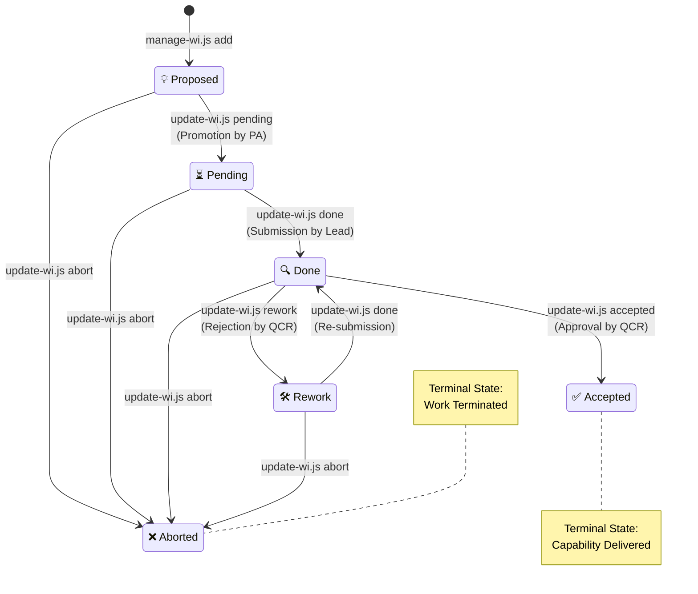
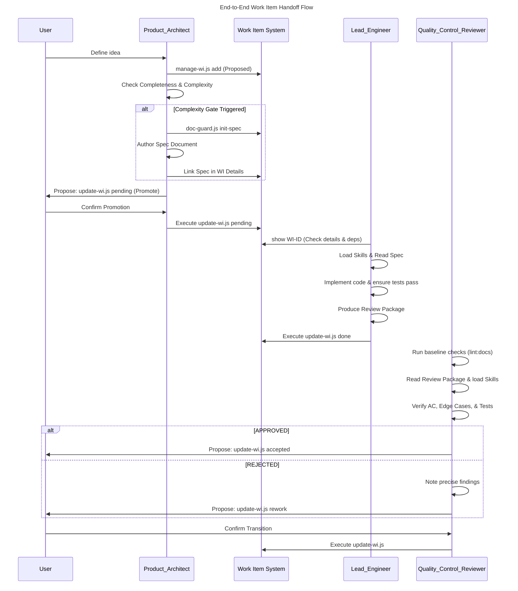

# Project Management Guide

All agents **must** govern Work Items using the automated scripts defined in this lifecycle to ensure consistency, traceability, and a synchronized backlog.

> [!IMPORTANT]
> **Exclusion Boundary**: This document strictly governs the Work Item lifecycle and Semantic Versioning process. It does **not** cover codebase architecture, TypeScript style guidelines, or specific test implementation strategies.

## 0. Core Philosophy: Capability Delivery Map

The project implements a **Capability Delivery Map** strategy. Unlike a traditional task list that tracks individual actions (coding vs. testing), our Roadmap focuses on **atomic capabilities**:

1. **Atomic Integrity**: A feature node (`WI-##`) does not turn `✅ Done` until it is both implemented and high-coverage tested.
2. **Outcome-Oriented**: Each node on the map represents a distinct, reliable feature that can be delivered to the end-user.
3. **Reduced Visual Noise**: Technical sub-tasks (like Unit Tests) are "absorbed" into the parent Work Item, ensuring the strategic view reflects system capabilities rather than developer effort.

---

## 1. Naming Conventions

All trackable units of work use a two-part identifier: a **prefix** and a **two-digit numeric index**.

### 1.1 Work Items (`WI-##`)

Used to track all units of development work. Every work item must conceptually align with one of the following canonical types:

- **`feature`**: Creates new business/user value or UI capabilities.
- **`refactor`**: Restructures existing code safely without changing external behavior.
- **`doc update`**: Updates READMEs, architectural wikis, or project manuals.
- **`bug`**: Discovers and resolves unintended behavior or an error.
- **`chore`**: Under-the-hood technical maintenance, dependency updates, or CI/CD pipelines.
- **`test`**: Adds quality-gap tests (regression, edge-case) for existing code.

| Field | Rule |
| :--- | :--- |
| **Format** | `WI-` + zero-padded two-digit number (e.g., `WI-01`, `WI-18`) |
| **Type** | Categorized conceptually as one of: `feature`, `refactor`, `doc update`, `bug`, `chore`, `test` |
| **Sub-tasks** | Split into standard incremental IDs (e.g., `WI-55`, `WI-56`) using `dependencies` for tracking |
| **Assignment** | Assigned by `Product_Architect` when creating or splitting a work item |
| **Uniqueness** | Numbers are never reused, even after an item is retired from `work-items.md` |

> To create, edit, or inspect Work Items, use the scripts defined in Skill: `work-item-management`.

### 1.2 Implementation & Testing Policies

#### A. Traceability in Code

Every implementation or test file associated with a work item **must** include its ID in a top-level JSDoc comment:

```typescript
/**
 * WI-05 — Implement WebSocket Transport Layer
 * ref: docs/work-items.md, docs/test-plan.md §2.2
 */
```

#### B. Testing Tasks Management

To maintain the **Capability Delivery Map**'s clarity, we distinguish between two types of testing activities:

##### **1. Feature-driven Tests**

- **Definition**: Tests added to verify **new code** being implemented for an active Work Item.
- **WI Policy**: **Do not create a separate WI**. The tests must be included within the feature's `WI-##` details. A feature is not "Done" until its tests pass.
- **Goal**: Ensure atomic integrity of new capabilities.

##### **2. Quality-gap Tests**

- **Definition**: Tests added to supplement coverage for **existing, already finished code** (e.g., missed edge cases, regression tests for long-stable modules).
- **WI Policy**: **Create a dedicated WI** (usually `Size: XS` or `S`).
- **Goal**: Make technical debt reduction visible on the Roadmap and track the strengthening of core stability.

---

### 1.3 Feature Groups

A **Feature Group** is a named domain category that groups related `WI-##` items by functional area. Feature Groups appear as `## Heading` sections in `docs/work-items.md`. The Feature Group provides the "Where" (the structural domain boundary), while the Work Item Type provides the "What" (the specific action).

How the 6 canonical work item types relate to their parent Feature Group:

- **`feature`**: Expands the group's capabilities.
- **`refactor`**: Optimizes the group's internal structure.
- **`doc update`**: Explains the group's specifications or architecture.
- **`bug`**: Repairs the group's capabilities.
- **`chore`**: Maintains the group's infrastructure or dependencies.
- **`test`**: Fortifies the group's existing logic against regressions.

> [!NOTE]
> The canonical Feature Group registry—including names, colors, and descriptions—is managed via the project's data layer. New groups are established using `node scripts/manage-wi.js add-group <Name> <FillHex> <StrokeHex> <Desc>`, which initializes a new functional domain. Items within a group can be inspected using `node scripts/manage-wi.js list-group <Name>`.

---

## 2. Work Item Lifecycle

A work item travels through the following states. Only `Product_Architect` may create or promote items; only `Lead_Engineer` may set an item to `done` or `abort`.



### 2.1 State Definitions

| State | Symbol | Location | Description |
| :--- | :--- | :--- | :--- |
| **Proposed** | 💡 | JSON SSOT | Idea raised; not yet formally scoped. Roadmap entry: milestone required. |
| **Pending** | ⏳ | `docs/work-items.md` | Scoped & approved; spec written if needed; ready for implementation. |
| **Done** | 🔍 | JSON SSOT | Implementation complete; awaiting Quality Control Review (QCR). |
| **Rework** | 🛠️ | JSON SSOT | Review failed; item returned to Lead_Engineer for fixes. |
| **Accepted** | ✅ | JSON SSOT | Formally approved by QCR; archived in changelog, reflected in roadmap. |
| **Aborted** | ❌ | JSON SSOT | Task cancelled or superseded; permanently stopped. |
| **Stabilized** | 💎 | Roadmap (auto) | All WIs in the group are `accepted`/`aborted`; roadmap style updated automatically. |

> [!IMPORTANT]
> **Never edit `work-items.md` or `project-roadmap.md` manually.** These files are auto-generated from the JSON SSOT; manual changes will be overwritten during the next sync. Always use the generation scripts.

---



> [Diagram: End-to-end sequence diagram illustrating the lifecycle handoffs: the Product Architect scopes and promotes the item, the Lead Engineer implements and compiles a Review Package, and the Quality Control Reviewer evaluates it before final submission.]

### 2.2 Phase 1: Scoping & Promotion (Product_Architect)

**Goal**: Transition a WI from `Proposed` to `Pending`.

**Prerequisites**:
- WI status is `Proposed`.
- All dependency WIs (`deps`) are `✅ Accepted`.

**Steps**:
1. **Creation**: User and PA define the idea and create a `Proposed` record using `manage-wi.js add`.
2. **Review**: Verify WI record completeness: `id`, `title`, `description`, `details[]` (requires ≥1 `[Test]`), `size`, `deps`.
3. **Complexity Gate**: Evaluate if the WI meets Spec criteria. A formal specification document (`docs/*.md`) is **mandatory** if any of the following conditions are met:
   - Introduces a new architectural pattern or design rule.
   - Requires coordinating changes across ≥3 files or layers.
   - Involves non-obvious protocol constraints (e.g., async sequencing, DAP edge cases).
   - Work Item Size is **M** or above.
4. **Spec Authoring**: If the gate is passed, initialize the spec using `node scripts/doc-guard.js init-spec <WI-ID> <type> [Filename]`. Complete the generated template and link it in the WI details.
5. **Promotion**: Propose the status transition to the USER. **Upon confirmation**, execute `node scripts/update-wi.js WI-## pending` to authorize development.

**Verification**:
- WI status is updated to `Pending` and appears in the Active Backlog.

---

### 2.3 Phase 2: Implementation & Submission (Lead_Engineer)

**Goal**: Implement the approved spec and compile a formal Review Package for the QCR.

**Preparation Prerequisites**:
- WI status is `Pending`.

**Preparation Steps**:
1. Execute `node scripts/manage-wi.js show {WI-ID}` and read `details[]` and `deps`.
2. Halt execution and notify `Product_Architect` if any dependency WIs are not `✅ Accepted`.
3. Load all relevant Skills listed in the WI or `project-context.md`.
4. Read the spec document (`docs/{WI-ID}-spec.md`) in full if linked in the WI details.

**Submission Steps**:
1. Implement all items listed in the WI's details.
2. Run: `npm run test -- --watch=false` (all tests must pass)
3. Run: `npm run lint:docs` (all documents must pass verification; alias for `node scripts/doc-guard.js verify`)
4. Produce: `docs/reviews/{WI-ID}.review-package.md`
   - **§1 Acceptance Criteria** (copied verbatim from `manage-wi.js show`)
   - **§2 Diff Summary** (file + line ranges only; no pasted code)
   - **§3 Edge Cases** (🔍 flags for areas requiring deeper QCR inspection)
   - **§4 Tests Added** (suite names + test descriptions)
   - **§5 Spec-Plan Updates** (list of spec-plan files updated)
   - **§6 Self-Verification** (pasted terminal output proving tests pass)
5. Submit: `"QCR review {WI-ID}"`
6. Execute `node scripts/update-wi.js WI-## done` to submit the Review Package to the QCR.

---

### 2.4 Phase 3: Quality Control Review (Quality_Control_Reviewer)

**Goal**: Verify implementation correctness strictly against the established Acceptance Criteria and Spec-Plans before approving the work item.

**Prerequisites**:
- WI status is `Done`.
- A valid Review Package (`docs/reviews/{WI-ID}.review-package.md`) exists.

**Steps**:
1. Run: `npm run lint:docs` (baseline document quality check)
2. Read `docs/reviews/{WI-ID}.review-package.md` (primary input)
3. Load only the Skills listed in `skills-required` frontmatter.
4. Verify **§1 Acceptance Criteria** — read only the diff line ranges in **§2**.
5. Inspect only 🔍-flagged areas in **§3**.
6. Verify tests in **§4** match the spec-plan entries in **§5**.
7. Formulate an APPROVED verdict, or note precise, actionable findings for a REJECTED verdict.
8. Propose the corresponding status transition to the USER (`update-wi.js {WI-ID} <accepted|rework>`).
9. Await explicit USER confirmation.
10. Execute the transition script.

> [!NOTE]
> The full Review Package format is defined in Skill: `review-package` (`docs/reviews/{WI-ID}.review-package.md`).
> [!CAUTION]
> `Quality_Control_Reviewer` is FORBIDDEN from re-reading full source files. All required context must be sourced from the Review Package and the specific line ranges listed in its §2 Diff Summary.

---

## 3. Package Release Flow (SemVer)

The project follows strict Semantic Versioning (SemVer) using pre-release suffixes to track milestone readiness.

> [!IMPORTANT]
> - `Product_Architect` MUST explicitly state "Version bump approved" in the conversation to authorize a transition.
> - `Lead_Engineer` MUST NOT modify `package.json` until this authorization is granted.

### 3.1 Stage Definitions

| Stage | Version Pattern | Objective |
| :--- | :--- | :--- |
| **Active Development** | `X.Y.Z-dev` | Default state. Features are being implemented. |
| **Release Candidate** | `X.Y.Z-rc.N` | Feature-complete. Regression and integration testing. |
| **Formal Release** | `X.Y.Z` | Stable, production-ready build. |

### 3.2 Transition to Release Candidate (`-dev` → `-rc.1`)

**Goal**: Freeze feature development and begin integration testing.

**Prerequisites**:
- [ ] All `⏳ Pending` items in `docs/work-items.md` are `✅ Accepted`.
- [ ] `npm run test -- --watch=false` passes with 0 failures.

**Steps**:
1. `Lead_Engineer` verifies prerequisites and requests transition approval.
2. `Product_Architect` evaluates and outputs "Version bump approved".
3. `Lead_Engineer` updates `package.json` version to `X.Y.Z-rc.1`.

### 3.3 Transition to Formal Release (`-rc.N` → Formal Release)

**Goal**: Publish the stable build.

**Prerequisites**:
- [ ] No open regression issues.
- [ ] `electron-builder` packages verified on all target platforms.
- [ ] If a blocker is fixed during the RC phase, increment `N` (e.g., `-rc.1` → `-rc.2`) and re-verify.

**Steps**:
1. `Lead_Engineer` confirms prerequisites and requests final sign-off.
2. `Product_Architect` outputs "Version bump approved".
3. `Lead_Engineer` updates `package.json` to `X.Y.Z` (removing the `-rc.N` suffix).

---

## 4. Related Documents

| Document | Purpose |
| :--- | :--- |
| [`docs/work-items.md`](work-items.md) | Active backlog of pending and in-progress work items |
| [`docs/archive/design-decisions.md`](design-decisions.md) | Architecture Decision Records (ADRs) for non-obvious implementation choices |
| [`docs/test-plan.md`](test-plan.md) | Detailed test strategy and TI scope definitions |
| [`docs/system-specification.md`](system-specification.md) | Feature requirements each WI must satisfy |
| [`.agents/project-context.md`](../.agents/project-context.md) | Agent navigation index — links to this document |
