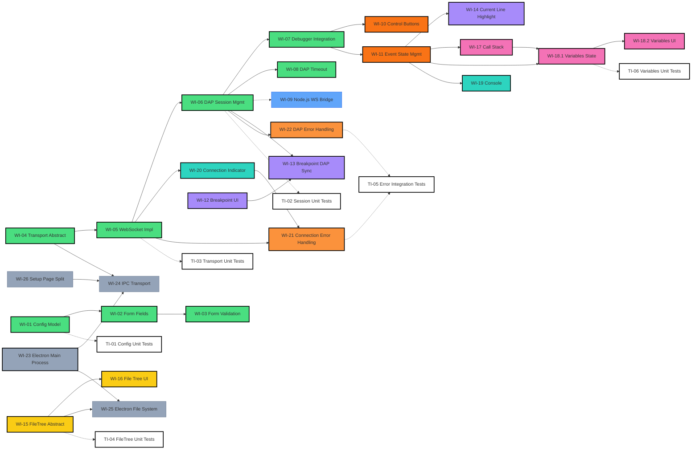

# Project Roadmap & Dependency Map

This document acts as the **Single Source of Truth (SSOT)** for the project's strategic roadmap and granular work item dependencies. It illustrates the sequence of implementation and the architectural relationships between all modules.

> [!NOTE]
> - **Lead Engineer**: Use this map to determine implementation order and spot architectural dependencies before starting a WI.
> - **QA Reviewer**: Use this map to identify regression testing paths and verify TI/WI coverage.
> - **Product Architect**: Maintain this map whenever a Feature Group is created, completed, or retired.

---

## Technical Dependency Map (Atomic View)

### Chart Color & Style Legend

| Color | Feature Group | Item Status | Style Representation |
| :--- | :--- | :--- | :--- |
| **All Colors** | (Varies by Fill Color) | **Pending / Proposed** | Solid background, standard border |
| **All Colors** | (Varies by Fill Color) | **Done** | Solid background + **Thick Black Border** (`stroke-width: 2.5px`) |
| **Any** | Retired Feature Group | **Archived** | No fill + **Dashed Border** (`stroke-dasharray: 5`) |
| 🟢 **Green** | Core Infrastructure | WI-01 ~ WI-08, WI-10, WI-11 | `#4ade80` |
| 🔵 **Blue** | Backend Relay | WI-09 | `#60a5fa` |
| 🟠 **Orange** | Debug Control UI | — | (Reserved) |
| 🟣 **Purple** | Editor Advanced Interaction | WI-12 ~ WI-14 | `#a78bfa` |
| 🟡 **Yellow** | File Resource Management | WI-15 ~ WI-16 | `#facc15` |
| 🩷 **Pink** | Debug Info Panel | WI-17 ~ WI-18 | `#f472b6` |
| 🔵 **Cyan** | Status & Console UI | WI-19 ~ WI-20 | `#2dd4bf` |
| 🟠 **Deep Orange** | Error Handling | WI-21 ~ WI-22 | `#fb923c` |
| ⬜ **Gray** | Electron Desktop Mode | WI-23 ~ WI-26 | `#94a3b8` |
| ⬜ **White** | Automation Tests | TI-01 ~ TI-06 | `#ffffff` |

### Full Map

