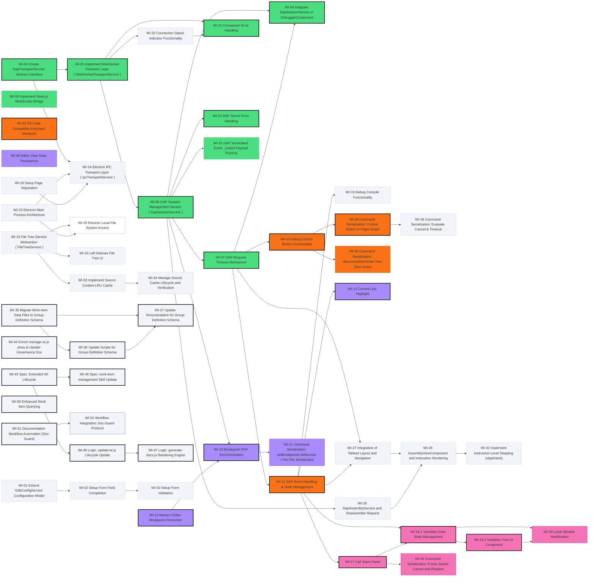

# Project Roadmap & Dependency Map

## Feature Groups

| Group | Color | Status |
| :--- | :--- | :--- |
| Setup View |  `#4ade80` | 💎 Stabilized |
| DAP Transport Layer |  `#4ade80` | 🔵 Active |
| Debug Controls |  `#f97316` | 🔵 Active |
| Editor Features |  `#a78bfa` | 🔵 Active |
| File Explorer |  `#facc15` | 💎 Stabilized |
| Variables & Call Stack |  `#f472b6` | 🔵 Active |
| Console & Status Bar |  `#2dd4bf` | 💎 Stabilized |
| Electron Desktop Mode |  `#94a3b8` | 💎 Stabilized |
| Low-Level Inspection |  `#6366f1` | 💎 Stabilized |
| General |  `#f1f5f9` | 🔵 Active |
