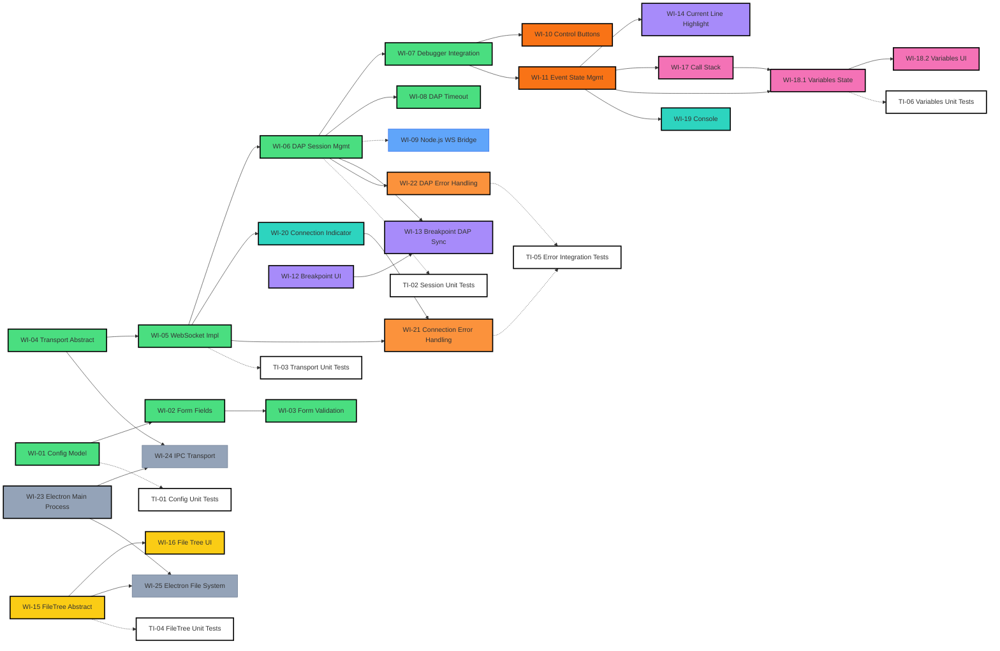

# DAP Debugger Frontend — Work Items

> [!NOTE]
> Generated from a gap analysis between [system-specification.md v1.0](system-specification.md) and the existing codebase. Each item is moderately sized for incremental delivery.
> Items use `WI-##` (e.g., `WI-01`, `WI-18.2`) and test items use `TI-##` (e.g., `TI-05`). For the full lifecycle process, see [project-management.md](project-management.md).

---

## Backend Relay (Web Mode)

### WI-09: Implement Node.js WebSocket Bridge
<!-- status: pending | size: M | depends: none -->
- **Size**: M
- **Description**: Implement a simple Node.js server that receives frontend WebSocket connections and forwards them to the local DAP executable (e.g., `lldb-dap`)
- **Details**:
  - Use the `ws` module to create a WebSocket Server (e.g., running on `:8080`)
  - On connection, launch `lldb-dap` or `gdb` as a child process based on the protocol
  - Bidirectional data forwarding: WebSocket → DAP `stdin`; DAP `stdout` → WebSocket back to frontend
  - Handle process termination and resource cleanup
- **Status**: ⏳ Pending

---

## Electron Desktop Mode (Optional)

### WI-24: Electron IPC Transport Layer (`IpcTransportService`)
<!-- status: pending | size: M | depends: WI-04, WI-23 -->
- **Size**: M
- **Description**: Implement IPC communication per spec [§4.1](system-specification.md#41-electron-desktop-mode)
- **Details**:
  - Implement `DapTransportService`'s IPC version (`IpcTransportService`)
  - `preload.ts` exposes `window.electronAPI` via `contextBridge` (native Electron API, no third-party wrapper)
  - Angular renderer side: `IpcTransportService` calls `window.electronAPI` for all DAP message I/O
  - Electron main process side: `ipcMain.handle` receives calls and forwards to the DAP Server via TCP socket
- **Dependencies**: WI-04, WI-23
- **Status**: ⏳ Pending

### WI-25: Electron Local File System Access
<!-- status: pending | size: S | depends: WI-15, WI-23 -->
- **Size**: S
- **Description**: Implement local file reading per spec [§6.1](system-specification.md#61-electron-desktop-mode)
- **Details**:
  - Implement `FileTreeService`'s Electron version
  - Read file tree and file contents via IPC calling Node.js `fs` API
- **Dependencies**: WI-15, WI-23
- **Status**: ⏳ Pending

---

## Recommended Development Order

### Chart Color Legend

| Color | Meaning | Item Status |
| --- | --- | --- |
| Solid background | Category feature (to implement) | Solid background color represents the category |
| Black border | Item completed | Solid category background + **thick black border** = completed |
| 🟢 **Green** | Core Infrastructure | WI-01 ~ WI-08, WI-10, WI-11 |
| 🔵 **Blue** | Backend Relay (Bridge) | WI-09 |
| 🟠 **Orange** | Debug Control UI (Controls) | |
| 🟣 **Purple** | Editor Advanced Interaction | WI-12 ~ WI-14 |
| 🟡 **Yellow** | File Resource Management (Explorer) | WI-15 ~ WI-16 |
| 🩷 **Pink** | Debug Info Panel (Inspector) | WI-17 ~ WI-18 |
| 🔵 **Cyan** | Status & Console (UI) | WI-19 ~ WI-20 |
| 🟠 **Deep Orange** | Error Handling | WI-21 ~ WI-22 |
| ⬜ **Gray** | Electron Desktop (Bridge) | WI-23 ~ WI-25 |
| ⬜ **White** | Automation Tests (Testing) | TI-01 ~ TI-05 |

