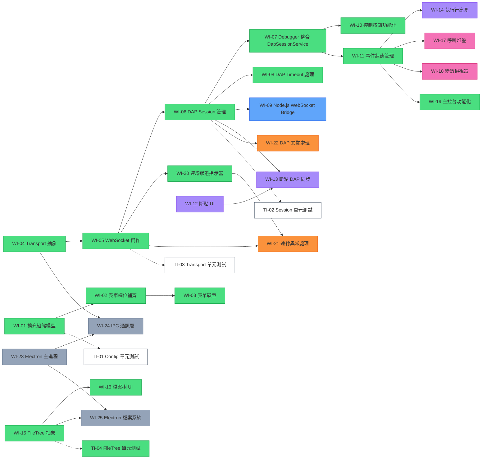

# DAP 偵錯器前端 — 工作項目清單

> [!NOTE]
> 本清單基於 [system-specification.md v1.0](system-specification.md) 規格書與現有 codebase 差異分析而產生。
> 每個項目大小適中，適合 incremental 方式逐步開發與交付。

---

## 現有 codebase 盤點

| 元件/檔案 | 狀態 | 說明 |
|---|---|---|
| `app.routes.ts` | ✅ 已完成 | `/setup` → `/debug` 路由已建立 |
| `DapConfigService` | ✅ 已完成 | 已擴充為完整的 DAP 連線組態介面（連線位址、啟動模式、引數等） |
| `SetupComponent` | ✅ 已完成 | 表單欄位均已實作，且結合 Reactive Forms 具備即時格式與必填驗證 |
| `DebuggerComponent` | ✅ 已完成 | 三段式佈局已整合動態檔案樹、偵錯控制按鈕、狀態指示器與主控台日誌 |
| `EditorComponent` | ⚠️ 基礎版 | Monaco Editor 已嵌入，但尚未實作斷點互動或執行行高亮 |
| DAP 通訊層 | ✅ 已完成 | `DapTransportService`、`WebSocketTransportService` 及 `DapSessionService` 皆已完成並具備超時機制 |
| 檔案樹 | ✅ 已完成 | 左側邊欄透過 `loadedSources` 渲染，點擊檔案可向 Server 提取原始碼並顯示 |
| 變數檢視器 | ❌ 未實作 | 右側為 placeholder 文字 |
| 呼叫堆疊 | ❌ 未實作 | 右側為 placeholder 文字 |
| 錯誤處理 | ❌ 未實作 | 尚未實作底層斷線重連機制及全域異常通知介面 |
| Electron 整合 | ❌ 未實作 | 僅有 devDependency，尚未建立 Main Process 及 IPC |

---

## 開發階段導覽 (Phases Navigation)

為便於追蹤進度，開發工作總共劃分為 11 個階段。已完工的階段已歸檔至 `changelog.md`，待處理之階段則保留於本清單。

| 階段 (Phase) | 狀態 | 核心目標說明 | 快速連結 |
|---|---|---|---|
| **Phase 1** | ✅ 完成 | 實作 `/setup` 表單與連線組態介面 | [前往檢視](changelog.md#phase-1完善設定視圖-setup-view) |
| **Phase 2** | ✅ 完成 | 建立 WebSocket 通訊層與 DAP 請求生命週期管理 | [前往檢視](changelog.md#phase-2dap-通訊層-transport-layer) |
| **Phase 3** | ⏳ 待處理 | 搭建 Web 模式專用之 Node.js 中繼通訊伺服器 | [前往檢視](#phase-3websocket-bridge-web-模式用後端中介) |
| **Phase 4** | ✅ 完成 | 實作 Toolbar 偵錯控制（Continue/Pause/Step）及狀態綁定 | [前往檢視](changelog.md#phase-4偵錯控制核心-debug-controls) |
| **Phase 5** | ⏳ 待處理 | Monaco Editor 進階整合，實作斷點互動與執行行高亮 | [前往檢視](#phase-5編輯器進階功能-editor-features) |
| **Phase 6** | ✅ 完成 | 動態渲染專案檔案樹，點擊可載入原始碼 | [前往檢視](changelog.md#phase-6檔案樹與原始碼載入-file-explorer) |
| **Phase 7** | ⏳ 待處理 | 呼叫堆疊清單，與處理巢狀變數檢視器 | [前往檢視](#phase-7變數與呼叫堆疊-variables--call-stack) |
| **Phase 8** | ✅ 完成 | 開發 UI 狀態列連線指示器與命令主控台介面 | [前往檢視](changelog.md#phase-8主控台與狀態列-console--status-bar) |
| **Phase 9** | ⏳ 待處理 | 全域連線異常處理、發布錯誤 Snackbar 回饋 | [前往檢視](#phase-9錯誤處理與使用者回饋-error-handling) |
| **Phase 10** | ⏳ 待處理 | Electron 桌面應用程式整合 (IPC, Main Process) | [前往檢視](#phase-10electron-桌面模式-optional) |
| **Phase 11** | 🔄 進行中 | 導入 Vitest 撰寫核心服務防呆等單元測試 | [前往檢視](#phase-11自動化測試-automation-tests) |

---

## Phase 3：WebSocket Bridge (Web 模式用後端中介)

### WI-09：實作 Node.js WebSocket Bridge
- **大小**：M
- **說明**：實作一個簡易的 Node.js 伺服器，接收前端的 WebSocket 連線，並轉發給本地的 DAP 執行檔（如 `lldb-dap`）
- **內容**：
  - 使用 `ws` 模組建立 WebSocket Server (例如運行在 `:8080`)
  - 收到連線時，根據協定啟動 `lldb-dap` 或 `gdb` 子程序 (Child Process)
  - 雙向資料轉發：WebSocket 收到的 JSON 轉給 DAP `stdin`；DAP `stdout` 收到的 JSON 轉給 WebSocket 傳回前端
  - 處理程序中斷與資源清理
- **狀態**：⏳ 待處理

---

## Phase 5：編輯器進階功能 (Editor Features)

### WI-12：Monaco Editor 斷點互動
- **大小**：M
- **說明**：根據規格書 §3.2.3，實作 Glyph Margin 斷點操作
- **內容**：
  - 監聽 Monaco `onMouseDown` 事件（glyph margin 區域點擊）
  - 點擊行號 → 新增/移除斷點（紅色圓點 decoration）
  - 維護本地斷點清單（`Map<filename, Set<lineNumber>>`）
  - 提供 `getBreakpoints()` 方法供 DAP 通訊使用
- **依賴**：無（可獨立於 DAP 層開發 UI 互動）
- **狀態**：⏳ 待處理

### WI-13：斷點與 DAP Server 同步
- **大小**：S
- **說明**：將本地斷點變更同步至 DAP Server
- **內容**：
  - 斷點新增/移除時發送 `setBreakpoints` request
  - 處理 `setBreakpoints` response，更新 verified 狀態（灰色 vs 紅色圓點）
  - 處理 `breakpoint` 事件，反映 server 端斷點變更
- **依賴**：WI-06, WI-12
- **狀態**：⏳ 待處理

### WI-14：執行行高亮標示 (Current Line Highlight)
- **大小**：S
- **說明**：根據規格書 §3.2.3，實作 `deltaDecorations` 標示當前執行行
- **內容**：
  - `stopped` 事件觸發時，根據 stackTrace 的 top frame 取得行號
  - 使用 `deltaDecorations` 在該行加上背景高亮
  - `continued` / `terminated` 時清除高亮
  - 自動 `revealLineInCenter` 捲動到當前行
- **依賴**：WI-11
- **狀態**：⏳ 待處理

---

## Phase 7：變數與呼叫堆疊 (Variables & Call Stack)

### WI-17：呼叫堆疊面板 (Call Stack Panel)
- **大小**：M
- **說明**：根據規格書 §3.2.4，實作呼叫堆疊顯示
- **內容**：
  - `stopped` 事件觸發時發送 `threads` + `stackTrace` 請求
  - 使用 `mat-list` 展示 stack frames（函式名稱、檔案名:行號）
  - 點擊 frame → 切換 Monaco Editor 到對應檔案與行號
  - 點擊 frame → 觸發 `scopes` + `variables` 請求更新變數面板
- **依賴**：WI-11
- **狀態**：⏳ 待處理

### WI-18：變數檢視器面板 (Variable Inspector)
- **大小**：L
- **說明**：根據規格書 §3.2.4，實作巢狀變數樹狀檢視
- **內容**：
  - 根據選中的 stack frame，發送 `scopes` → `variables` 請求
  - 使用 `mat-tree` 展示巢狀變數（支援展開結構體/陣列/物件）
  - 展開子節點時 lazy load 對應的 `variables` 請求
  - 整合 CDK Virtual Scroll 處理大量變數
  - 顯示變數名稱、型別、數值
- **依賴**：WI-11
- **狀態**：⏳ 待處理

---

## Phase 9：錯誤處理與使用者回饋 (Error Handling)

### WI-21：連線異常處理
- **大小**：M
- **說明**：根據規格書 §7.1，實作連線異常處理機制
- **內容**：
  - 連線逾時 → `MatDialog` 錯誤提示 + 重試按鈕
  - 連線中斷 → 狀態指示器更新 + 主控台輸出原因
  - 手動重連按鈕
  - WebSocket `onerror` / `onclose` 事件處理
- **依賴**：WI-05, WI-20
- **狀態**：⏳ 待處理

### WI-22：DAP Server 異常處理
- **大小**：S
- **說明**：根據規格書 §7.2，處理 DAP Server 異常
- **內容**：
  - 程序異常終止 → `MatSnackBar` 通知
  - 無效 DAP 回應 → 記錄至主控台，忽略該訊息
  - DAP error response → 顯示錯誤訊息給使用者
- **依賴**：WI-06
- **狀態**：⏳ 待處理

---

## Phase 10：Electron 桌面模式 (Optional)

### WI-23：Electron 主進程基礎架構
- **大小**：M
- **說明**：根據規格書 §6.1，建立 Electron 主進程
- **內容**：
  - 建立 `electron/main.ts` + `electron/preload.ts`
  - `BrowserWindow` 載入 Angular 應用
  - 配置 `contextBridge`，暴露 IPC API
- **狀態**：⏳ 待處理

### WI-24：Electron IPC 通訊層 (`IpcTransportService`)
- **大小**：M
- **說明**：根據規格書 §4.1，實作 IPC 通訊
- **內容**：
  - 實作 `DapTransportService` 的 IPC 版本
  - Electron 主進程側：IPC 接收 → TCP 轉發至 DAP Server
  - Angular renderer 側：透過 `contextBridge` 調用 IPC
- **依賴**：WI-04, WI-23
- **狀態**：⏳ 待處理

### WI-25：Electron 本機檔案系統存取
- **大小**：S
- **說明**：根據規格書 §6.1，實作本機檔案讀取
- **內容**：
  - 實作 `FileTreeService` 的 Electron 版本
  - 透過 IPC 呼叫 Node.js `fs` API 讀取檔案樹與檔案內容
- **依賴**：WI-15, WI-23
- **狀態**：⏳ 待處理

---

## Phase 11：自動化測試 (Automation Tests)

### TI-01：`DapConfigService` 單元測試
- **大小**：S
- **說明**：根據 `test-plan.md` 規劃，驗證全域組態的存取機制
- **內容**：
  - 驗證 `setConfig()` 與 `getConfig()` 是否能正確存儲與回傳完整的 `DapConfig` 資料
- **狀態**：⏳ 待處理

### TI-02：`DapSessionService` 會話管理單元測試
- **大小**：M
- **說明**：根據 `test-plan.md` 規劃，驗證會話生命週期與對應機制
- **內容**：
  - **Sequence ID 管理**：驗證發出 request 時 `seq` 是否正確遞增
  - **Promise Mapping**：驗證 `sendRequest` 產生的 Promise 在收到 response 時能正確 resolve 或 reject
  - **Timeout 機制**：模擬伺服器無回應，驗證 `sendRequest` 於設定時間後是否觸發 timeout 錯誤
- **依賴**：WI-06, WI-07
- **狀態**：⏳ 待處理

### TI-03：`WebSocketTransportService` 傳輸層單元測試
- **大小**：M
- **說明**：根據 `test-plan.md` 規劃，驗證底層防呆機制與資料緩衝
- **內容**：
  - **Header 解析驗證**：確保封包能依 `Content-Length: ...\r\n\r\n` 被正確分割並觸發 message 事件
  - **黏包/半包處理**：模擬 TCP 碎化封包，驗證 Buffer 拼接邏輯是否能正確拼出完整 JSON
  - **防呆與錯誤隔離 (Fail-Fast)**：送入錯誤格式封包，驗證服務是否永久中斷 `Subject` 並拒絕後續訊息
- **依賴**：WI-05
- **狀態**：⏳ 待處理

---

## 建議開發順序

### 圖表顏色說明
| 顏色 | 代表意義 | 項目範例 |
|---|---|---|
| ● **綠色** | 已完成功能 (Core) | WI-01 ~ WI-08, WI-10, WI-11 |
| ● **藍色** | 後端中繼層 (Bridge) | WI-09 |
| ● **橘色** | 偵錯控制 UI (Controls) | |
| ● **紫色** | 編輯器進階互動 (Editor) | WI-12 ~ WI-14 |
| ● **黃色** | 檔案資源管理 (Explorer) | WI-15 ~ WI-16 |
| ● **粉色** | 偵錯資訊面板 (Inspector) | WI-17 ~ WI-18 |
| ● **青色** | 狀態與主控台 (UI) | WI-19 ~ WI-20 |
| ● **深橘** | 異常處理 (Error Handling) | WI-21 ~ WI-22 |
| ● **灰色** | Electron 桌面專屬 (Bridge) | WI-23 ~ WI-25 |
| ● **白色** | 自動化測試 (Testing) | TI-01 ~ TI-04 |

---

## 開發里程碑摘要

| 里程碑 | 涵蓋項目 | 交付物 |
|---|---|---|
| **M1：完整設定頁面** | WI-01 ~ WI-03 | 完整表單 + 驗證，可正確傳遞所有 DAP 參數 |
| **M2：DAP 通訊建立** | WI-04 ~ WI-09 | WebSocket 連線 + Bridge + Timeout 機制完成 |
| **M3：基礎偵錯體驗** | WI-10 ~ WI-14 | 可設斷點、暫停、逐步執行、看到當前行高亮 |
| **M4：全面資訊呈現** | WI-15 ~ WI-20 | 檔案樹、變數、堆疊、主控台、狀態列全面功能化 |
| **M5：穩健性提升** | WI-21 ~ WI-22 | 連線異常處理、DAP 錯誤處理 |
| **M6：Electron 桌面版** | WI-23 ~ WI-25 | 桌面應用可獨立運行、本機檔案存取 |
| **M7：測試與品質保證** | TI-01 ~ TI-04 | 核心服務之單元測試，確保邊界與異常處理 |

> [!TIP]
> **建議先從 Phase 1 + Phase 2 並行**開始：Phase 1 (UI 表單) 不依賴 DAP 通訊層，Phase 2 (通訊層) 也不依賴 UI 變更，兩者可同時進行。另外 **WI-12（斷點 UI）** 也可獨立開發，不依賴 DAP 層。

