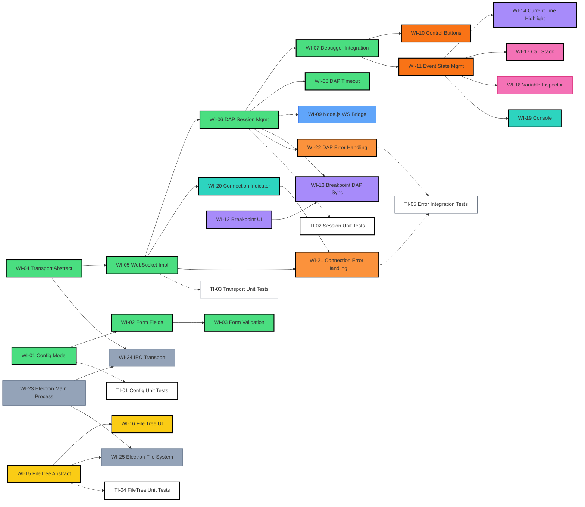

# DAP Debugger Frontend — Work Items

> [!NOTE]
> This list is generated from a gap analysis between [system-specification.md v1.0](system-specification.md) and the existing codebase.
> Each item is moderately sized, suitable for incremental development and delivery.

---

## Existing Codebase Inventory

| Component / File | Status | Description |
|---|---|---|
| `app.routes.ts` | ✅ Done | `/setup` → `/debug` routing established |
| `DapConfigService` | ✅ Done | Extended to a complete DAP connection config interface (address, launch mode, args, etc.) |
| `SetupComponent` | ✅ Done | All form fields implemented with Reactive Forms, real-time format and required validation |
| `DebuggerComponent` | ✅ Done | Three-panel layout integrated with dynamic file tree, debug controls, status indicators, and console logs |
| `EditorComponent` | ⚠️ Basic | Monaco Editor embedded, current line highlight and breakpoint interaction implemented |
| DAP Communication Layer | ✅ Done | `DapTransportService`, `WebSocketTransportService`, and `DapSessionService` completed with timeout mechanism |
| File Tree | ✅ Done | Left sidebar renders via `loadedSources`, clicking a file fetches source code from Server and displays it |
| Variable Inspector | ❌ Not implemented | Right panel is placeholder text |
| Call Stack | ✅ Done | Implemented in DebuggerComponent right panel, auto-listens to stopped events and lists stack frames |
| Error Handling | ✅ Done | Connection disconnect/reconnect mechanism, timeout, and global error notification UI implemented |
| Electron Integration | ❌ Not implemented | Only devDependency exists, no Main Process or IPC established |

---

## Phase Navigation

Development work is divided into 11 phases. Completed phases are archived to `changelog.md`; pending phases remain in this list.

| Phase | Status | Core Objective | Quick Link |
|---|---|---|---|
| **Phase 1** | ✅ Done | Implement `/setup` form and connection config interface | [View](changelog.md#phase-1-setup-view) |
| **Phase 2** | ✅ Done | Build WebSocket communication layer and DAP request lifecycle management | [View](changelog.md#phase-2-dap-transport-layer) |
| **Phase 3** | ⏳ Pending | Build Node.js relay communication server for Web mode | [View](#phase-3-websocket-bridge-web-mode-backend-relay) |
| **Phase 4** | ✅ Done | Implement toolbar debug controls (Continue/Pause/Step) and state binding | [View](changelog.md#phase-4-debug-controls) |
| **Phase 5** | ✅ Done | Monaco Editor advanced integration, breakpoint interaction and line highlight | [View](changelog.md#phase-5-editor-features) |
| **Phase 6** | ✅ Done | Dynamic project file tree rendering, click to load source code | [View](changelog.md#phase-6-file-explorer) |
| **Phase 7** | 🔄 In Progress | Call stack list and nested variable inspector | [View](#phase-7-variables--call-stack) |
| **Phase 8** | ✅ Done | Develop UI status bar connection indicator and command console interface | [View](changelog.md#phase-8-console--status-bar) |
| **Phase 9** | ✅ Done | Global connection error handling, error snackbar feedback | [View](changelog.md#phase-9-error-handling) |
| **Phase 10** | ⏳ Pending | Electron desktop application integration (IPC, Main Process) | [View](#phase-10-electron-desktop-mode-optional) |
| **Phase 11** | 🔄 In Progress | Introduce Vitest for core service unit tests | [View](#phase-11-automation-tests) |

---

## Phase 3: WebSocket Bridge (Web Mode Backend Relay)

### WI-09: Implement Node.js WebSocket Bridge
<!-- status: pending | size: M | phase: 3 | depends: none -->
- **Size**: M
- **Description**: Implement a simple Node.js server that receives frontend WebSocket connections and forwards them to the local DAP executable (e.g., `lldb-dap`)
- **Details**:
  - Use the `ws` module to create a WebSocket Server (e.g., running on `:8080`)
  - On connection, launch `lldb-dap` or `gdb` as a child process based on the protocol
  - Bidirectional data forwarding: WebSocket → DAP `stdin`; DAP `stdout` → WebSocket back to frontend
  - Handle process termination and resource cleanup
- **Status**: ⏳ Pending

---

---

## Phase 7: Variables & Call Stack

### WI-18: Variable Inspector Panel
<!-- status: pending | size: L | phase: 7 | depends: WI-11 -->
- **Size**: L
- **Description**: Implement nested variable tree view per spec [§3.2.4](system-specification.md#324-right-sidenav)
- **Details**:
  - Based on selected stack frame, send `scopes` → `variables` requests
  - Display nested variables using `mat-tree` (support expanding structs/arrays/objects)
  - Lazy-load child nodes via `variables` request on expand
  - Integrate CDK Virtual Scroll for large variable sets
  - Display variable name, type, and value
- **Dependencies**: WI-11
- **Files to modify**: `debugger.component.ts`, `debugger.component.html`
- **Status**: ⏳ Pending

---

## Phase 10: Electron Desktop Mode (Optional)

### WI-23: Electron Main Process Architecture
<!-- status: pending | size: M | phase: 10 | depends: none -->
- **Size**: M
- **Description**: Establish Electron main process per spec [§6.1](system-specification.md#61-electron-desktop-mode)
- **Details**:
  - Create `electron/main.ts` + `electron/preload.ts`
  - `BrowserWindow` loads the Angular application
  - Configure `contextBridge`, expose IPC API
- **Status**: ⏳ Pending

### WI-24: Electron IPC Transport Layer (`IpcTransportService`)
<!-- status: pending | size: M | phase: 10 | depends: WI-04, WI-23 -->
- **Size**: M
- **Description**: Implement IPC communication per spec [§4.1](system-specification.md#41-electron-desktop-mode)
- **Details**:
  - Implement `DapTransportService`'s IPC version
  - Electron main process side: IPC receive → TCP forward to DAP Server
  - Angular renderer side: Call IPC via `contextBridge`
- **Dependencies**: WI-04, WI-23
- **Status**: ⏳ Pending

### WI-25: Electron Local File System Access
<!-- status: pending | size: S | phase: 10 | depends: WI-15, WI-23 -->
- **Size**: S
- **Description**: Implement local file reading per spec [§6.1](system-specification.md#61-electron-desktop-mode)
- **Details**:
  - Implement `FileTreeService`'s Electron version
  - Read file tree and file contents via IPC calling Node.js `fs` API
- **Dependencies**: WI-15, WI-23
- **Status**: ⏳ Pending

---

## Phase 11: Automation Tests

### TI-03: `WebSocketTransportService` Transport Layer Unit Tests
<!-- status: pending | size: M | phase: 11 | depends: WI-05 -->
- **Size**: M
- **Description**: Verify low-level fail-safe mechanism and data buffering per [test-plan.md](test-plan.md)
- **Details**:
  - **Header parsing verification**: Ensure packets are correctly split by `Content-Length: ...\r\n\r\n` and trigger message events
  - **Sticky/half packet handling**: Simulate TCP fragmented packets, verify buffer concatenation logic correctly assembles complete JSON
  - **Fail-Fast & Error Isolation**: Feed malformed packets, verify service permanently terminates `Subject` and rejects subsequent messages
- **Dependencies**: WI-05
- **Status**: ⏳ Pending

### TI-05: Connection Error & Intent Detection Integration Tests
<!-- status: pending | size: M | phase: 11 | depends: WI-21, WI-22 -->
- **Size**: M
- **Description**: Verify error propagation, connection timeout, and user-initiated disconnect interception between Session and Transport
- **Details**:
  - **Normal stop intent interception**: Verify `isDisconnecting` flag correctly suppresses redundant error feedback
  - **Connection timeout auto-catch**: Simulate WebSocket connection timeout, trigger `ErrorDialog`
  - **Disconnect auto-reaction**: Simulate server crash, verify cascading state transition
- **Dependencies**: WI-21, WI-22
- **Status**: ⏳ Pending

---

## Recommended Development Order

### Chart Color Legend
| Color | Meaning | Item Status |
|---|---|---|
| Solid background | Category feature (to implement) | Solid background color represents the category |
| Black border | Item completed | Solid category background + **thick black border** = completed |
| 🟢 **Green** | Core Infrastructure | WI-01 ~ WI-08, WI-10, WI-11 |
| 🔵 **Blue** | Backend Relay (Bridge) | WI-09 |
| 🟠 **Orange** | Debug Control UI (Controls) | |
| 🟣 **Purple** | Editor Advanced Interaction | WI-12 ~ WI-14 |
| 🟡 **Yellow** | File Resource Management (Explorer) | WI-15 ~ WI-16 |
| 🩷 **Pink** | Debug Info Panel (Inspector) | WI-17 ~ WI-18 |
| 🔵 **Cyan** | Status & Console (UI) | WI-19 ~ WI-20 |
| 🟠 **Deep Orange** | Error Handling | WI-21 ~ WI-22 |
| ⬜ **Gray** | Electron Desktop (Bridge) | WI-23 ~ WI-25 |
| ⬜ **White** | Automation Tests (Testing) | TI-01 ~ TI-05 |

---

## Milestone Summary

| Milestone | Items Covered | Deliverable |
|---|---|---|
| **M1: Complete Setup Page** | WI-01 ~ WI-03 | Full form + validation, correctly passes all DAP parameters |
| **M2: DAP Communication** | WI-04 ~ WI-09 | WebSocket connection + Bridge + Timeout mechanism complete |
| **M3: Basic Debug Experience** | WI-10 ~ WI-14 | Can set breakpoints, pause, step, see current line highlight |
| **M4: Full Information Display** | WI-15 ~ WI-20 | File tree, variables, stack, console, status bar all functional |
| **M5: Robustness** | WI-21 ~ WI-22 | Connection error handling, DAP error handling |
| **M6: Electron Desktop** | WI-23 ~ WI-25 | Desktop app runs independently, local file access |
| **M7: Testing & QA** | TI-01 ~ TI-05 | Core service unit tests, boundary and error handling coverage |

> [!TIP]
> **Recommended start**: Phase 1 + Phase 2 in parallel — Phase 1 (UI form) has no dependency on the DAP communication layer, and Phase 2 (communication layer) doesn't depend on UI changes. Both can proceed simultaneously. Additionally, **WI-12 (Breakpoint UI)** can be developed independently without DAP layer dependency.
