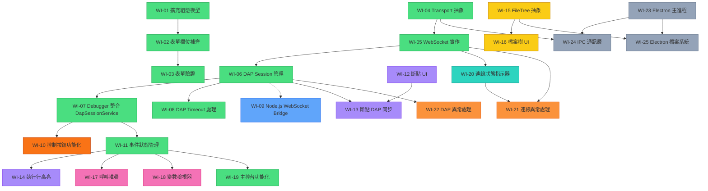

# DAP 偵錯器前端 — 工作項目清單

> [!NOTE]
> 本清單基於 [specification.md v1.0](specification.md) 規格書與現有 codebase 差異分析而產生。
> 每個項目大小適中，適合 incremental 方式逐步開發與交付。

---

## 現有 codebase 盤點

| 元件/檔案 | 狀態 | 說明 |
|---|---|---|
| `app.routes.ts` | ✅ 已完成 | `/setup` → `/debug` 路由已建立 |
| `GdbConfigService` | ✅ 已完成 | 僅存 `executableFile` / `sourceFile`，缺少 DAP Server 位址、Launch Mode、程式引數 |
| `SetupComponent` | ✅ 已完成 | DAP Server 位址、Launch/Attach 模式切換、執行檔路徑、原始碼目錄、程式引數欄位均已實作；Reactive Forms 驗證（WI-03）已完成 |
| `DebuggerComponent` | ⚠️ 骨架版 | 佈局三段式已成形，但側邊欄/工具列/主控台皆為 placeholder |
| `EditorComponent` | ⚠️ 基礎版 | Monaco Editor 已嵌入，但無斷點互動、執行行高亮 |
| DAP 通訊層 | ✅ 已完成 | `DapTransportService`、`WebSocketTransportService` 及 `DapSessionService` 皆已完成 |
| 檔案樹 | ❌ 未實作 | 左側邊欄為硬編碼假資料 |
| 變數檢視器 | ❌ 未實作 | 右側為 placeholder 文字 |
| 呼叫堆疊 | ❌ 未實作 | 右側為 placeholder 文字 |
| 錯誤處理 | ❌ 未實作 | 無連線逾時、斷線處理、SnackBar 通知 |
| Electron 整合 | ❌ 未實作 | 僅有 devDependency，無主進程/preload/IPC |

---

## Phase 1：完善設定視圖 (Setup View)

### WI-01：擴充 `GdbConfigService` 組態模型
- **大小**：S
- **說明**：將 config 物件擴充為完整的 DAP 連線組態介面
- **內容**：
  - 定義 `DapConfig` interface（`serverAddress`, `launchMode: 'launch' | 'attach'`, `executablePath`, `sourcePath`, `programArgs`）
  - 更新 `GdbConfigService` 的 `setConfig()` / `getConfig()` 方法
  - 重新命名 service 為 `DapConfigService`（配合規格中通用 DAP 概念）
- **狀態**：✅ 已完成

### WI-02：Setup 表單欄位補齊 
- **大小**：M
- **說明**：根據規格書 §3.1，補齊所有 Setup 表單欄位
- **內容**：
  - 新增 **DAP Server 連線位址** 欄位（如 `localhost:4711`）
  - 新增 **啟動模式** 選擇器（`mat-button-toggle` 或 `mat-radio`：Launch / Attach）
  - 新增 **程式引數** 欄位（選填）
  - 按鈕文字隨 Launch Mode 動態切換（「Launch」/「Attach」）
- **依賴**：WI-01
- **狀態**：✅ 已完成

### WI-03：Setup 表單驗證
- **大小**：S
- **說明**：根據規格書 §7.3，實作即時表單驗證
- **內容**：
  - 改用 Reactive Forms（`FormGroup` + `Validators`）
  - 連線位址格式驗證（`host:port`）
  - 必填欄位驗證 + 行內錯誤訊息
  - Launch/Attach 按鈕在驗證失敗時 disable
- **依賴**：WI-02
- **狀態**：✅ 已完成

---

## Phase 2：DAP 通訊層 (Transport Layer)

### WI-04：建立 `DapTransportService` 抽象介面
- **大小**：S
- **說明**：根據規格書 §4，定義統一的通訊抽象層
- **內容**：
  - 定義抽象 class / interface `DapTransportService`
  - 方法：`connect()`, `disconnect()`, `sendRequest()`, `onEvent()` (Observable)
  - 定義 DAP Message 基礎型別（`DapRequest`, `DapResponse`, `DapEvent`）
- **狀態**：✅ 已完成

### WI-05：實作 WebSocket 通訊層 (`WebSocketTransportService`)
- **大小**：M
- **說明**：根據規格書 §4.2，實作 Web 模式下的 WebSocket 通訊
- **內容**：
  - 實作 `DapTransportService` 的 WebSocket 版本
  - WebSocket 連線/斷線管理
  - DAP 訊息序列化/反序列化（Content-Length header + JSON body）
  - 使用 RxJS Subject 發射接收到的事件
- **依賴**：WI-04
- **狀態**：✅ 已完成

### WI-06：DAP 會話管理服務 (`DapSessionService`)
- **大小**：M
- **說明**：封裝 DAP 協定的請求/回應生命週期
- **內容**：
  - `initialize()` → 交換 Capabilities
  - `launch()` / `attach()` → 根據設定啟動偵錯
  - `configurationDone()` → 通知 DAP Server
  - `disconnect()` → 終止會話
  - 管理 request sequence ID 與 pending response 對應
- **依賴**：WI-05
- **狀態**：✅ 已完成

### WI-07：DAP 請求逾時處理機制 (Timeout Mechanism)
- **大小**：S
- **說明**：為 `DapSessionService` 的請求實作超時機制，防止伺服器無回應時造成的永久等待
- **內容**：
  - 修改 `sendRequest` 方法，加入 `setTimeout` 等待上限 (例如 5秒)
  - 逾時發生時，清除 pending handler 並 reject `Promise`
- **依賴**：WI-06
- **狀態**：✅ 已完成

### WI-08：在 DebuggerComponent 整合 DapSessionService
- **大小**：S
- **說明**：負責在 DebuggerComponent 中實際調用 DapSessionService 啟動與終止偵錯會話
- **內容**：
  - 於 `ngOnInit` 執行 `initializeSession`、`launchOrAttach` 與 `configurationDone`
  - 於 `ngOnDestroy` 與 `goBack` 時呼叫 `disconnect` 以清除會話與連線
  - 訂閱 `onEvent()` 即時記錄基礎事件至 UI 日誌
  - 使用 `try/catch` 捕捉 timeout 錯誤，於 UI 顯示友善提示（如 `MatSnackBar` 或 `dapLogs`）
- **依賴**：WI-06, WI-07
- **狀態**：✅ 已完成

---

## Phase 3：WebSocket Bridge (Web 模式用後端中介)

### WI-09：實作 Node.js WebSocket Bridge
- **大小**：M
- **說明**：實作一個簡易的 Node.js 伺服器，接收前端的 WebSocket 連線，並轉發給本地的 DAP 執行檔（如 `lldb-dap`）
- **內容**：
  - 使用 `ws` 模組建立 WebSocket Server (例如運行在 `:8080`)
  - 收到連線時，根據協定啟動 `lldb-dap` 或 `gdb` 子程序 (Child Process)
  - 雙向資料轉發：WebSocket 收到的 JSON 轉給 DAP `stdin`；DAP `stdout` 收到的 JSON 轉給 WebSocket 傳回前端
  - 處理程序中斷與資源清理
- **狀態**：⏳ 待處理

---

## Phase 4：偵錯控制核心 (Debug Controls)

### WI-10：偵錯控制按鈕功能化
- **大小**：M
- **說明**：將 toolbar 上的控制按鈕連接到 DAP 請求
- **內容**：
  - Continue → `continue` request
  - Step Over → `next` request
  - Step Into → `stepIn` request
  - Step Out → `stepOut` request（目前 template 中缺少此按鈕，需補上）
  - Pause → `pause` request
  - Stop → `disconnect` request
  - 按鈕狀態管理（Running 時只能 Pause/Stop，Stopped 時可 Continue/Step）
- **依賴**：WI-07
- **狀態**：⏳ 待處理

### WI-11：DAP 事件處理與狀態管理
- **大小**：M
- **說明**：處理 DAP Server 回傳的事件，更新前端狀態
- **內容**：
  - `stopped` 事件 → 更新為暫停狀態，觸發 stackTrace/scopes/variables 查詢
  - `continued` 事件 → 更新為執行中狀態
  - `terminated` / `exited` 事件 → 更新為已終止狀態，通知使用者
  - `output` 事件 → 寫入主控台 log
  - `initialized` 事件 → 觸發 `configurationDone`
  - `breakpoint` 事件 → 更新斷點顯示狀態
- **依賴**：WI-07
- **狀態**：✅ 已完成

---

## Phase 5：編輯器進階功能 (Editor Features)

### WI-12：Monaco Editor 斷點互動
- **大小**：M
- **說明**：根據規格書 §3.2.3，實作 Glyph Margin 斷點操作
- **內容**：
  - 監聽 Monaco `onMouseDown` 事件（glyph margin 區域點擊）
  - 點擊行號 → 新增/移除斷點（紅色圓點 decoration）
  - 維護本地斷點清單（`Map<filename, Set<lineNumber>>`）
  - 提供 `getBreakpoints()` 方法供 DAP 通訊使用
- **依賴**：無（可獨立於 DAP 層開發 UI 互動）
- **狀態**：⏳ 待處理

### WI-13：斷點與 DAP Server 同步
- **大小**：S
- **說明**：將本地斷點變更同步至 DAP Server
- **內容**：
  - 斷點新增/移除時發送 `setBreakpoints` request
  - 處理 `setBreakpoints` response，更新 verified 狀態（灰色 vs 紅色圓點）
  - 處理 `breakpoint` 事件，反映 server 端斷點變更
- **依賴**：WI-06, WI-12
- **狀態**：⏳ 待處理

### WI-14：執行行高亮標示 (Current Line Highlight)
- **大小**：S
- **說明**：根據規格書 §3.2.3，實作 `deltaDecorations` 標示當前執行行
- **內容**：
  - `stopped` 事件觸發時，根據 stackTrace 的 top frame 取得行號
  - 使用 `deltaDecorations` 在該行加上背景高亮
  - `continued` / `terminated` 時清除高亮
  - 自動 `revealLineInCenter` 捲動到當前行
- **依賴**：WI-11
- **狀態**：⏳ 待處理

---

## Phase 6：檔案樹與原始碼載入 (File Explorer)

### WI-15：檔案樹服務抽象 (`FileTreeService`)
- **大小**：S
- **說明**：根據規格書 §3.2.2，定義檔案樹資料取得的抽象介面
- **內容**：
  - 定義 `FileNode` 介面（`name`, `path`, `type: 'file' | 'directory'`, `children?`）
  - 定義 `FileTreeService` 抽象（`getTree(rootPath)`, `readFile(path)`）
  - Web 模式：透過後端 API / WebSocket 取得遠端檔案樹
- **依賴**：無
- **狀態**：⏳ 待處理

### WI-16：左側邊欄檔案樹 UI
- **大小**：M
- **說明**：將左側邊欄從硬編碼替換為動態檔案樹
- **內容**：
  - 使用 `mat-tree`（Flat 或 Nested）展示檔案/資料夾階層
  - 資料夾展開/收合功能
  - 點擊檔案 → 載入原始碼至 Monaco Editor
  - 當前開啟檔案高亮顯示
- **依賴**：WI-15
- **狀態**：⏳ 待處理

---

## Phase 7：變數與呼叫堆疊 (Variables & Call Stack)

### WI-17：呼叫堆疊面板 (Call Stack Panel)
- **大小**：M
- **說明**：根據規格書 §3.2.4，實作呼叫堆疊顯示
- **內容**：
  - `stopped` 事件觸發時發送 `threads` + `stackTrace` 請求
  - 使用 `mat-list` 展示 stack frames（函式名稱、檔案名:行號）
  - 點擊 frame → 切換 Monaco Editor 到對應檔案與行號
  - 點擊 frame → 觸發 `scopes` + `variables` 請求更新變數面板
- **依賴**：WI-11
- **狀態**：⏳ 待處理

### WI-18：變數檢視器面板 (Variable Inspector)
- **大小**：L
- **說明**：根據規格書 §3.2.4，實作巢狀變數樹狀檢視
- **內容**：
  - 根據選中的 stack frame，發送 `scopes` → `variables` 請求
  - 使用 `mat-tree` 展示巢狀變數（支援展開結構體/陣列/物件）
  - 展開子節點時 lazy load 對應的 `variables` 請求
  - 整合 CDK Virtual Scroll 處理大量變數
  - 顯示變數名稱、型別、數值
- **依賴**：WI-11
- **狀態**：⏳ 待處理

---

## Phase 8：主控台與狀態列 (Console & Status Bar)

### WI-19：偵錯主控台功能化
- **大小**：M
- **說明**：根據規格書 §3.2.5，完善底部主控台
- **內容**：
  - 接收 DAP `output` 事件，依 category 分流至 Debugger Console / Program Console
  - 新增命令輸入欄位（input field），發送 `evaluate` request
  - 自動捲動至最新 log
  - Log 時間戳記顯示
- **依賴**：WI-11
- **狀態**：✅ 已完成

### WI-20：連線狀態指示器功能化
- **大小**：S
- **說明**：根據規格書 §3.2.5，將狀態列動態化
- **內容**：
  - 綁定 `DapTransportService` 的連線狀態 Observable
  - 綠燈 = 已連線、灰燈 = 未連線、紅燈 = 連線異常
  - 顯示連線位址資訊
  - 顯示目前偵錯狀態（Running / Stopped / Terminated）
- **依賴**：WI-05
- **狀態**：✅ 已完成

---

## Phase 9：錯誤處理與使用者回饋 (Error Handling)

### WI-21：連線異常處理
- **大小**：M
- **說明**：根據規格書 §7.1，實作連線異常處理機制
- **內容**：
  - 連線逾時 → `MatDialog` 錯誤提示 + 重試按鈕
  - 連線中斷 → 狀態指示器更新 + 主控台輸出原因
  - 手動重連按鈕
  - WebSocket `onerror` / `onclose` 事件處理
- **依賴**：WI-05, WI-20
- **狀態**：⏳ 待處理

### WI-22：DAP Server 異常處理
- **大小**：S
- **說明**：根據規格書 §7.2，處理 DAP Server 異常
- **內容**：
  - 程序異常終止 → `MatSnackBar` 通知
  - 無效 DAP 回應 → 記錄至主控台，忽略該訊息
  - DAP error response → 顯示錯誤訊息給使用者
- **依賴**：WI-06
- **狀態**：⏳ 待處理

---

## Phase 10：Electron 桌面模式 (Optional)

### WI-23：Electron 主進程基礎架構
- **大小**：M
- **說明**：根據規格書 §6.1，建立 Electron 主進程
- **內容**：
  - 建立 `electron/main.ts` + `electron/preload.ts`
  - `BrowserWindow` 載入 Angular 應用
  - 配置 `contextBridge`，暴露 IPC API
- **狀態**：⏳ 待處理

### WI-24：Electron IPC 通訊層 (`IpcTransportService`)
- **大小**：M
- **說明**：根據規格書 §4.1，實作 IPC 通訊
- **內容**：
  - 實作 `DapTransportService` 的 IPC 版本
  - Electron 主進程側：IPC 接收 → TCP 轉發至 DAP Server
  - Angular renderer 側：透過 `contextBridge` 調用 IPC
- **依賴**：WI-04, WI-23
- **狀態**：⏳ 待處理

### WI-25：Electron 本機檔案系統存取
- **大小**：S
- **說明**：根據規格書 §6.1，實作本機檔案讀取
- **內容**：
  - 實作 `FileTreeService` 的 Electron 版本
  - 透過 IPC 呼叫 Node.js `fs` API 讀取檔案樹與檔案內容
- **依賴**：WI-15, WI-23
- **狀態**：⏳ 待處理

---

## 建議開發順序

---

## 開發里程碑摘要

| 里程碑 | 涵蓋項目 | 交付物 |
|---|---|---|
| **M1：完整設定頁面** | WI-01 ~ WI-03 | 完整表單 + 驗證，可正確傳遞所有 DAP 參數 |
| **M2：DAP 通訊建立** | WI-04 ~ WI-09 | WebSocket 連線 + Bridge + Timeout 機制完成 |
| **M3：基礎偵錯體驗** | WI-10 ~ WI-14 | 可設斷點、暫停、逐步執行、看到當前行高亮 |
| **M4：全面資訊呈現** | WI-15 ~ WI-20 | 檔案樹、變數、堆疊、主控台、狀態列全面功能化 |
| **M5：穩健性提升** | WI-21 ~ WI-22 | 連線異常處理、DAP 錯誤處理 |
| **M6：Electron 桌面版** | WI-23 ~ WI-25 | 桌面應用可獨立運行、本機檔案存取 |

> [!TIP]
> **建議先從 Phase 1 + Phase 2 並行**開始：Phase 1 (UI 表單) 不依賴 DAP 通訊層，Phase 2 (通訊層) 也不依賴 UI 變更，兩者可同時進行。另外 **WI-12（斷點 UI）** 也可獨立開發，不依賴 DAP 層。

